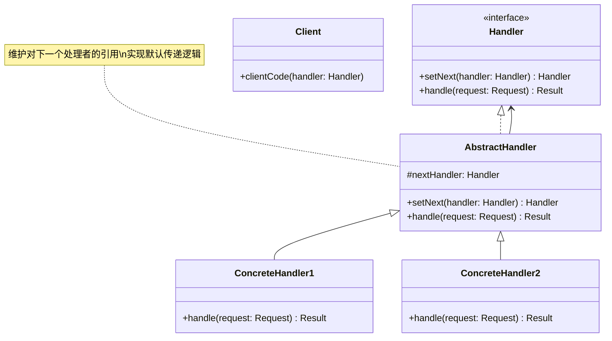

# 责任链 (Chain of Responsibility)

## 概述

**定义**：允许你将请求沿着处理链传递，直到有处理者能够处理它。每个处理者决定是否处理请求或将其传递给链中的下一个处理者。

**分类**：行为型模式

---

## 问题场景

### 核心问题

1. **请求处理的不确定性**：程序中有多个对象可以处理某个请求，但不知道具体哪个对象应该处理它。
2. **处理者的动态配置**：处理请求的对象集合需要动态指定，处理顺序也需要灵活配置。
3. **解耦请求发送者和接收者**：不希望明确指定哪个对象处理请求，希望运行时自动确定。

### 示例场景

- 事件处理系统：多个事件处理器按优先级处理事件
- 审批流程：请假申请需要经过多个级别的审批
- 异常处理：从具体异常到通用异常的捕获链
- 认证系统：支持多种认证方式（用户名密码、API密钥、JWT等）
- 日志系统：不同级别的日志由不同的处理器处理

---

## 解决方案

### 核心思想

将多个处理者连成一条链，请求沿着链传递，直到有处理者处理它或到达链的末尾。每个处理者都包含对下一个处理者的引用。

### 设计原理

1. **处理者接口**：定义统一的处理方法和设置下一个处理者的方法
2. **抽象处理者**：实现默认的传递逻辑，子类只需实现具体的处理逻辑
3. **具体处理者**：实现具体的处理逻辑，决定是否处理或传递请求
4. **链式调用**：支持流畅的链式配置，方便构建处理链

---

## 结构

### UML 类图



### 参与者

- **Handler（处理者接口）**：定义处理请求的接口和设置后继处理者的方法
- **AbstractHandler（抽象处理者）**：实现后继处理者的引用和默认的传递逻辑
- **ConcreteHandler（具体处理者）**：实现具体的处理逻辑，可以处理请求或传递给下一个
- **Client（客户端）**：创建处理链并向链头的处理者提交请求

### 协作关系

1. 客户端创建处理链，将处理者按顺序连接
2. 客户端向链头的处理者提交请求
3. 每个处理者检查是否能处理请求，如果能则处理，否则传递给下一个
4. 请求沿着链传递，直到被处理或到达链尾

---

## 代码示例

### 概念性实现

#### 核心代码

```typescript
/**
 * 处理者接口声明了构建处理链的方法和执行请求的方法
 */
interface Handler<Request = string, Result = string> {
    setNext(handler: Handler<Request, Result>): Handler<Request, Result>;
    handle(request: Request): Result;
}

/**
 * 抽象处理者实现了默认的链式行为
 */
abstract class AbstractHandler implements Handler {
    private nextHandler: Handler;

    public setNext(handler: Handler): Handler {
        this.nextHandler = handler;
        // 返回处理者以支持链式调用
        // 例如：monkey.setNext(squirrel).setNext(dog);
        return handler;
    }

    public handle(request: string): string {
        if (this.nextHandler) {
            return this.nextHandler.handle(request);
        }
        return null;
    }
}

/**
 * 具体处理者：猴子
 */
class MonkeyHandler extends AbstractHandler {
    public handle(request: string): string {
        if (request === 'Banana') {
            return `Monkey: I'll eat the ${request}.`;
        }
        return super.handle(request);
    }
}

/**
 * 具体处理者：松鼠
 */
class SquirrelHandler extends AbstractHandler {
    public handle(request: string): string {
        if (request === 'Nut') {
            return `Squirrel: I'll eat the ${request}.`;
        }
        return super.handle(request);
    }
}

/**
 * 具体处理者：狗
 */
class DogHandler extends AbstractHandler {
    public handle(request: string): string {
        if (request === 'MeatBall') {
            return `Dog: I'll eat the ${request}.`;
        }
        return super.handle(request);
    }
}

/**
 * 客户端代码
 */
function clientCode(handler: Handler) {
    const foods = ['Nut', 'Banana', 'Cup of coffee'];

    for (const food of foods) {
        console.log(`Client: Who wants a ${food}?`);

        const result = handler.handle(food);
        if (result) {
            console.log(`  ${result}`);
        } else {
            console.log(`  ${food} was left untouched.`);
        }
    }
}

// 使用示例
const monkey = new MonkeyHandler();
const squirrel = new SquirrelHandler();
const dog = new DogHandler();

monkey.setNext(squirrel).setNext(dog);

console.log('Chain: Monkey > Squirrel > Dog\n');
clientCode(monkey);
```

#### 运行结果

```
Chain: Monkey > Squirrel > Dog

Client: Who wants a Nut?
  Squirrel: I'll eat the Nut.
Client: Who wants a Banana?
  Monkey: I'll eat the Banana.
Client: Who wants a Cup of coffee?
  Cup of coffee was left untouched.
```

#### 代码解析

1. **处理者接口**：`Handler` 接口定义了 `setNext` 和 `handle` 方法
2. **抽象处理者**：`AbstractHandler` 实现了默认的传递逻辑
3. **具体处理者**：每个处理者只处理自己感兴趣的请求，其他请求传递给下一个
4. **链式调用**：`setNext` 返回处理者对象，支持流畅的链式配置
5. **灵活处理**：客户端可以向链中任意位置的处理者提交请求

---

### 实际应用示例

#### 应用场景

实现一个 HTTP 请求的认证系统，支持多种认证方式：基础认证、API密钥认证、JWT令牌认证。

#### 核心代码

```typescript
/**
 * 认证请求类型
 */
type AuthenticationRequest = {
    user?: {
        name: string;
        password: string;
    };
    apiKey?: string;
    jwtToken?: string;
};

/**
 * 认证结果类型
 */
type AuthenticationResult = {
    success: boolean;
    message: string;
};

/**
 * 认证处理者接口
 */
interface AuthenticationHandler
    extends Handler<AuthenticationRequest, AuthenticationResult> { }

/**
 * 基础认证处理者
 */
class BasicAuthenticationHandler extends AbstractAuthenticationHandler {
    public handle(request: AuthenticationRequest): AuthenticationResult {
        const user = request.user;
        if (user && user.name === 'admin' && user.password === 'password') {
            return {
                success: true,
                message: 'User authenticated with basic authentication.'
            };
        }
        return super.handle(request);
    }
}

/**
 * API密钥认证处理者
 */
class ApiKeyAuthenticationHandler extends AbstractAuthenticationHandler {
    public handle(request: AuthenticationRequest): AuthenticationResult {
        if (request.apiKey === 'my-api-key') {
            return {
                success: true,
                message: 'User authenticated with API key.'
            };
        }
        return super.handle(request);
    }
}

/**
 * JWT令牌认证处理者
 */
class JwtAuthenticationHandler extends AbstractAuthenticationHandler {
    public handle(request: AuthenticationRequest): AuthenticationResult {
        if (request.jwtToken === 'my-jwt-token') {
            return {
                success: true,
                message: 'User authenticated with JWT token.'
            };
        }
        return super.handle(request);
    }
}

/**
 * 抽象认证处理者
 */
abstract class AbstractAuthenticationHandler implements AuthenticationHandler {
    private nextHandler: AuthenticationHandler;

    public setNext(handler: AuthenticationHandler): AuthenticationHandler {
        this.nextHandler = handler;
        return handler;
    }

    public handle(request: AuthenticationRequest): AuthenticationResult {
        if (this.nextHandler) {
            return this.nextHandler.handle(request);
        }
        return { success: false, message: 'Unable to authenticate user.' };
    }
}

/**
 * 客户端代码
 */
// 构建认证处理链
const basicAuth = new BasicAuthenticationHandler();
const apiKeyAuth = new ApiKeyAuthenticationHandler();
const jwtAuth = new JwtAuthenticationHandler();

basicAuth.setNext(apiKeyAuth).setNext(jwtAuth);

// 测试不同的认证方式
console.log('Testing basic authentication:');
let result = basicAuth.handle({
    user: { name: 'admin', password: 'password' }
});
console.log(result.success ? `✓ ${result.message}` : `✗ ${result.message}`);

console.log('\nTesting API key authentication:');
result = basicAuth.handle({
    apiKey: 'my-api-key'
});
console.log(result.success ? `✓ ${result.message}` : `✗ ${result.message}`);

console.log('\nTesting JWT authentication:');
result = basicAuth.handle({
    jwtToken: 'my-jwt-token'
});
console.log(result.success ? `✓ ${result.message}` : `✗ ${result.message}`);

console.log('\nTesting invalid authentication:');
result = basicAuth.handle({
    user: { name: 'invalid', password: 'invalid' }
});
console.log(result.success ? `✓ ${result.message}` : `✗ ${result.message}`);
```

#### 运行结果

```
Testing basic authentication:
✓ User authenticated with basic authentication.

Testing API key authentication:
✓ User authenticated with API key.

Testing JWT authentication:
✓ User authenticated with JWT token.

Testing invalid authentication:
✗ Unable to authenticate user.
```

#### 实现要点

1. **多种认证方式**：支持基础认证、API密钥、JWT令牌等多种认证方式
2. **灵活配置**：可以动态调整认证顺序，添加或移除认证方式
3. **类型安全**：使用 TypeScript 类型定义确保请求和结果的类型安全
4. **职责分离**：每个处理者只负责一种认证方式，符合单一职责原则
5. **可扩展性**：新增认证方式只需添加新的处理者类

---

## 适用场景

### ✅ 适合使用的场景

1. **多个对象可以处理请求**：有多个对象可以处理同一个请求，但不知道具体由哪个处理
2. **处理顺序可变**：需要动态指定处理者集合和处理顺序
3. **解耦发送者和接收者**：不希望明确指定请求的接收者
4. **多层处理**：请求需要经过多层级处理，如审批流程、异常处理等

### ❌ 不适合使用的场景

1. **只有一个处理者**：只有一个对象能处理请求时，不需要责任链
2. **性能敏感**：责任链会增加调用开销，可能影响性能
3. **处理顺序固定**：处理顺序完全固定且不会变化时，可以使用更简单的方式
4. **请求必须被处理**：如果请求必须被处理，而责任链可能导致请求不被处理

---

## 优缺点

### 优点

1. **解耦发送者和接收者**：发送者不需要知道具体的处理者
2. **开闭原则**：可以新增处理者而不修改现有代码
3. **灵活配置**：可以动态调整处理链的结构和顺序
4. **单一职责**：每个处理者只关注自己能处理的请求
5. **简化对象连接**：处理者之间不需要显式相互引用

### 缺点

1. **请求可能不被处理**：没有处理者能处理时，请求可能无法被处理
2. **性能开销**：请求需要经过多个处理者，可能影响性能
3. **调试困难**：处理链较长时，调试和追踪问题变得困难
4. **运行时错误**：处理链配置不当可能导致运行时错误

---

## 与其他模式的关系

- **与命令模式**：责任链中的处理者可以执行命令
- **与组合模式**：组合模式可以用于构建复杂的责任链结构
- **与装饰器模式**：两者都是通过递归组合来工作，但目的不同
- **与状态模式**：状态模式也可以处理请求，但状态转换是明确的

---

## TypeScript 实现要点

### TypeScript 特性应用

1. **泛型接口**：使用泛型定义灵活的处理者接口
2. **类型别名**：使用类型别名定义复杂的请求和结果类型
3. **抽象类**：使用抽象类提供默认实现
4. **可选属性**：使用可选属性处理不同类型的认证信息

### 最佳实践

```typescript
/**
 * 泛型处理者接口
 */
interface Handler<TRequest, TResult> {
    setNext(handler: Handler<TRequest, TResult>): Handler<TRequest, TResult>;
    handle(request: TRequest): TResult;
}

/**
 * 抽象处理者实现
 */
abstract class AbstractHandler<TRequest, TResult>
    implements Handler<TRequest, TResult> {
    protected nextHandler?: Handler<TRequest, TResult>;

    public setNext(handler: Handler<TRequest, TResult>): Handler<TRequest, TResult> {
        this.nextHandler = handler;
        return handler;
    }

    public handle(request: TRequest): TResult {
        if (this.nextHandler) {
            return this.nextHandler.handle(request);
        }
        throw new Error('No handler can process this request');
    }
}

/**
 * 具体处理者实现
 */
class ConcreteHandler extends AbstractHandler<string, string> {
    public handle(request: string): string {
        if (this.canHandle(request)) {
            return this.process(request);
        }
        return super.handle(request);
    }

    private canHandle(request: string): boolean {
        // 判断是否可以处理请求
        return true;
    }

    private process(request: string): string {
        // 处理请求
        return `Processed: ${request}`;
    }
}
```

### 异步处理链

```typescript
/**
 * 异步处理者接口
 */
interface AsyncHandler<TRequest, TResult> {
    setNext(handler: AsyncHandler<TRequest, TResult>): AsyncHandler<TRequest, TResult>;
    handle(request: TRequest): Promise<TResult>;
}

/**
 * 异步处理者基类
 */
abstract class AsyncAbstractHandler<TRequest, TResult>
    implements AsyncHandler<TRequest, TResult> {
    protected nextHandler?: AsyncHandler<TRequest, TResult>;

    public setNext(handler: AsyncHandler<TRequest, TResult>): AsyncHandler<TRequest, TResult> {
        this.nextHandler = handler;
        return handler;
    }

    public async handle(request: TRequest): Promise<TResult> {
        if (this.nextHandler) {
            return this.nextHandler.handle(request);
        }
        throw new Error('No handler can process this request');
    }
}
```

---

## 参考资源

- Refactoring.Guru: [Chain of Responsibility Pattern](https://refactoring.guru/design-patterns/chain-of-responsibility)
- GoF 原书：第 5 章 "行为型模式"
- 相关模式：[命令](command.md) | [组合](../structural/composite.md) | [装饰器](../structural/decorator.md)
