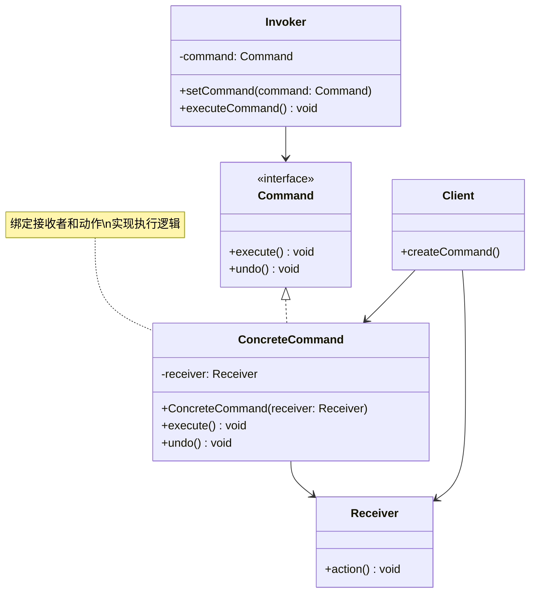

# 命令 (Command)

## 概述

**定义**：将请求转换为包含该请求所有信息的独立对象。这种转换让你可以参数化方法、延迟请求执行、排队请求，并支持可撤销的操作。

**分类**：行为型模式

---

## 问题场景

### 核心问题

1. **解耦请求发送者和接收者**：需要让发送请求的对象与执行请求的对象解耦
2. **操作的历史记录**：需要记录操作的历史，支持撤销和重做
3. **延迟执行**：需要在特定时间或条件下执行请求
4. **操作队列化**：需要将请求排队，按顺序执行

### 示例场景

- GUI按钮和菜单：每个按钮点击都是一个命令
- 文本编辑器：复制、粘贴、撤销操作
- 事务处理：数据库事务的提交和回滚
- 任务调度：定时执行某些命令
- 远程控制：远程执行命令

---

## 解决方案

### 核心思想

将请求封装为对象，从而允许你用不同的请求对客户进行参数化、对请求排队或记录请求日志，以及支持可撤销的操作。

### 设计原理

1. **命令接口**：声明执行操作的接口
2. **具体命令**：实现命令接口，将接收者绑定到动作
3. **接收者**：知道如何执行与请求相关的操作
4. **调用者**：请求命令执行请求
5. **客户端**：创建具体命令对象并设置其接收者

---

## 结构

### UML 类图



### 参与者

- **Command（命令接口）**：声明执行操作的接口
- **ConcreteCommand（具体命令）**：实现命令接口，将一个接收者对象绑定到一个动作
- **Receiver（接收者）**：知道如何执行与请求相关的操作
- **Invoker（调用者）**：要求命令执行请求
- **Client（客户端）**：创建具体命令对象并设置其接收者

### 协作关系

1. 客户端创建具体命令对象并指定接收者
2. 调用者存储命令对象
3. 调用者通过执行命令的 execute 方法来发起请求
4. 具体命令调用接收者的方法来执行实际操作

---

## 代码示例

### 概念性实现

#### 核心代码

```typescript
/**
 * 命令接口声明执行方法
 */
interface Command {
    execute(): void;
}

/**
 * 简单命令：可以直接执行简单操作
 */
class SimpleCommand implements Command {
    private payload: string;

    constructor(payload: string) {
        this.payload = payload;
    }

    public execute(): void {
        console.log(`SimpleCommand: See, I can do simple things like printing (${this.payload})`);
    }
}

/**
 * 复杂命令：将执行委托给接收者
 */
class ComplexCommand implements Command {
    private receiver: Receiver;
    private a: string;
    private b: string;

    constructor(receiver: Receiver, a: string, b: string) {
        this.receiver = receiver;
        this.a = a;
        this.b = b;
    }

    public execute(): void {
        console.log('ComplexCommand: Complex stuff should be done by a receiver object.');
        this.receiver.doSomething(this.a);
        this.receiver.doSomethingElse(this.b);
    }
}

/**
 * 接收者：包含重要的业务逻辑
 */
class Receiver {
    public doSomething(a: string): void {
        console.log(`Receiver: Working on (${a}.)`);
    }

    public doSomethingElse(b: string): void {
        console.log(`Receiver: Also working on (${b}.)`);
    }
}

/**
 * 调用者：关联命令并发送请求
 */
class Invoker {
    private onStart: Command;
    private onFinish: Command;

    public setOnStart(command: Command): void {
        this.onStart = command;
    }

    public setOnFinish(command: Command): void {
        this.onFinish = command;
    }

    public doSomethingImportant(): void {
        console.log('Invoker: Does anybody want something done before I begin?');
        if (this.isCommand(this.onStart)) {
            this.onStart.execute();
        }

        console.log('Invoker: ...doing something really important...');

        console.log('Invoker: Does anybody want something done after I finish?');
        if (this.isCommand(this.onFinish)) {
            this.onFinish.execute();
        }
    }

    private isCommand(object): object is Command {
        return object.execute !== undefined;
    }
}

/**
 * 客户端代码
 */
const invoker = new Invoker();
invoker.setOnStart(new SimpleCommand('Say Hi!'));
const receiver = new Receiver();
invoker.setOnFinish(new ComplexCommand(receiver, 'Send email', 'Save report'));

invoker.doSomethingImportant();
```

#### 运行结果

```
Invoker: Does anybody want something done before I begin?
SimpleCommand: See, I can do simple things like printing (Say Hi!)
Invoker: ...doing something really important...
Invoker: Does anybody want something done after I finish?
ComplexCommand: Complex stuff should be done by a receiver object.
Receiver: Working on (Send email.)
Receiver: Also working on (Save report.)
```

#### 代码解析

1. **命令接口**：`Command` 接口声明了 `execute()` 方法
2. **简单命令**：`SimpleCommand` 自己实现简单的操作
3. **复杂命令**：`ComplexCommand` 将操作委托给接收者
4. **接收者**：`Receiver` 包含实际的业务逻辑
5. **调用者**：`Invoker` 不依赖具体的命令和接收者类

---

### 实际应用示例

#### 应用场景

创建一个命令调度器，每隔几秒执行一次获取随机信息的命令。这个命令可以从远程 API 获取数据。

#### 核心代码

```typescript
const https = require('node:https');

/**
 * 命令接口
 */
interface Command {
    execute(): void;
}

/**
 * 获取随机事实的命令
 */
class PrintRandomFactCommand implements Command {
    constructor(
        protected randomFactDomainServiceReceiver: RandomFactDomainServiceReceiver
    ) {}

    public async execute(): Promise<void> {
        const fact = await this.randomFactDomainServiceReceiver.getRandomFact();
        console.info(fact);
    }
}

/**
 * 接收者：包含获取随机事实的业务逻辑
 */
class RandomFactDomainServiceReceiver {
    public getRandomFact(): Promise<string> {
        return new Promise((resolve, reject) => {
            https.get(
                'https://uselessfacts.jsph.pl/api/v2/facts/random',
                (res) => {
                    res.on('data', (d) => {
                        const data = JSON.parse(d);
                        const fact = data.text;
                        resolve(fact);
                    });
                }
            ).on('error', (error) => {
                reject(error);
            });
        });
    }
}

/**
 * 调用者：定期执行命令
 */
class CommandInvoker {
    constructor(
        protected command: Command,
        protected seconds: number = 5
    ) {}

    start(): void {
        setInterval(() => {
            this.command.execute();
        }, this.seconds * 1000);
    }
}

/**
 * 客户端代码
 */
const randomFactDomainServiceReceiver = new RandomFactDomainServiceReceiver();
const command = new PrintRandomFactCommand(randomFactDomainServiceReceiver);
const commandInvoker = new CommandInvoker(command, 3);

console.log('Starting command scheduler (every 3 seconds)...');
commandInvoker.start();
```

#### 运行结果

```
Starting command scheduler (every 3 seconds)...
A sneeze can travel as fast as 100 miles per hour.
The world's oldest cat lived to be 34 years old.
Honey never spoils.
```

#### 实现要点

1. **异步命令**：命令可以是异步的，返回 Promise
2. **定时执行**：调用者可以定期执行命令
3. **关注点分离**：命令只负责触发，接收者负责实际操作
4. **可测试性**：可以模拟接收者来测试命令逻辑
5. **可扩展性**：可以轻松添加新的命令类型

---

## 适用场景

### ✅ 适合使用的场景

1. **GUI操作**：按钮、菜单项等触发操作
2. **撤销/重做**：需要支持操作的历史记录和撤销
3. **延迟执行**：需要在特定时间执行请求
4. **操作队列**：需要将请求排队执行
5. **事务处理**：数据库事务的提交和回滚
6. **远程控制**：通过网络发送命令并执行

### ❌ 不适合使用的场景

1. **简单操作**：操作非常简单，不需要封装为对象
2. **不需要解耦**：发送者和接收者之间耦合度不高
3. **不需要历史**：不需要记录操作历史或支持撤销
4. **性能敏感**：命令模式会增加对象数量，可能影响性能

---

## 优缺点

### 优点

1. **解耦发送者和接收者**：调用者不需要知道接收者的具体实现
2. **单一职责**：命令类只负责封装请求
3. **开闭原则**：可以新增命令而不修改现有代码
4. **支持撤销**：可以轻松实现操作的撤销
5. **组合操作**：可以将多个命令组合成复合命令
6. **延迟执行**：可以延迟或定时执行命令

### 缺点

1. **增加复杂性**：引入许多新的类，增加系统复杂度
2. **代码膨胀**：每个具体操作都需要一个命令类
3. **接收者耦合**：某些命令类可能与特定接收者紧密耦合
4. **调试困难**：命令链较长时，调试变得困难

---

## 与其他模式的关系

- **与组合模式**：可以将多个命令组合成宏命令
- **与备忘录模式**：备忘录可以用于实现命令的撤销
- **与原型模式**：可以使用原型模式复制命令对象
- **与策略模式**：命令封装操作，策略封装算法

---

## TypeScript 实现要点

### TypeScript 特性应用

1. **接口定义**：使用接口定义命令契约
2. **类型安全**：确保命令和接收者的类型安全
3. **异步支持**：支持异步命令的执行
4. **泛型**：使用泛型创建通用的命令类型

### 最佳实践

```typescript
/**
 * 命令接口
 */
interface Command {
    execute(): void | Promise<void>;
    undo?(): void | Promise<void>;
}

/**
 * 宏命令：组合多个命令
 */
class MacroCommand implements Command {
    private commands: Command[] = [];

    public add(command: Command): void {
        this.commands.push(command);
    }

    public remove(command: Command): void {
        const index = this.commands.indexOf(command);
        if (index !== -1) {
            this.commands.splice(index, 1);
        }
    }

    public async execute(): Promise<void> {
        for (const command of this.commands) {
            await command.execute();
        }
    }

    public async undo(): Promise<void> {
        for (let i = this.commands.length - 1; i >= 0; i--) {
            const command = this.commands[i];
            if (command.undo) {
                await command.undo();
            }
        }
    }
}

/**
 * 可撤销的命令
 */
abstract class UndoableCommand implements Command {
    abstract execute(): void | Promise<void>;
    abstract undo(): void | Promise<void>;
}

/**
 * 命令历史记录
 */
class CommandHistory {
    private history: Command[] = [];

    public push(command: Command): void {
        this.history.push(command);
    }

    public pop(): Command | undefined {
        return this.history.pop();
    }

    public async undo(): Promise<void> {
        const command = this.pop();
        if (command && command.undo) {
            await command.undo();
        }
    }
}
```

### 泛型命令实现

```typescript
/**
 * 泛型命令接口
 */
interface GenericCommand<TContext, TResult> {
    execute(context: TContext): TResult;
}

/**
 * 泛型命令实现
 */
class GenericCommandImpl<TContext, TResult>
    implements GenericCommand<TContext, TResult> {
    constructor(
        private readonly handler: (context: TContext) => TResult
    ) {}

    public execute(context: TContext): TResult {
        return this.handler(context);
    }
}

/**
 * 命令工厂
 */
class CommandFactory {
    static create<TContext, TResult>(
        handler: (context: TContext) => TResult
    ): GenericCommand<TContext, TResult> {
        return new GenericCommandImpl(handler);
    }
}

// 使用示例
const command = CommandFactory.create<{ name: string }, string>(
    (context) => `Hello, ${context.name}!`
);

console.log(command.execute({ name: 'World' }));
```

---

## 参考资源

- Refactoring.Guru: [Command Pattern](https://refactoring.guru/design-patterns/command)
- GoF 原书：第 5 章 "行为型模式"
- 相关模式：[组合](../structural/composite.md) | [备忘录](memento.md) | [策略](strategy.md)
