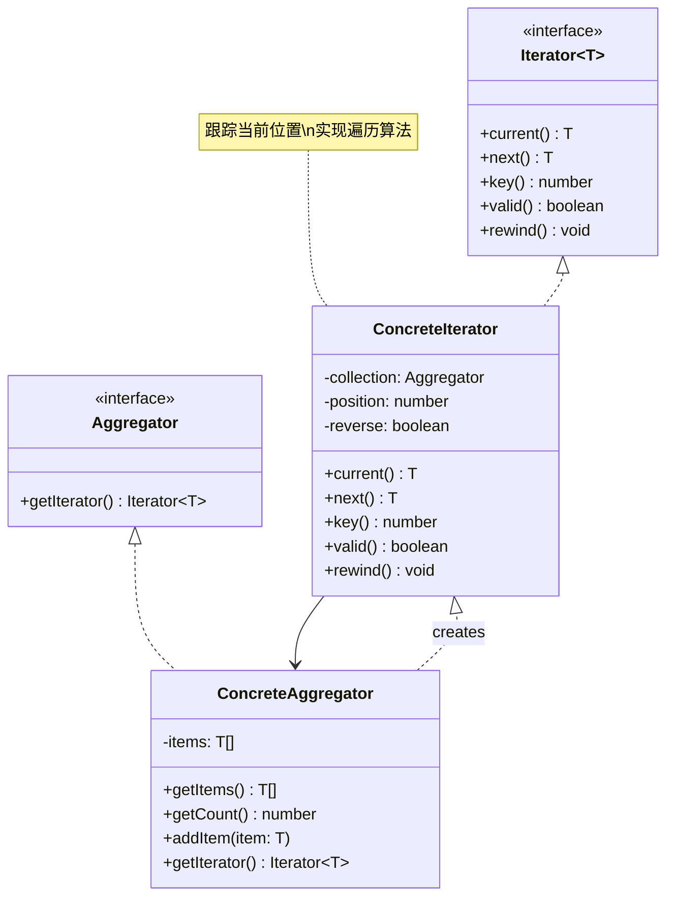

# 迭代器 (Iterator)

## 概述

**定义**：让你能够遍历集合中的元素，而又不暴露其底层表示（列表、栈、树等）。

**分类**：行为型模式

---

## 问题场景

### 核心问题

1. **集合遍历的统一接口**：需要一种统一的方式遍历不同类型的集合（数组、链表、树等）
2. **隐藏内部结构**：不希望暴露集合的内部结构，只提供遍历接口
3. **多种遍历方式**：同一集合可能需要多种遍历方式（正向、反向、按层级等）
4. **解耦集合和遍历**：将集合对象的职责与遍历行为分离

### 示例场景

- 遍历数组、链表、树等数据结构
- 实现自定义集合类型
- 多层嵌套结构的遍历
- 数据库查询结果的遍历
- 文件系统的遍历

---

## 解决方案

### 核心思想

迭代器模式将遍历集合的责任封装到一个独立的对象中，该对象被称为迭代器。迭代器提供统一的接口来访问集合中的元素，而不暴露集合的内部结构。

### 设计原理

1. **迭代器接口**：定义访问和遍历元素的接口
2. **具体迭代器**：实现迭代器接口，跟踪当前位置
3. **聚合接口**：定义创建迭代器的接口
4. **具体聚合**：实现创建相应迭代器的方法

---

## 结构

### UML 类图



### 参与者

- **Iterator（迭代器接口）**：定义访问和遍历元素的接口
- **ConcreteIterator（具体迭代器）**：实现迭代器接口，跟踪当前位置
- **Aggregator（聚合接口）**：定义创建迭代器对象的接口
- **ConcreteAggregator（具体聚合）**：实现创建相应迭代器的方法

### 协作关系

1. 具体聚合创建一个具体迭代器对象
2. 客户端通过迭代器的接口访问聚合中的元素
3. 迭代器跟踪当前位置，并在每次调用 `next` 时移动到下一个元素
4. 迭代器可以提供不同的遍历方式（正向、反向等）

---

## 代码示例

### 概念性实现

#### 核心代码

```typescript
/**
 * 迭代器接口
 */
interface Iterator<T> {
    // 返回当前元素
    current(): T;

    // 返回当前元素并向前移动
    next(): T;

    // 返回当前键值
    key(): number;

    // 检查当前位置是否有效
    valid(): boolean;

    // 重置迭代器到第一个元素
    rewind(): void;
}

/**
 * 聚合接口
 */
interface Aggregator {
    // 获取外部迭代器
    getIterator(): Iterator<string>;
}

/**
 * 具体迭代器：按字母顺序迭代
 */
class AlphabeticalOrderIterator implements Iterator<string> {
    private collection: WordsCollection;
    private position: number = 0;
    private reverse: boolean = false;

    constructor(collection: WordsCollection, reverse: boolean = false) {
        this.collection = collection;
        this.reverse = reverse;

        if (reverse) {
            this.position = collection.getCount() - 1;
        }
    }

    public rewind() {
        this.position = this.reverse ?
            this.collection.getCount() - 1 :
            0;
    }

    public current(): string {
        return this.collection.getItems()[this.position];
    }

    public key(): number {
        return this.position;
    }

    public next(): string {
        const item = this.collection.getItems()[this.position];
        this.position += this.reverse ? -1 : 1;
        return item;
    }

    public valid(): boolean {
        if (this.reverse) {
            return this.position >= 0;
        }
        return this.position < this.collection.getCount();
    }
}

/**
 * 具体聚合：单词集合
 */
class WordsCollection implements Aggregator {
    private items: string[] = [];

    public getItems(): string[] {
        return this.items;
    }

    public getCount(): number {
        return this.items.length;
    }

    public addItem(item: string): void {
        this.items.push(item);
    }

    public getIterator(): Iterator<string> {
        return new AlphabeticalOrderIterator(this);
    }

    public getReverseIterator(): Iterator<string> {
        return new AlphabeticalOrderIterator(this, true);
    }
}

/**
 * 客户端代码
 */
const collection = new WordsCollection();
collection.addItem('First');
collection.addItem('Second');
collection.addItem('Third');

const iterator = collection.getIterator();

console.log('Straight traversal:');
while (iterator.valid()) {
    console.log(iterator.next());
}

console.log('');
console.log('Reverse traversal:');
const reverseIterator = collection.getReverseIterator();
while (reverseIterator.valid()) {
    console.log(reverseIterator.next());
}
```

#### 运行结果

```
Straight traversal:
First
Second
Third

Reverse traversal:
Third
Second
First
```

#### 代码解析

1. **迭代器接口**：`Iterator` 接口定义了标准的遍历方法
2. **具体迭代器**：`AlphabeticalOrderIterator` 实现了正向和反向遍历
3. **聚合接口**：`Aggregator` 定义了获取迭代器的方法
4. **具体聚合**：`WordsCollection` 管理单词集合，可以创建不同类型的迭代器
5. **灵活遍历**：同一集合可以提供多种遍历方式

---

### 实际应用示例

#### 应用场景

实现一个联系人树的遍历，可以遍历前两层的联系人，模拟公司组织结构的遍历。

#### 核心代码

```typescript
/**
 * 联系人类：实现可迭代接口
 */
class Contact implements IterableIterator<Contact> {
    private contacts: Contact[] = [];
    private iteratorFirstLevelIndex: number = 0;
    private iteratorSecondLevelIndex: number = 0;

    constructor(public name: string) {}

    addContact(contact: Contact) {
        this.contacts.push(contact);
    }

    next(): IteratorResult<Contact> {
        const done = this.iteratorFirstLevelIndex === this.contacts.length;
        if (done) {
            return { value: null, done: true };
        }
        const firstLevelContact = this.contacts[this.iteratorFirstLevelIndex];
        const value = firstLevelContact.contacts[this.iteratorSecondLevelIndex];
        if (this.iteratorSecondLevelIndex === firstLevelContact.contacts.length - 1) {
            this.iteratorFirstLevelIndex += 1;
            this.iteratorSecondLevelIndex = 0;
        } else {
            this.iteratorSecondLevelIndex += 1;
        }
        return { value, done };
    }

    [Symbol.iterator]() {
        return this;
    }
}

/**
 * 客户端代码：可以使用 for..of 语法遍历联系人的前两层
 */
const superboss = new Contact('Super Boss');
const boss1 = new Contact('Boss One');
const boss2 = new Contact('Boss Two');
const boss3 = new Contact('Boss Three');

const employee11 = new Contact('Employee One One');
const employee12 = new Contact('Employee One Two');
const employee13 = new Contact('Employee One Three');

const employee21 = new Contact('Employee Two One');
const employee22 = new Contact('Employee Two Two');
const employee23 = new Contact('Employee Two Three');

const employee31 = new Contact('Employee Three One');
const employee32 = new Contact('Employee Three Two');
const employee33 = new Contact('Employee Three Three');

const tooLowInTheTree = new Contact('Contact too low in the tree');

// 构建组织结构
superboss.addContact(boss1);
superboss.addContact(boss2);
superboss.addContact(boss3);

boss1.addContact(employee11);
boss1.addContact(employee12);
boss1.addContact(employee13);

boss2.addContact(employee21);
boss2.addContact(employee22);
boss2.addContact(employee23);

boss3.addContact(employee31);
boss3.addContact(employee32);
boss3.addContact(employee33);

employee33.addContact(tooLowInTheTree);

// 遍历前两层联系人
console.log('Traversing first two levels of contact tree:');
for (const contact of superboss) {
    console.log(contact.name);
}
```

#### 运行结果

```
Traversing first two levels of contact tree:
Employee One One
Employee One Two
Employee One Three
Employee Two One
Employee Two Two
Employee Two Three
Employee Three One
Employee Three Two
Employee Three Three
```

#### 实现要点

1. **IterableIterator接口**：同时实现 Iterable 和 Iterator 接口
2. **Symbol.iterator**：使对象可以使用 `for..of` 语法
3. **多层遍历**：只遍历前两层，更深层的联系人被忽略
4. **状态管理**：迭代器维护当前位置状态
5. **类型安全**：使用 TypeScript 的类型注解确保类型安全

---

## 适用场景

### ✅ 适合使用的场景

1. **需要遍历集合**：当需要遍历复杂集合对象时
2. **多种遍历方式**：需要提供多种遍历方式（正向、反向、按层级等）
3. **统一接口**：需要为不同类型的集合提供统一的遍历接口
4. **隐藏内部结构**：不希望暴露集合的内部实现
5. **简化集合接口**：将遍历逻辑从集合接口中分离出来

### ❌ 不适合使用的场景

1. **简单集合**：对于简单的数组，使用内置的迭代机制更合适
2. **不需要多种遍历**：只需要一种遍历方式时，可能过度设计
3. **性能敏感**：迭代器模式会增加一层间接访问，可能影响性能

---

## 优缺点

### 优点

1. **单一职责**：将遍历逻辑从集合中分离出来
2. **开闭原则**：可以新增迭代器而不修改集合代码
3. **统一接口**：为不同类型的集合提供统一的遍历接口
4. **多遍历方式**：同一集合可以支持多种遍历方式
5. **封装性好**：不暴露集合的内部结构

### 缺点

1. **增加复杂性**：引入新的类和接口
2. **内存开销**：迭代器对象需要额外的内存
3. **访问效率**：比直接访问集合元素的效率低
4. **状态管理**：迭代器需要管理遍历状态

---

## 与其他模式的关系

- **与组合模式**：迭代器常用于遍历组合模式构建的树形结构
- **与工厂方法**：可以使用工厂方法创建迭代器
- **与备忘录模式**：迭代器可以使用备忘录保存当前状态
- **与访问者模式**：迭代器可以配合访问者模式遍历对象

---

## TypeScript 实现要点

### TypeScript 特性应用

1. **泛型接口**：使用泛型创建类型安全的迭代器
2. **Iterable协议**：实现 `Iterable` 和 `Iterator` 接口
3. **Symbol.iterator**：使对象支持 `for..of` 语法
4. **类型推断**：利用 TypeScript 的类型推断简化代码

### 最佳实践

```typescript
/**
 * 泛型迭代器接口
 */
interface GenericIterator<T> {
    next(): IteratorResult<T>;
    [Symbol.iterator](): Iterator<T>;
}

/**
 * 泛型聚合接口
 */
interface GenericAggregate<T> {
    [Symbol.iterator](): Iterator<T>;
}

/**
 * 可迭代的集合
 */
class IterableCollection<T> implements GenericAggregate<T> {
    constructor(private items: T[] = []) {}

    public add(item: T): void {
        this.items.push(item);
    }

    public [Symbol.iterator](): Iterator<T> {
        return this.items[Symbol.iterator]();
    }
}

// 使用示例
const collection = new IterableCollection<number>();
collection.add(1);
collection.add(2);
collection.add(3);

for (const item of collection) {
    console.log(item);
}
```

### 原生迭代器支持

```typescript
/**
 * 使用原生的 Iterable 和 Iterator 接口
 */
class MyCollection implements Iterable<string> {
    private items: string[] = [];

    add(item: string): void {
        this.items.push(item);
    }

    [Symbol.iterator](): Iterator<string> {
        let index = 0;
        const items = this.items;

        return {
            next(): IteratorResult<string> {
                if (index < items.length) {
                    return { value: items[index++], done: false };
                } else {
                    return { value: null as any, done: true };
                }
            }
        };
    }
}

// 使用示例
const collection = new MyCollection();
collection.add('First');
collection.add('Second');
collection.add('Third');

for (const item of collection) {
    console.log(item);
}
```

### 生成器函数

```typescript
/**
 * 使用生成器函数创建迭代器
 */
class GeneratorCollection {
    private items: string[] = [];

    add(item: string): void {
        this.items.push(item);
    }

    *[Symbol.iterator](): Iterator<string> {
        for (const item of this.items) {
            yield item;
        }
    }

    *reverseIterator(): Iterator<string> {
        for (let i = this.items.length - 1; i >= 0; i--) {
            yield this.items[i];
        }
    }
}

// 使用示例
const collection = new GeneratorCollection();
collection.add('First');
collection.add('Second');
collection.add('Third');

console.log('Forward iteration:');
for (const item of collection) {
    console.log(item);
}

console.log('\nReverse iteration:');
for (const item of collection.reverseIterator()) {
    console.log(item);
}
```

---

## 参考资源

- Refactoring.Guru: [Iterator Pattern](https://refactoring.guru/design-patterns/iterator)
- GoF 原书：第 5 章 "行为型模式"
- 相关模式：[组合](../structural/composite.md) | [工厂方法](../creational/factory-method.md) | [备忘录](memento.md)
