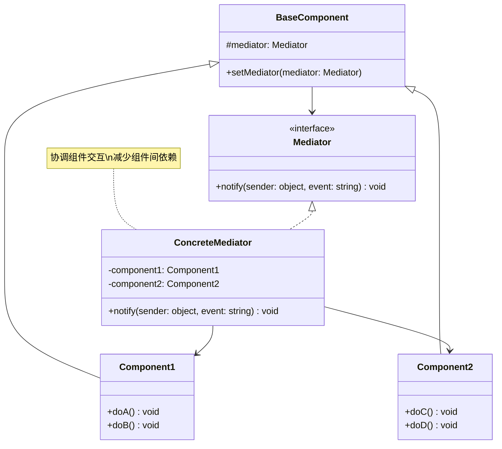

# 中介者 (Mediator)

## 概述

**定义**：让你能够减少对象之间的混乱依赖。通过限制对象之间的直接通信，强制它们通过一个中介者对象进行协作。

**分类**：行为型模式

---

## 问题场景

### 核心问题

1. **对象间复杂依赖**：多个对象之间存在复杂的相互引用关系
2. **难以维护**：修改一个对象可能影响多个其他对象
3. **重用困难**：对象因为依赖其他对象而难以独立重用
4. **逻辑分散**：业务逻辑分散在多个对象中

### 示例场景

- GUI组件通信：多个UI组件之间的交互
- 聊天室：用户之间的消息传递
- 航空管制系统：飞机与塔台的通信
- 智能家居：多个设备的协调控制
- MVC架构：控制器作为模型和视图的中介者

---

## 解决方案

### 核心思想

将对象之间的多对多关系转换为一对多关系，所有对象通过中介者进行通信，而不是直接相互引用。

### 设计原理

1. **中介者接口**：定义与同事对象通信的接口
2. **具体中介者**：协调多个同事对象之间的交互
3. **同事类**：通过中介者与其他同事通信
4. **松耦合**：同事对象之间不直接引用

---

## 结构

### UML 类图



### 参与者

- **Mediator（中介者接口）**：定义与同事对象通信的接口
- **ConcreteMediator（具体中介者）**：实现协调逻辑，管理具体的同事对象
- **BaseComponent（基础组件）**：存储对中介者的引用
- **ConcreteComponent（具体组件）**：通过中介者与其他组件通信

### 协作关系

1. 组件通过中介者的接口发送和接收消息
2. 中介者实现协调逻辑，将消息转发给相应的组件
3. 组件之间不直接引用，只通过中介者通信
4. 中介者可以扩展功能而不影响组件

---

## 代码示例

### 概念性实现

#### 核心代码

```typescript
/**
 * 中介者接口
 */
interface Mediator {
    notify(sender: object, event: string): void;
}

/**
 * 具体中介者
 */
class ConcreteMediator implements Mediator {
    private component1: Component1;
    private component2: Component2;

    constructor(c1: Component1, c2: Component2) {
        this.component1 = c1;
        this.component1.setMediator(this);
        this.component2 = c2;
        this.component2.setMediator(this);
    }

    public notify(sender: object, event: string): void {
        if (event === 'A') {
            console.log('Mediator reacts on A and triggers following operations:');
            this.component2.doC();
        }

        if (event === 'D') {
            console.log('Mediator reacts on D and triggers following operations:');
            this.component1.doB();
            this.component2.doC();
        }
    }
}

/**
 * 基础组件
 */
class BaseComponent {
    protected mediator: Mediator;

    constructor(mediator?: Mediator) {
        this.mediator = mediator!;
    }

    public setMediator(mediator: Mediator): void {
        this.mediator = mediator;
    }
}

/**
 * 具体组件1
 */
class Component1 extends BaseComponent {
    public doA(): void {
        console.log('Component 1 does A.');
        this.mediator.notify(this, 'A');
    }

    public doB(): void {
        console.log('Component 1 does B.');
        this.mediator.notify(this, 'B');
    }
}

/**
 * 具体组件2
 */
class Component2 extends BaseComponent {
    public doC(): void {
        console.log('Component 2 does C.');
        this.mediator.notify(this, 'C');
    }

    public doD(): void {
        console.log('Component 2 does D.');
        this.mediator.notify(this, 'D');
    }
}

/**
 * 客户端代码
 */
const c1 = new Component1();
const c2 = new Component2();
const mediator = new ConcreteMediator(c1, c2);

console.log('Client triggers operation A.');
c1.doA();

console.log('');
console.log('Client triggers operation D.');
c2.doD();
```

#### 运行结果

```
Client triggers operation A.
Component 1 does A.
Mediator reacts on A and triggers following operations:
Component 2 does C.

Client triggers operation D.
Component 2 does D.
Mediator reacts on D and triggers following operations:
Component 1 does B.
Component 2 does C.
```

#### 代码解析

1. **中介者接口**：`Mediator` 接口定义了 `notify` 方法
2. **具体中介者**：`ConcreteMediator` 协调组件1和组件2之间的交互
3. **基础组件**：`BaseComponent` 提供对中介者的引用
4. **具体组件**：组件通过中介者通知其他组件，而不是直接调用
5. **解耦合**：组件之间不直接引用，只通过中介者通信

---

### 实际应用示例

#### 应用场景

实现一个简单的聊天应用，用户可以订阅群组并发送消息。用户之间不直接通信，而是通过聊天应用中介者进行消息传递。

#### 核心代码

```typescript
/**
 * 中介者接口（扩展支持payload）
 */
interface Mediator {
    notify(sender: object, event: string, payload?: string): void;
}

/**
 * 用户类：扮演独立组件的角色
 */
class User {
    constructor(
        public name: string,
        private mediator: Mediator
    ) {
        this.mediator.notify(this, 'subscribe');
    }

    receiveMessage(message: string) {
        console.log(`Message received by ${this.name}: ${message}`);
    }

    publishMessage(message: string) {
        this.mediator.notify(this, 'publish', message);
    }
}

/**
 * 聊天应用中介者
 */
class ChatAppMediator implements Mediator {
    private users: User[] = [];

    public notify(sender: object, event: string, payload?: string): void {
        if (event === 'subscribe') {
            const user = sender as User;
            console.log(`Subscribing ${user.name}`);
            this.users.push(user);
        }

        if (event === 'publish') {
            console.log(`Publishing message "${payload}" to the group`);
            const usersExcludingSender = this.users.filter(u => u !== sender);
            for (const user of usersExcludingSender) {
                user.receiveMessage(payload);
            }
        }
    }
}

/**
 * 客户端代码
 */
const chatAppMediator = new ChatAppMediator();
const user1 = new User('Lightning', chatAppMediator);
const user2 = new User('Doc', chatAppMediator);
const user3 = new User('Mater', chatAppMediator);

user1.publishMessage('Catchaw');
user2.publishMessage('Ey kid');
user3.publishMessage('Tomato');
```

#### 运行结果

```
Subscribing Lightning
Subscribing Doc
Subscribing Mater
Publishing message "Catchaw" to the group
Message received by Doc: Catchaw
Message received by Mater: Catchaw
Publishing message "Ey kid" to the group
Message received by Lightning: Ey kid
Message received by Mater: Ey kid
Publishing message "Tomato" to the group
Message received by Lightning: Tomato
Message received by Doc: Tomato
```

#### 实现要点

1. **用户订阅**：创建用户时自动订阅到聊天应用
2. **消息发布**：用户发布消息，中介者转发给其他用户
3. **过滤发送者**：发送者不会收到自己发送的消息
4. **解耦合**：用户之间不直接引用，通过中介者通信
5. **易于扩展**：可以轻松添加新功能，如消息过滤、持久化等

---

## 适用场景

### ✅ 适合使用的场景

1. **对象间复杂交互**：多个对象之间存在复杂的引用关系
2. **难以复用**：对象因为依赖其他对象而难以独立重用
3. **逻辑分散**：业务逻辑分散在多个对象中
4. **需要集中控制**：需要集中控制对象之间的交互
5. **GUI应用**：UI组件之间的复杂交互

### ❌ 不适合使用的场景

1. **交互简单**：对象之间的交互很简单
2. **性能敏感**：中介者可能成为性能瓶颈
3. **责任明确**：每个对象的职责非常明确，不需要协调
4. **对象数量少**：只有少量对象，中介者可能过度设计

---

## 优缺点

### 优点

1. **降低耦合**：减少对象之间的直接依赖
2. **单一职责**：每个对象只关注自己的职责
3. **易于维护**：修改交互逻辑只需修改中介者
4. **可重用性**：对象可以独立重用
5. **集中控制**：集中管理对象之间的交互

### 缺点

1. **复杂度增加**：引入新的中介者类
2. **上帝对象**：中介者可能变得过于复杂
3. **维护困难**：中介者逻辑复杂时难以维护
4. **性能问题**：所有通信都通过中介者

---

## 与其他模式的关系

- **与观察者模式**：中介者可以使用观察者模式实现通信
- **与外观模式**：外观模式简化接口，中介者模式协调对象
- **与单例模式**：中介者通常实现为单例

---

## TypeScript 实现要点

### TypeScript 特性应用

1. **接口定义**：使用接口定义中介者契约
2. **类型注解**：确保中介者和组件的类型安全
3. **可选参数**：使用可选参数处理不同的通知类型
4. **访问修饰符**：使用 protected 和 private 控制访问

### 最佳实践

```typescript
/**
 * 泛型中介者接口
 */
interface GenericMediator<TComponent, TEvent> {
    notify(sender: TComponent, event: TEvent, payload?: any): void;
    register(component: TComponent): void;
    unregister(component: TComponent): void;
}

/**
 * 泛型中介者实现
 */
class GenericMediatorImpl<TComponent extends BaseComponent>
    implements GenericMediator<TComponent, string> {

    private components: Map<string, TComponent> = new Map();

    public register(component: TComponent): void {
        this.components.set(component.id, component);
        component.setMediator(this);
    }

    public unregister(component: TComponent): void {
        this.components.delete(component.id);
    }

    public notify(sender: TComponent, event: string, payload?: any): void {
        console.log(`Mediator: ${event} from ${sender.id}`);
        // 实现协调逻辑
    }
}

/**
 * 基础组件
 */
abstract class BaseComponent {
    abstract readonly id: string;
    protected mediator?: GenericMediator<BaseComponent, string>;

    public setMediator(mediator: GenericMediator<BaseComponent, string>): void {
        this.mediator = mediator;
    }
}

/**
 * 事件驱动的中介者
 */
class EventMediator implements Mediator {
    private eventHandlers: Map<string, Function[]> = new Map();

    public on(event: string, handler: Function): void {
        if (!this.eventHandlers.has(event)) {
            this.eventHandlers.set(event, []);
        }
        this.eventHandlers.get(event)!.push(handler);
    }

    public notify(sender: object, event: string, payload?: any): void {
        const handlers = this.eventHandlers.get(event);
        if (handlers) {
            for (const handler of handlers) {
                handler(sender, payload);
            }
        }
    }
}
```

---

## 参考资源

- Refactoring.Guru: [Mediator Pattern](https://refactoring.guru/design-patterns/mediator)
- GoF 原书：第 5 章 "行为型模式"
- 相关模式：[观察者](observer.md) | [外观](../structural/facade.md) | [单例](../creational/singleton.md)
