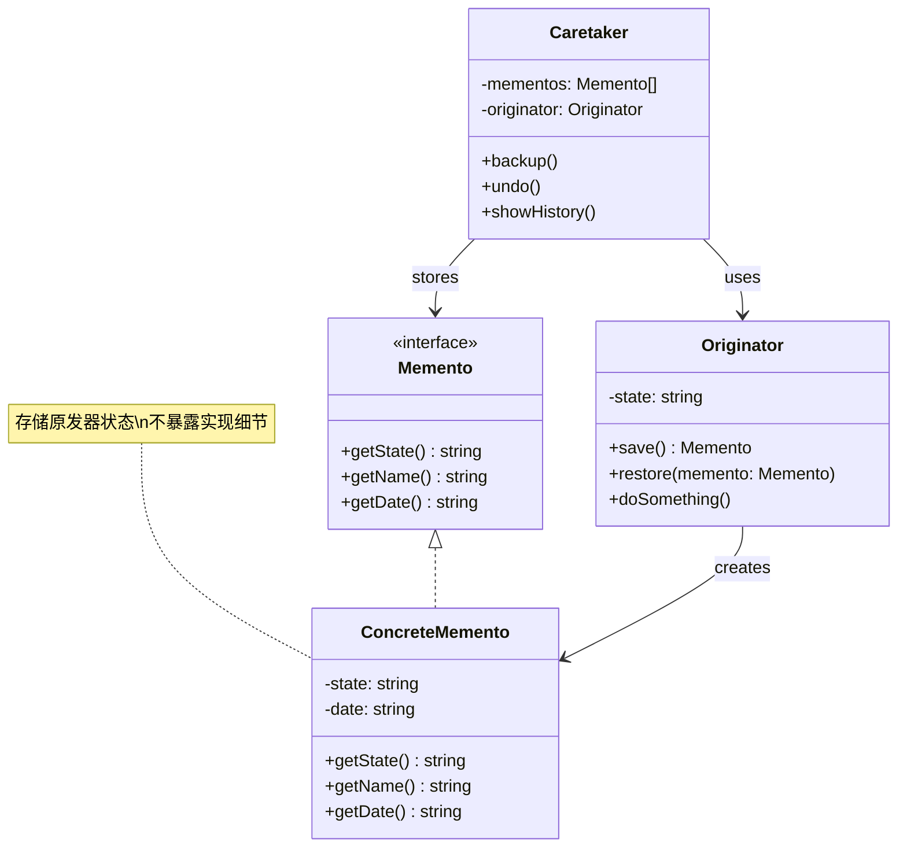

# 备忘录 (Memento)

## 概述

**定义**：让你能够保存和恢复对象的先前状态，而又不暴露其实现细节。

**分类**：行为型模式

---

## 问题场景

### 核心问题

1. **状态保存和恢复**：需要保存对象的状态，以便在需要时恢复
2. **封装性**：不希望暴露对象的内部实现细节
3. **撤销操作**：需要支持操作的撤销功能
4. **快照机制**：需要为对象创建快照

### 示例场景

- 文本编辑器：保存和恢复文档状态，支持撤销/重做
- 数据库事务：保存事务前的状态，支持回滚
- 游戏：保存游戏进度，支持读取存档
- 版本控制：保存文件的不同版本
- 表单填写：保存草稿，支持恢复

---

## 解决方案

### 核心思想

将对象的状态封装在独立的对象（备忘录）中，这样可以在不破坏封装性的前提下保存和恢复对象的状态。

### 设计原理

1. **原发器（Originator）**：创建备忘录，保存和恢复内部状态
2. **备忘录（Memento）**：存储原发器的内部状态
3. **负责人（Caretaker）**：负责保存备忘录，但不修改其内容

---

## 结构

### UML 类图



### 参与者

- **Originator（原发器）**：可以创建备忘录，保存和恢复其内部状态
- **Memento（备忘录接口）**：提供访问备忘录元数据的方法
- **ConcreteMemento（具体备忘录）**：存储原发器的内部状态
- **Caretaker（负责人）**：负责保存备忘录，但不修改其内容

### 协作关系

1. 客户端向原发器请求保存当前状态
2. 原发器创建包含其当前状态的备忘录对象
3. 负责人保存备忘录对象
4. 客户端请求撤销操作
5. 负责人将备忘录返回给原发器
6. 原发器从备忘录中恢复状态

---

## 代码示例

### 概念性实现

#### 核心代码

```typescript
/**
 * 原发器类
 */
class Originator {
    private state: string;

    constructor(state: string) {
        this.state = state;
        console.log(`Originator: My initial state is: ${state}`);
    }

    public doSomething(): void {
        console.log('Originator: I\'m doing something important.');
        this.state = this.generateRandomString(30);
        console.log(`Originator: and my state has changed to: ${this.state}`);
    }

    private generateRandomString(length: number = 10): string {
        const charSet = 'abcdefghijklmnopqrstuvwxyzABCDEFGHIJKLMNOPQRSTUVWXYZ';
        return Array
            .apply(null, { length })
            .map(() => charSet.charAt(Math.floor(Math.random() * charSet.length)))
            .join('');
    }

    /**
     * 保存当前状态到备忘录
     */
    public save(): Memento {
        return new ConcreteMemento(this.state);
    }

    /**
     * 从备忘录恢复状态
     */
    public restore(memento: Memento): void {
        this.state = memento.getState();
        console.log(`Originator: My state has changed to: ${this.state}`);
    }
}

/**
 * 备忘录接口
 */
interface Memento {
    getState(): string;
    getName(): string;
    getDate(): string;
}

/**
 * 具体备忘录
 */
class ConcreteMemento implements Memento {
    private state: string;
    private date: string;

    constructor(state: string) {
        this.state = state;
        this.date = new Date().toISOString().slice(0, 19).replace('T', ' ');
    }

    public getState(): string {
        return this.state;
    }

    public getName(): string {
        return `${this.date} / (${this.state.substr(0, 9)}...)`;
    }

    public getDate(): string {
        return this.date;
    }
}

/**
 * 负责人类
 */
class Caretaker {
    private mementos: Memento[] = [];
    private originator: Originator;

    constructor(originator: Originator) {
        this.originator = originator;
    }

    public backup(): void {
        console.log('\nCaretaker: Saving Originator\'s state...');
        this.mementos.push(this.originator.save());
    }

    public undo(): void {
        if (!this.mementos.length) {
            return;
        }
        const memento = this.mementos.pop();
        console.log(`Caretaker: Restoring state to: ${memento.getName()}`);
        this.originator.restore(memento);
    }

    public showHistory(): void {
        console.log('Caretaker: Here\'s the list of mementos:');
        for (const memento of this.mementos) {
            console.log(memento.getName());
        }
    }
}

/**
 * 客户端代码
 */
const originator = new Originator('Super-duper-super-puper-super.');
const caretaker = new Caretaker(originator);

caretaker.backup();
originator.doSomething();

caretaker.backup();
originator.doSomething();

caretaker.backup();
originator.doSomething();

console.log('');
caretaker.showHistory();

console.log('\nClient: Now, let\'s rollback!\n');
caretaker.undo();

console.log('\nClient: Once more!\n');
caretaker.undo();
```

#### 运行结果

```
Originator: My initial state is: Super-duper-super-puper-super.

Caretaker: Saving Originator's state...
Originator: I'm doing something important.
Originator: and my state has changed to: qbqRdUkEZFpDaXSCcMgRjAeUFSJzL

Caretaker: Saving Originator's state...
Originator: I'm doing something important.
Originator: and my state has changed to: kYXCzmDlHLBOpxTVJMQLRnYHgEOLNZ

Caretaker: Saving Originator's state...
Originator: I'm doing something important.
Originator: and my state has changed to: lVHUGtWHpBYhNQYIQJLMYfLYfhqKOM

Caretaker: Here's the list of mementos:
2024-01-26 10:30:00 / (Super-dup...)
2024-01-26 10:30:01 / (qbqRdUkE...)
2024-01-26 10:30:02 / (kYXCzmDl...)

Client: Now, let's rollback!

Caretaker: Restoring state to: 2024-01-26 10:30:02 / (kYXCzmDl...)
Originator: My state has changed to: kYXCzmDlHLBOpxTVJMQLRnYHgEOLNZ

Client: Once more!

Caretaker: Restoring state to: 2024-01-26 10:30:01 / (qbqRdUkE...)
Originator: My state has changed to: qbqRdUkEZFpDaXSCcMgRjAeUFSJzL
```

#### 代码解析

1. **原发器**：`Originator` 可以保存和恢复其状态
2. **备忘录接口**：`Memento` 接口只提供访问元数据的方法
3. **具体备忘录**：`ConcreteMemento` 存储原发器的状态
4. **负责人**：`Caretaker` 负责保存备忘录，但不访问其内容
5. **封装性**：负责人只能通过备忘录接口访问数据，不暴露实现细节

---

### 实际应用示例

#### 应用场景

实现一个员工管理系统，保存员工的所有版本状态。员工可以保存和恢复他们的备忘录，存储在历史记录类中作为负责人。

#### 核心代码

```typescript
const DEFAULT_MONTHLY_EXPENSES_LIMIT = 0;

/**
 * 原发器：员工类
 */
class EmployeeOriginator {
    private _name: string;
    private _salary: number;
    private _monthlyExpensesLimit: number;

    constructor(name: string, salary: number) {
        this._name = name;
        this._salary = salary;
        this._monthlyExpensesLimit = DEFAULT_MONTHLY_EXPENSES_LIMIT;
    }

    get name() { return this._name; }
    get salary() { return this._salary; }

    public raiseSalaryTo(newSalary: number) {
        this._salary = newSalary;
    }

    public raiseLimitTo(newLimit: number) {
        this._monthlyExpensesLimit = newLimit;
    }

    public saveSnapshot(): Memento<EmployeeState> {
        return new EmployeeMemento({
            salary: this._salary,
            monthlyExpensesLimit: this._monthlyExpensesLimit,
        });
    }

    public restore(memento: Memento<EmployeeState>): void {
        this._salary = memento.state.salary;
        this._monthlyExpensesLimit = memento.state.monthlyExpensesLimit;
        console.log(`Originator: Restored state from memento: ${memento.name}`);
    }

    public showState(): void {
        console.log(`Employee: State for ${this.name} is salary=${this._salary} and monthlyExpensesLimit=${this._monthlyExpensesLimit}`);
    }
}

/**
 * 备忘录接口
 */
interface Memento<T> {
    readonly state: T;
    readonly name: string;
    readonly date: Date;
}

/**
 * 员工状态接口
 */
interface EmployeeState {
    salary: number;
    monthlyExpensesLimit: number;
}

/**
 * 具体备忘录：员工备忘录
 */
class EmployeeMemento implements Memento<EmployeeState> {
    private _state: EmployeeState;
    private _date: Date;
    private _name: string;

    constructor(state: EmployeeState) {
        this._state = state;
        this._date = new Date();
        this._name = `date=${this._date.toISOString().substring(0, 10)}, salary=${this._state.salary}, limit=${this._state.monthlyExpensesLimit}`;
    }

    get state() { return this._state; }
    get name() { return this._name; }
    get date() { return this._date; }
}

/**
 * 负责人：员工历史记录
 */
class EmployeeCaretaker {
    private _employeeMementos: Memento<EmployeeState>[] = [];
    private _employee: EmployeeOriginator;

    constructor(employee: EmployeeOriginator) {
        this._employee = employee;
    }

    public backup(): void {
        console.log('Employee caretaker: Saving employee\'s state...');
        this._employeeMementos.push(this._employee.saveSnapshot());
    }

    public undo(): void {
        if (!this._employeeMementos.length) {
            return;
        }
        const employeeMementoToRestore = this._employeeMementos.pop();
        console.log(`Employee caretaker: Restoring memento: ${employeeMementoToRestore.name}`);
        this._employee.restore(employeeMementoToRestore);
    }

    public showHistory(): void {
        if (!this._employeeMementos.length) {
            console.log('Empty employee mementos list');
            return;
        }
        for (const memento of this._employeeMementos) {
            console.log(memento.name);
        }
    }
}

/**
 * 客户端代码
 */
console.log('Client: Creating employee originator and caretaker...');
const originator = new EmployeeOriginator('Justin Case', 50000);
const caretaker = new EmployeeCaretaker(originator);

console.log('\nClient: Let\'s change states saving state before each change...');
caretaker.backup();
originator.raiseSalaryTo(60000);
caretaker.backup();
originator.raiseLimitTo(100);
caretaker.backup();
originator.raiseSalaryTo(100000);

console.log('\nClient: This is the history of mementos and the state of the originator:');
caretaker.showHistory();
originator.showState();

console.log('\nClient: Changed state up to 3 times, let\'s rollback to the initial state!');
caretaker.undo();
originator.showState();
caretaker.undo();
originator.showState();
caretaker.undo();
originator.showState();

console.log('\nClient: Now the history of mementos should be empty');
caretaker.showHistory();

console.log('\nClient: A new undo will leave the employee untouched');
caretaker.undo();
originator.showState();
```

#### 运行结果

```
Client: Creating employee originator and caretaker...

Client: Let's change states saving state before each change...
Employee caretaker: Saving employee's state...
Employee caretaker: Saving employee's state...
Employee caretaker: Saving employee's state...

Client: This is the history of mementos and the state of the originator:
date=2024-01-26, salary=50000, limit=0
date=2024-01-26, salary=60000, limit=0
date=2024-01-26, salary=60000, limit=100
Employee: State for Justin Case is salary=100000 and monthlyExpensesLimit=100

Client: Changed state up to 3 times, let's rollback to the initial state!
Employee caretaker: Restoring memento: date=2024-01-26, salary=60000, limit=100
Originator: Restored state from memento: date=2024-01-26, salary=60000, limit=100
Employee: State for Justin Case is salary=60000 and monthlyExpensesLimit=100
Employee caretaker: Restoring memento: date=2024-01-26, salary=60000, limit=0
Originator: Restored state from memento: date=2024-01-26, salary=60000, limit=0
Employee: State for Justin Case is salary=60000 and monthlyExpensesLimit=0
Employee caretaker: Restoring memento: date=2024-01-26, salary=50000, limit=0
Originator: Restored state from memento: date=2024-01-26, salary=50000, limit=0
Employee: State for Justin Case is salary=50000 and monthlyExpensesLimit=0

Client: Now the history of mementos should be empty
Empty employee mementos list

Client: A new undo will leave the employee untouched
Employee: State for Justin Case is salary=50000 and monthlyExpensesLimit=0
```

#### 实现要点

1. **状态接口**：定义员工状态的接口，只包含需要保存的字段
2. **泛型备忘录**：使用泛型创建可重用的备忘录接口
3. **负责人管理**：负责人负责保存和管理备忘录历史
4. **封装性**：负责人只能通过备忘录接口访问状态
5. **版本控制**：可以保存多个版本的状态

---

## 适用场景

### ✅ 适合使用的场景

1. **需要保存状态**：需要保存对象的状态以便后续恢复
2. **撤销操作**：需要支持撤销/重做功能
3. **快照机制**：需要为对象创建快照
4. **封装性要求**：不希望暴露对象的内部实现细节
5. **事务处理**：需要保存事务前的状态

### ❌ 不适合使用的场景

1. **状态简单**：对象状态很简单，不值得使用备忘录
2. **内存敏感**：备忘录会占用较多内存
3. **不需要恢复**：不需要恢复之前的状态
4. **频繁变化**：对象状态频繁变化，备忘录会很多

---

## 优缺点

### 优点

1. **封装性**：不暴露对象的内部实现细节
2. **简化原发器**：原发器不需要管理和跟踪历史状态
3. **可控访问**：负责人只能访问备忘录的元数据
4. **支持撤销**：可以轻松实现撤销功能

### 缺点

1. **内存开销**：保存多个状态会占用大量内存
2. **维护成本**：维护备忘录历史需要额外的代码
3. **序列化复杂**：复杂对象的序列化和反序列化可能很复杂
4. **性能影响**：频繁保存状态可能影响性能

---

## 与其他模式的关系

- **与命令模式**：命令模式可以使用备忘录实现撤销功能
- **与迭代器模式**：迭代器可以使用备忘录保存当前位置
- **与原型模式**：可以使用原型模式创建备忘录的副本
- **与状态模式**：备忘录保存状态快照，状态模式改变状态

---

## TypeScript 实现要点

### TypeScript 特性应用

1. **泛型接口**：使用泛型创建类型安全的备忘录
2. **只读属性**：使用 `readonly` 确保备忘录的不可变性
3. **类型注解**：确保状态类型的正确性
4. **接口分离**：分离原发器、备忘录和负责人的职责

### 最佳实践

```typescript
/**
 * 泛型备忘录接口
 */
interface IMemento<TState> {
    readonly state: TState;
    readonly timestamp: Date;
    readonly version: number;
}

/**
 * 泛型原发器
 */
abstract class GenericOriginator<TState> {
    protected state: TState;

    constructor(initialState: TState) {
        this.state = initialState;
    }

    public save(): IMemento<TState> {
        return {
            state: { ...this.state },
            timestamp: new Date(),
            version: this.getVersion()
        };
    }

    public restore(memento: IMemento<TState>): void {
        this.state = { ...memento.state };
    }

    protected abstract getVersion(): number;
}

/**
 * 泛型负责人
 */
class GenericCaretaker<TState> {
    private history: IMemento<TState>[] = [];
    private maxSize: number;

    constructor(maxSize: number = 10) {
        this.maxSize = maxSize;
    }

    public add(memento: IMemento<TState>): void {
        this.history.push(memento);
        if (this.history.length > this.maxSize) {
            this.history.shift();
        }
    }

    public getLatest(): IMemento<TState> | undefined {
        return this.history[this.history.length - 1];
    }

    public getAt(index: number): IMemento<TState> | undefined {
        return this.history[index];
    }

    public getAll(): readonly IMemento<TState>[] {
        return this.history;
    }

    public clear(): void {
        this.history = [];
    }
}
```

### 序列化支持

```typescript
/**
 * 可序列化的备忘录
 */
interface SerializableMemento<TState> extends IMemento<TState> {
    serialize(): string;
}

class SerializableMementoImpl<TState> implements SerializableMemento<TState> {
    constructor(
        public readonly state: TState,
        public readonly timestamp: Date = new Date(),
        public readonly version: number = 1
    ) {}

    public serialize(): string {
        return JSON.stringify({
            state: this.state,
            timestamp: this.timestamp.toISOString(),
            version: this.version
        });
    }

    public static deserialize<TState>(json: string): SerializableMementoImpl<TState> {
        const data = JSON.parse(json);
        return new SerializableMementoImpl<TState>(
            data.state,
            new Date(data.timestamp),
            data.version
        );
    }
}

/**
 * 持久化负责人
 */
class PersistentCaretaker<TState> extends GenericCaretaker<TState> {
    constructor(
        maxSize: number = 10,
        private storageKey: string
    ) {
        super(maxSize);
        this.loadFromStorage();
    }

    public saveToStorage(): void {
        const serialized = this.getAll().map(m => m.serialize());
        localStorage.setItem(this.storageKey, JSON.stringify(serialized));
    }

    private loadFromStorage(): void {
        const stored = localStorage.getItem(this.storageKey);
        if (stored) {
            const deserialized: string[] = JSON.parse(stored);
            for (const item of deserialized) {
                const memento = SerializableMementoImpl.deserialize<any>(item);
                this.add(memento as any);
            }
        }
    }
}
```

---

## 参考资源

- Refactoring.Guru: [Memento Pattern](https://refactoring.guru/design-patterns/memento)
- GoF 原书：第 5 章 "行为型模式"
- 相关模式：[命令](command.md) | [迭代器](iterator.md) | [原型](../creational/prototype.md)
