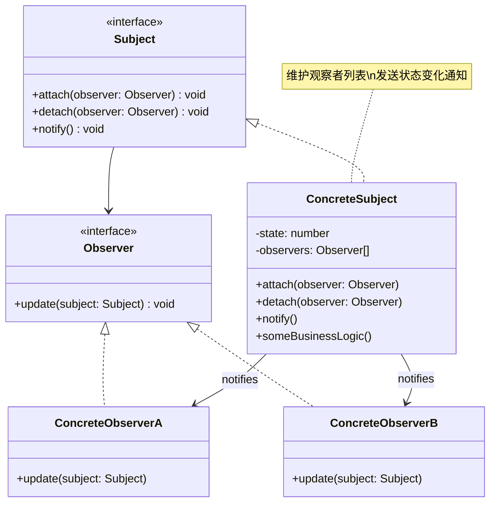

# 观察者 (Observer)

## 概述

**定义**：定义对象之间的一对多依赖关系，当一个对象状态改变时，所有依赖它的对象都会得到通知并自动更新。

**分类**：行为型模式

---

## 问题场景

### 核心问题

1. **对象间依赖**：一个对象的状态变化需要通知其他对象
2. **解耦发布和订阅**：发布者和订阅者之间不希望有紧密耦合
3. **动态订阅**：需要动态添加或删除观察者
4. **广播通知**：一个事件需要通知多个对象

### 示例场景

- GUI事件处理：按钮点击、窗口关闭等
- 数据绑定：数据模型变化通知视图更新
- 消息队列：发布-订阅模式
- 社交媒体：用户关注、点赞、评论通知
- 股票系统：股价变化通知投资者

---

## 解决方案

### 核心思想

定义对象间的一对多依赖关系，当一个对象（主题）状态改变时，所有依赖它的对象（观察者）都会得到通知并自动更新。

### 设计原理

1. **Subject（主题）**：也称为发布者，维护观察者列表，发送通知
2. **Observer（观察者）**：定义更新接口，接收主题通知
3. **ConcreteSubject（具体主题）**：实现主题接口，存储状态
4. **ConcreteObserver（具体观察者）**：实现观察者接口，响应通知

---

## 结构

### UML 类图



### 参与者

- **Subject（主题接口）**：定义添加、删除和通知观察者的方法
- **Observer（观察者接口）**：定义更新方法
- **ConcreteSubject（具体主题）**：存储状态，通知观察者
- **ConcreteObserver（具体观察者）**：实现更新方法

### 协作关系

1. 具体主题状态改变时，调用 `notify()` 方法
2. `notify()` 方法遍历所有观察者，调用它们的 `update()` 方法
3. 观察者收到通知后，根据自己的逻辑进行更新

---

## 代码示例

### 概念性实现

#### 核心代码

```typescript
/**
 * 主题接口
 */
interface Subject {
    attach(observer: Observer): void;
    detach(observer: Observer): void;
    notify(): void;
}

/**
 * 具体主题
 */
class ConcreteSubject implements Subject {
    public state: number;
    private observers: Observer[] = [];

    /**
     * 订阅管理方法
     */
    public attach(observer: Observer): void {
        const isExist = this.observers.includes(observer);
        if (isExist) {
            return console.log('Subject: Observer has been attached already.');
        }
        console.log('Subject: Attached an observer.');
        this.observers.push(observer);
    }

    public detach(observer: Observer): void {
        const observerIndex = this.observers.indexOf(observer);
        if (observerIndex === -1) {
            return console.log('Subject: Nonexistent observer.');
        }
        this.observers.splice(observerIndex, 1);
        console.log('Subject: Detached an observer.');
    }

    /**
     * 触发每个订阅者的更新
     */
    public notify(): void {
        console.log('Subject: Notifying observers...');
        for (const observer of this.observers) {
            observer.update(this);
        }
    }

    /**
     * 业务逻辑：状态改变时通知观察者
     */
    public someBusinessLogic(): void {
        console.log('\nSubject: I\'m doing something important.');
        this.state = Math.floor(Math.random() * (10 + 1));
        console.log(`Subject: My state has just changed to: ${this.state}`);
        this.notify();
    }
}

/**
 * 观察者接口
 */
interface Observer {
    update(subject: Subject): void;
}

/**
 * 具体观察者A
 */
class ConcreteObserverA implements Observer {
    public update(subject: Subject): void {
        if (subject instanceof ConcreteSubject && subject.state < 3) {
            console.log('ConcreteObserverA: Reacted to the event.');
        }
    }
}

/**
 * 具体观察者B
 */
class ConcreteObserverB implements Observer {
    public update(subject: Subject): void {
        if (subject instanceof ConcreteSubject && (subject.state === 0 || subject.state >= 2)) {
            console.log('ConcreteObserverB: Reacted to the event.');
        }
    }
}

/**
 * 客户端代码
 */
const subject = new ConcreteSubject();

const observer1 = new ConcreteObserverA();
subject.attach(observer1);

const observer2 = new ConcreteObserverB();
subject.attach(observer2);

subject.someBusinessLogic();
subject.someBusinessLogic();

subject.detach(observer2);

subject.someBusinessLogic();
```

#### 运行结果

```
Subject: Attached an observer.
Subject: Attached an observer.

Subject: I'm doing something important.
Subject: My state has just changed to: 6
Subject: Notifying observers...
ConcreteObserverB: Reacted to the event.

Subject: I'm doing something important.
Subject: My state has just changed to: 3
Subject: Notifying observers...
ConcreteObserverB: Reacted to the event.
Subject: Detached an observer.

Subject: I'm doing something important.
Subject: My state has just changed to: 2
Subject: Notifying observers...
ConcreteObserverA: Reacted to the event.
ConcreteObserverB: Reacted to the event.
```

#### 代码解析

1. **主题接口**：`Subject` 接口定义了订阅、取消和通知方法
2. **具体主题**：`ConcreteSubject` 维护观察者列表和状态
3. **观察者接口**：`Observer` 接口定义了更新方法
4. **具体观察者**：观察者根据自己的逻辑响应通知
5. **动态订阅**：可以动态添加和删除观察者

---

### 实际应用示例

#### 应用场景

实现一个音量控制器，记录用户对音量的所有修改操作。使用 Node.js 的 EventEmitter 实现观察者模式。

#### 核心代码

```typescript
import { EventEmitter } from 'node:events';

/**
 * 主题：音量控制器，继承 EventEmitter
 */
class VolumeControllerSubject extends EventEmitter {
    private _volume: number = 50;

    public get volume(): number { return this._volume; }

    constructor() {
        super();
        this.on('newListener', (eventName) => {
            console.log(`Added a new listener to the '${eventName}' event`);
        });
        this.on('removeListener', (eventName) => {
            console.log(`Removed a listener of the ${eventName} event from the list`);
        });
    }

    volumeUp(): void {
        this._volume += 5;
        this.emit('volumeUp', this._volume);
    }

    volumeDown(): void {
        this._volume -= 5;
        this.emit('volumeDown', this._volume);
    }
}

/**
 * 观察者：日志记录器
 */
class LoggingObserver {
    constructor(private volumeController: VolumeControllerSubject) {
        this.volumeController.on('volumeUp', this.volumeUpObserver);
        this.volumeController.on('volumeDown', this.volumeDownObserver);
    }

    private volumeUpObserver = (volume: number) => {
        console.log(`Volume up, now the volume value is ${volume}`);
    }

    private volumeDownObserver = (volume: number) => {
        console.log(`Volume down, now the volume value is ${volume}`);
    }

    public stopObservingVolumeDown() {
        this.volumeController.removeListener('volumeDown', this.volumeDownObserver);
    }
}

/**
 * 客户端代码
 */
const volumeController = new VolumeControllerSubject();
const loggingObserver = new LoggingObserver(volumeController);

console.log('\n=== Testing initial volume changes ===');
volumeController.volumeUp();
volumeController.volumeDown();
volumeController.volumeUp();
volumeController.volumeDown();

console.log('\n=== Stop observing volume down ===');
loggingObserver.stopObservingVolumeDown();

volumeController.volumeUp();
volumeController.volumeDown();
volumeController.volumeUp();
volumeController.volumeDown();
```

#### 运行结果

```
Added a new listener to the 'volumeUp' event
Added a new listener to the 'volumeDown' event

=== Testing initial volume changes ===
Volume up, now the volume value is 55
Volume down, now the volume value is 50
Volume up, now the volume value is 55
Volume down, now the volume value is 50

=== Stop observing volume down ===
Removed a listener of the volumeDown event from the list
Volume up, now the volume value is 55
Volume down, now the volume value is 50
Volume up, now the volume value is 55
Volume down, now the volume value is 50
```

#### 实现要点

1. **EventEmitter**：利用 Node.js 的 EventEmitter 实现观察者模式
2. **事件订阅**：在构造函数中自动订阅事件
3. **取消订阅**：可以取消订阅特定事件
4. **监听器管理**：自动记录新增和移除的监听器
5. **类型安全**：使用箭头函数保持 `this` 上下文

---

## 适用场景

### ✅ 适合使用的场景

1. **事件驱动系统**：GUI事件、用户交互等
2. **数据绑定**：数据模型变化通知视图更新
3. **发布-订阅**：消息队列、事件总线等
4. **分布式系统**：服务间的消息通知
5. **实时更新**：股票价格、社交媒体通知等

### ❌ 不适合使用的场景

1. **一对一关系**：只有一个观察者时，可能过度设计
2. **性能敏感**：大量观察者可能影响性能
3. **顺序依赖**：观察者之间有明确的执行顺序要求
4. **不确定性通知**：不确定何时需要通知

---

## 优缺点

### 优点

1. **开闭原则**：可以新增观察者而不修改主题代码
2. **运行时绑定**：可以动态添加和删除观察者
3. **解耦合**：主题和观察者之间松耦合
4. **广播通信**：一个事件可以通知多个对象
5. **符合单一职责**：主题只负责通知，观察者只负责更新

### 缺点

1. **性能问题**：大量观察者可能影响性能
2. **顺序不确定**：观察者的更新顺序不确定
3. **调试困难**：难以追踪观察者之间的交互
4. **内存泄漏**：未正确取消订阅可能导致内存泄漏
5. **循环依赖**：可能导致观察者和主题之间的循环依赖

---

## 与其他模式的关系

- **与中介者模式**：中介者可以使用观察者模式实现通信
- **与责任链模式**：观察者模式广播通知，责任链模式顺序传递
- **与单例模式**：主题通常实现为单例

---

## TypeScript 实现要点

### TypeScript 特性应用

1. **接口定义**：使用接口定义主题和观察者契约
2. **类型注解**：确保主题和观察者的类型安全
3. **泛型**：使用泛型创建通用的观察者类型
4. **EventEmitter**：利用 Node.js 的 EventEmitter

### 最佳实践

```typescript
/**
 * 泛型观察者接口
 */
interface GenericObserver<TData> {
    update(data: TData): void | Promise<void>;
}

/**
 * 泛型主题接口
 */
interface GenericSubject<TData> {
    subscribe(observer: GenericObserver<TData>): void;
    unsubscribe(observer: GenericObserver<TData>): void;
    notify(data: TData): void | Promise<void>;
}

/**
 * 泛型主题实现
 */
class GenericSubjectImpl<TData> implements GenericSubject<TData> {
    private observers: Set<GenericObserver<TData>> = new Set();

    public subscribe(observer: GenericObserver<TData>): void {
        this.observers.add(observer);
    }

    public unsubscribe(observer: GenericObserver<TData>): void {
        this.observers.delete(observer);
    }

    public async notify(data: TData): Promise<void> {
        for (const observer of this.observers) {
            await observer.update(data);
        }
    }
}

/**
 * 事件类型定义
 */
interface EventData {
    type: string;
    payload: any;
}

/**
 * 事件发射器
 */
class TypedEventEmitter<TEvents extends Record<string, any>> {
    private listeners: Map<keyof TEvents, Function[]> = new Map();

    public on<K extends keyof TEvents>(
        event: K,
        listener: (data: TEvents[K]) => void
    ): void {
        if (!this.listeners.has(event)) {
            this.listeners.set(event, []);
        }
        this.listeners.get(event)!.push(listener);
    }

    public off<K extends keyof TEvents>(
        event: K,
        listener: (data: TEvents[K]) => void
    ): void {
        const listeners = this.listeners.get(event);
        if (listeners) {
            const index = listeners.indexOf(listener);
            if (index !== -1) {
                listeners.splice(index, 1);
            }
        }
    }

    public emit<K extends keyof TEvents>(event: K, data: TEvents[K]): void {
        const listeners = this.listeners.get(event);
        if (listeners) {
            for (const listener of listeners) {
                listener(data);
            }
        }
    }
}

// 使用示例
interface AppEvents {
    userLogin: { userId: string; timestamp: Date };
    userLogout: { userId: string; timestamp: Date };
    messageReceived: { from: string; message: string };
}

const eventEmitter = new TypedEventEmitter<AppEvents>();

eventEmitter.on('userLogin', (data) => {
    console.log(`User ${data.userId} logged in at ${data.timestamp}`);
});

eventEmitter.emit('userLogin', { userId: '123', timestamp: new Date() });
```

### 自动清理机制

```typescript
/**
 * 可销毁的观察者
 */
interface Disposable {
    dispose(): void;
}

/**
 * 订阅令牌
 */
class Subscription implements Disposable {
    constructor(
        private subject: GenericSubjectImpl<any>,
        private observer: GenericObserver<any>
    ) {}

    public dispose(): void {
        this.subject.unsubscribe(this.observer);
    }
}

/**
 * 带自动清理的主题
 */
class AutoCleanupSubject<TData> implements GenericSubject<TData>, Disposable {
    private subject = new GenericSubjectImpl<TData>();
    private subscriptions: Disposable[] = [];

    public subscribe(observer: GenericObserver<TData>): Disposable {
        this.subject.subscribe(observer);
        const subscription = new Subscription(this.subject, observer);
        this.subscriptions.push(subscription);
        return subscription;
    }

    public unsubscribe(observer: GenericObserver<TData>): void {
        this.subject.unsubscribe(observer);
    }

    public notify(data: TData): Promise<void> {
        return this.subject.notify(data);
    }

    public dispose(): void {
        for (const subscription of this.subscriptions) {
            subscription.dispose();
        }
        this.subscriptions = [];
    }
}
```

---

## 参考资源

- Refactoring.Guru: [Observer Pattern](https://refactoring.guru/design-patterns/observer)
- GoF 原书：第 5 章 "行为型模式"
- 相关模式：[中介者](mediator.md) | [责任链](chain-of-responsibility.md) | [单例](../creational/singleton.md)
