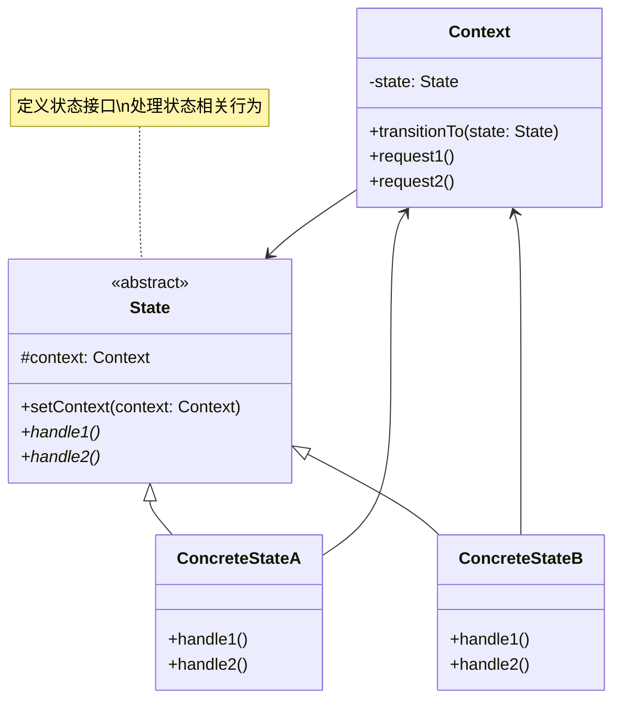

# 状态 (State)

## 概述

**定义**：允许一个对象在其内部状态改变时改变其行为。该对象看起来就像改变了它的类一样。

**分类**：行为型模式

---

## 问题场景

### 核心问题

1. **状态依赖行为**：对象的行为依赖于其当前状态
2. **大量条件语句**：代码中包含大量的 switch-case 或 if-else 语句
3. **状态转换**：对象需要在不同状态之间转换
4. **代码可维护性**：状态相关逻辑散布在多个方法中，难以维护

### 示例场景

- 订单系统：订单状态（待支付、已支付、已发货、已完成等）
- 文档编辑器：文档状态（编辑、预览、只读等）
- 游戏角色：角色状态（空闲、移动、攻击、受伤等）
- 音视频播放器：播放状态（播放、暂停、停止等）
- 自动售货机：机器状态（就绪、交易中、缺货等）

---

## 解决方案

### 核心思想

将对象的状态抽象为独立的类，对象在不同状态下具有不同的行为。状态转换时，切换到对应的状态对象。

### 设计原理

1. **Context（环境）**：维护当前状态的引用
2. **State（状态接口）**：定义所有状态的公共接口
3. **ConcreteState（具体状态）**：实现特定状态的行为
4. **状态转换**：状态对象可以请求环境转换到另一个状态

---

## 结构

### UML 类图



### 参与者

- **Context（环境）**：定义客户端感兴趣的接口，维护当前状态
- **State（状态接口）**：定义所有状态的公共接口
- **ConcreteState（具体状态）**：实现特定状态的行为
- **Client（客户端）**：使用环境对象

### 协作关系

1. 环境维护当前状态的引用
2. 客户端调用环境的方法
3. 环境将请求委托给当前状态对象
4. 状态对象处理请求，可能请求环境转换到另一个状态

---

## 代码示例

### 概念性实现

#### 核心代码

```typescript
/**
 * 环境类
 */
class Context {
    private state: State;

    constructor(state: State) {
        this.transitionTo(state);
    }

    /**
     * 环境允许在运行时改变状态
     */
    public transitionTo(state: State): void {
        console.log(`Context: Transition to ${(<any>state).constructor.name}.`);
        this.state = state;
        this.state.setContext(this);
    }

    /**
     * 环境将部分行为委托给当前状态对象
     */
    public request1(): void {
        this.state.handle1();
    }

    public request2(): void {
        this.state.handle2();
    }
}

/**
 * 基础状态类
 */
abstract class State {
    protected context: Context;

    public setContext(context: Context) {
        this.context = context;
    }

    public abstract handle1(): void;
    public abstract handle2(): void;
}

/**
 * 具体状态A
 */
class ConcreteStateA extends State {
    public handle1(): void {
        console.log('ConcreteStateA handles request1.');
        console.log('ConcreteStateA wants to change the state of the context.');
        this.context.transitionTo(new ConcreteStateB());
    }

    public handle2(): void {
        console.log('ConcreteStateA handles request2.');
    }
}

/**
 * 具体状态B
 */
class ConcreteStateB extends State {
    public handle1(): void {
        console.log('ConcreteStateB handles request1.');
    }

    public handle2(): void {
        console.log('ConcreteStateB handles request2.');
        console.log('ConcreteStateB wants to change the state of the context.');
        this.context.transitionTo(new ConcreteStateA());
    }
}

/**
 * 客户端代码
 */
const context = new Context(new ConcreteStateA());
context.request1();
context.request2();
```

#### 运行结果

```
Context: Transition to ConcreteStateA.
ConcreteStateA handles request1.
ConcreteStateA wants to change the state of the context.
Context: Transition to ConcreteStateB.
ConcreteStateB handles request2.
ConcreteStateB wants to change the state of the context.
Context: Transition to ConcreteStateA.
```

#### 代码解析

1. **环境类**：`Context` 维护当前状态的引用
2. **状态接口**：`State` 抽象类定义了状态的行为接口
3. **具体状态**：每个具体状态实现特定的行为
4. **状态转换**：状态可以请求环境转换到另一个状态
5. **行为委托**：环境将请求委托给当前状态对象

---

### 实际应用示例

#### 应用场景

实现一个多产品自动售货机的控制器。使用有限状态机来控制可能的状态和状态转换。

#### 核心代码

```typescript
/**
 * 辅助接口
 */
interface Coin {
    name: string;
    value: number;
}

interface Product {
    name: string;
    value: number;
}

interface InventoryItem {
    product: Product;
    items: number;
}

interface Inventory {
    items: InventoryItem[];
}

/**
 * 环境类：自动售货机
 */
class VendingMachineContext {
    private state: State;
    private credit: number = 0;
    private inventory: Inventory = INITIAL_INVENTORY;

    constructor(state: State) {
        this.transitionTo(state);
    }

    /**
     * 环境公共方法：状态将与之交互
     */
    public addCredit(credit: number) {
        this.credit += credit;
        console.log(`Credit is now ${this.credit}`);
    }

    public resetCredit() {
        this.credit = 0;
        console.log('Credit has been reset');
    }

    public hasStockOf(product: Product): boolean {
        return this.inventory.items.some(i => i.product.name === product.name && i.items > 0);
    }

    public isOutOfStock(): boolean {
        return !this.inventory.items.some(i => i.items > 0);
    }

    public dispenseProduct(product: Product) {
        if (product.value > this.credit) {
            throw new Error(`You are trying to buy a product with price ${product.value} but your credit is only ${this.credit}`);
        }
        if (!this.hasStockOf(product)) {
            throw new Error(`No ${product.name} products left, select another one`);
        }
        const inventoryItem = this.inventory.items.find(i => i.product.name === product.name);
        const newInventoryItem = {
            product,
            items: inventoryItem.items - 1,
        };
        const restOfInventory = this.inventory.items.filter(i => i.product.name !== product.name);
        this.inventory.items = [...restOfInventory, newInventoryItem];
        console.log(`Product ${product.name} dispensed. Inventory is now:`, this.inventory.items);
        this.resetCredit();
    }

    /**
     * 环境允许在运行时改变状态
     */
    public transitionTo(state: State): void {
        console.log(`Context: Transition to ${(<any>state).constructor.name}.`);
        this.state = state;
        this.state.setContext(this);
    }

    /**
     * 环境将部分行为委托给当前状态
     */
    public insertCoin(coin: Coin): void {
        this.state.insertCoin(coin);
    }

    public selectProduct(product: Product): void {
        this.state.selectProduct(product);
    }
}

/**
 * 基础状态类
 */
abstract class State {
    protected context: VendingMachineContext;

    public setContext(context: VendingMachineContext) {
        this.context = context;
    }

    public abstract insertCoin(coin: Coin): void;
    public abstract selectProduct(product: Product): void;
}

/**
 * 具体状态：初始就绪状态
 */
class InitialReadyState extends State {
    public insertCoin(coin: Coin): void {
        this.context.addCredit(coin.value);
        this.context.transitionTo(new TransactionStarted());
    }

    public selectProduct(_: Product): void {
        throw new Error('You should insert coins before selecting the product');
    }
}

/**
 * 具体状态：交易已开始
 */
class TransactionStarted extends State {
    public insertCoin(coin: Coin): void {
        this.context.addCredit(coin.value);
    }

    public selectProduct(product: Product): void {
        this.context.dispenseProduct(product);

        if (this.context.isOutOfStock()) {
            this.context.transitionTo(new OutOfStock());
        } else {
            this.context.transitionTo(new InitialReadyState());
        }
    }
}

/**
 * 具体状态：缺货状态
 */
class OutOfStock extends State {
    public insertCoin(_: Coin): void {
        throw new Error('Stop inserting coins, we completely run out of stock');
    }

    public selectProduct(_: Product): void {
        throw new Error('Stop selecting products, we completely run of stock');
    }
}

/**
 * 常量定义
 */
const SODA: Product = {
    name: 'Soda',
    value: 15,
};
const NUTS: Product = {
    name: 'Nuts',
    value: 25,
};

const INITIAL_INVENTORY: Inventory = {
    items: [
        { product: SODA, items: 2 },
        { product: NUTS, items: 0 },
    ],
};

const NICKEL = { name: 'nickel', value: 5 };
const DIME = { name: 'dime', value: 10 };

/**
 * 客户端代码
 */
const context = new VendingMachineContext(new InitialReadyState());

const handleError = (error: Error) => {
    console.error(error.message);
};

try {
    context.selectProduct(NUTS);
} catch (error) {
    handleError(error);
}

context.insertCoin(DIME);
try {
    context.selectProduct(SODA);
} catch (error) {
    handleError(error);
}

context.insertCoin(NICKEL);
context.selectProduct(SODA);

context.insertCoin(DIME);
context.insertCoin(NICKEL);
try {
    context.selectProduct(SODA);
} catch (error) {
    handleError(error);
}

try {
    context.insertCoin(NICKEL);
} catch (error) {
    handleError(error);
}
```

#### 运行结果

```
Context: Transition to InitialReadyState.
You should insert coins before selecting the product
Credit is now 10
Context: Transition to TransactionStarted.
You are trying to buy a product with price 15 but your credit is only 10
Credit is now 15
Product Soda dispensed. Inventory is now: [{product: {name: 'Soda', value: 15}, items: 1}]
Credit has been reset
Context: Transition to InitialReadyState.
Credit is now 10
Context: Transition to TransactionStarted.
Credit is now 15
Product Soda dispensed. Inventory is now: [{product: {name: 'Soda', value: 15}, items: 0}]
Credit has been reset
Context: Transition to OutOfStock.
Stop inserting coins, we completely run out of stock
```

#### 实现要点

1. **状态机**：实现了有限状态机，控制状态转换
2. **状态转换**：状态可以请求环境转换到另一个状态
3. **错误处理**：每个状态定义了合法操作，非法操作抛出异常
4. **关注点分离**：状态只负责状态转换，实际操作委托给环境
5. **扩展性**：可以轻松添加新的状态

---

## 适用场景

### ✅ 适合使用的场景

1. **状态依赖行为**：对象的行为依赖于其当前状态
2. **大量条件语句**：代码中包含大量与状态相关的条件语句
3. **状态转换**：对象需要在不同状态之间转换
4. **代码可维护性**：需要将状态相关逻辑集中管理
5. **游戏开发**：游戏角色、游戏关卡的状态管理

### ❌ 不适合使用的场景

1. **状态简单**：对象只有少量状态，不需要抽象
2. **状态不常变化**：对象状态很少变化
3. **性能敏感**：状态模式会增加对象数量

---

## 优缺点

### 优点

1. **单一职责**：每个状态类只负责一种状态的行为
2. **开闭原则**：可以新增状态而不修改现有代码
3. **消除条件语句**：将复杂的条件逻辑转换为状态类
4. **状态转换清晰**：状态转换逻辑明确
5. **易于维护**：状态相关逻辑集中管理

### 缺点

1. **类数量增加**：每个状态都是一个类
2. **状态转换分散**：状态转换逻辑分散在各个状态类中
3. **上下文依赖**：状态类需要了解环境的其他状态
4. **复杂性增加**：对于简单的状态机可能过度设计

---

## 与其他模式的关系

- **与策略模式**：状态模式根据状态改变行为，策略模式根据算法改变行为
- **与单例模式**：状态对象通常实现为单例
- **与观察者模式**：状态变化时可以通知观察者
- **与工厂模式**：可以使用工厂模式创建状态对象

---

## TypeScript 实现要点

### TypeScript 特性应用

1. **抽象类**：使用抽象类定义状态基类
2. **类型注解**：确保状态和环境的类型安全
3. **接口定义**：使用接口定义状态相关的数据结构
4. **访问修饰符**：使用 protected 控制访问

### 最佳实践

```typescript
/**
 * 状态接口
 */
interface IState<TContext> {
    enter(context: TContext): void;
    exit(context: TContext): void;
    update(context: TContext, deltaTime: number): void;
}

/**
 * 状态基类
 */
abstract class BaseState<TContext> implements IState<TContext> {
    public enter(context: TContext): void {
        // 默认实现：什么都不做
    }

    public exit(context: TContext): void {
        // 默认实现：什么都不做
    }

    public abstract update(context: TContext, deltaTime: number): void;
}

/**
 * 状态机
 */
class StateMachine<TContext> {
    private currentState: IState<TContext> | null = null;
    private previousState: IState<TContext> | null = null;
    private globalState: IState<TContext> | null = null;

    public setCurrentState(state: IState<TContext>, context: TContext): void {
        if (this.currentState) {
            this.currentState.exit(context);
        }
        this.previousState = this.currentState;
        this.currentState = state;
        this.currentState.enter(context);
    }

    public update(context: TContext, deltaTime: number): void {
        if (this.globalState) {
            this.globalState.update(context, deltaTime);
        }
        if (this.currentState) {
            this.currentState.update(context, deltaTime);
        }
    }

    public revertToPreviousState(context: TContext): void {
        if (this.previousState) {
            this.setCurrentState(this.previousState, context);
        }
    }
}

/**
 * 游戏角色状态示例
 */
interface GameContext {
    deltaTime: number;
}

class IdleState extends BaseState<GameContext> {
    public enter(context: GameContext): void {
        console.log('Entering Idle state');
    }

    public update(context: GameContext, deltaTime: number): void {
        console.log('Idling...');
    }
}

class MovingState extends BaseState<GameContext> {
    public enter(context: GameContext): void {
        console.log('Entering Moving state');
    }

    public update(context: GameContext, deltaTime: number): void {
        console.log('Moving...');
    }
}

// 使用示例
const stateMachine = new StateMachine<GameContext>();
const context: GameContext = { deltaTime: 0 };

stateMachine.setCurrentState(new IdleState(), context);
stateMachine.update(context, 16);
stateMachine.setCurrentState(new MovingState(), context);
stateMachine.update(context, 16);
```

### 状态转换表

```typescript
/**
 * 状态转换配置
 */
interface StateTransition {
    from: string;
    to: string;
    condition: (context: any) => boolean;
}

/**
 * 状态转换表
 */
class StateTransitionTable {
    private transitions: Map<string, StateTransition[]> = new Map();

    public addTransition(transition: StateTransition): void {
        if (!this.transitions.has(transition.from)) {
            this.transitions.set(transition.from, []);
        }
        this.transitions.get(transition.from)!.push(transition);
    }

    public getNextState(currentState: string, context: any): string | null {
        const transitions = this.transitions.get(currentState);
        if (!transitions) {
            return null;
        }

        for (const transition of transitions) {
            if (transition.condition(context)) {
                return transition.to;
            }
        }

        return null;
    }
}

/**
 * 使用状态转换表的状态机
 */
class TableDrivenStateMachine {
    private currentState: string;
    private transitionTable: StateTransitionTable;
    private states: Map<string, IState<any>>;

    constructor(
        initialState: string,
        transitionTable: StateTransitionTable,
        states: Map<string, IState<any>>
    ) {
        this.currentState = initialState;
        this.transitionTable = transitionTable;
        this.states = states;
    }

    public update(context: any): void {
        const nextState = this.transitionTable.getNextState(this.currentState, context);
        if (nextState) {
            const currentStateObj = this.states.get(this.currentState);
            const nextStateObj = this.states.get(nextState);

            if (currentStateObj) {
                currentStateObj.exit(context);
            }
            if (nextStateObj) {
                nextStateObj.enter(context);
            }

            this.currentState = nextState;
        }

        const currentStateObj = this.states.get(this.currentState);
        if (currentStateObj) {
            currentStateObj.update(context, 0);
        }
    }
}
```

---

## 参考资源

- Refactoring.Guru: [State Pattern](https://refactoring.guru/design-patterns/state)
- GoF 原书：第 5 章 "行为型模式"
- 相关模式：[策略](strategy.md) | [观察者](observer.md) | [单例](../creational/singleton.md)
