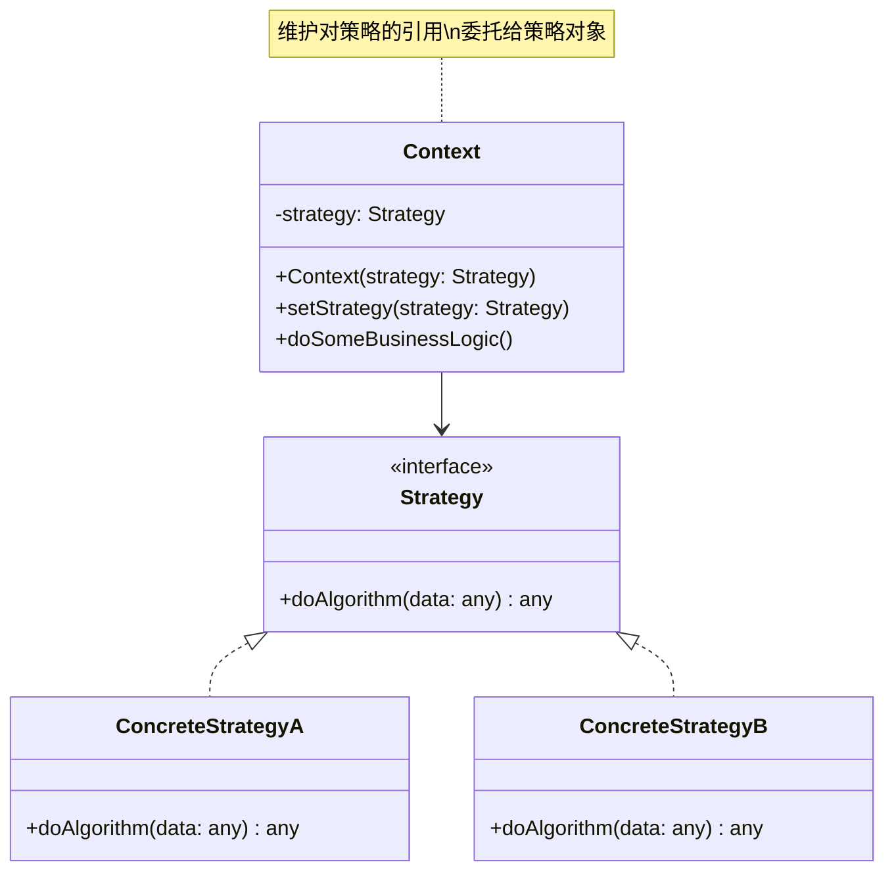

# 策略 (Strategy)

## 概述

**定义**：定义一系列算法，把它们一个个封装起来，并且使它们可以相互替换。策略模式让算法独立于使用它的客户而变化。

**分类**：行为型模式

---

## 问题场景

### 核心问题

1. **算法选择**：需要在运行时从多个算法中选择一个
2. **消除条件语句**：代码中包含大量与算法相关的条件语句
3. **算法变化**：算法经常变化，需要灵活扩展
4. **算法隔离**：需要将算法的定义和使用分离

### 示例场景

- 排序算法：冒泡排序、快速排序、归并排序等
- 支付方式：信用卡支付、支付宝、微信支付等
- 数据压缩：ZIP、RAR、7z等
- 路径规划：最短路径、最快路径、避开收费等
- 文件上传：本地存储、AWS S3、阿里云OSS等

---

## 解决方案

### 核心思想

将算法定义为独立的类，这些类都实现同一个接口。客户端可以动态选择使用哪个算法，而不需要知道算法的具体实现。

### 设计原理

1. **Strategy（策略接口）**：声明所有算法的公共接口
2. **ConcreteStrategy（具体策略）**：实现具体的算法
3. **Context（环境）**：维护对策略对象的引用，可以定义策略的接口

---

## 结构

### UML 类图



### 参与者

- **Strategy（策略接口）**：声明所有支持的算法的公共接口
- **ConcreteStrategy（具体策略）**：实现策略接口，提供具体的算法实现
- **Context（环境）**：维护对策略对象的引用，调用策略算法

### 协作关系

1. 客户端创建具体的策略对象
2. 客户端将策略对象传递给环境
3. 环境调用策略对象的算法方法
4. 策略对象执行具体的算法

---

## 代码示例

### 概念性实现

#### 核心代码

```typescript
/**
 * 策略接口
 */
interface Strategy {
    doAlgorithm(data: string[]): string[];
}

/**
 * 具体策略A：正序排序
 */
class ConcreteStrategyA implements Strategy {
    public doAlgorithm(data: string[]): string[] {
        return data.sort();
    }
}

/**
 * 具体策略B：反序排序
 */
class ConcreteStrategyB implements Strategy {
    public doAlgorithm(data: string[]): string[] {
        return data.reverse();
    }
}

/**
 * 环境类
 */
class Context {
    private strategy: Strategy;

    constructor(strategy: Strategy) {
        this.strategy = strategy;
    }

    public setStrategy(strategy: Strategy) {
        this.strategy = strategy;
    }

    public doSomeBusinessLogic(): void {
        console.log('Context: Sorting data using the strategy (not sure how it\'ll do it)');
        const result = this.strategy.doAlgorithm(['a', 'b', 'c', 'd', 'e']);
        console.log(result.join(','));
    }
}

/**
 * 客户端代码
 */
const context = new Context(new ConcreteStrategyA());
console.log('Client: Strategy is set to normal sorting.');
context.doSomeBusinessLogic();

console.log('');

console.log('Client: Strategy is set to reverse sorting.');
context.setStrategy(new ConcreteStrategyB());
context.doSomeBusinessLogic();
```

#### 运行结果

```
Client: Strategy is set to normal sorting.
Context: Sorting data using the strategy (not sure how it'll do it)
a,b,c,d,e

Client: Strategy is set to reverse sorting.
Context: Sorting data using the strategy (not sure how it'll do it)
e,d,c,b,a
```

#### 代码解析

1. **策略接口**：`Strategy` 接口定义了 `doAlgorithm` 方法
2. **具体策略**：`ConcreteStrategyA` 和 `ConcreteStrategyB` 实现不同的排序算法
3. **环境类**：`Context` 维护对策略的引用，委托策略执行算法
4. **运行时切换**：可以在运行时切换策略
5. **解耦合**：算法的定义和使用分离

---

### 实际应用示例

#### 应用场景

实现文件上传功能，支持上传到本地目录和 AWS S3。使用策略模式让用户可以选择不同的上传方式。

#### 核心代码

```typescript
import * as fs from "fs/promises";
import * as path from "path";

interface UploadResult {
    success: boolean;
    message: string;
}

interface UploadStrategy {
    upload(
        filePath: string,
        name: string,
        content: string
    ): Promise<UploadResult>;
}

/**
 * 具体策略：上传到本地存储
 */
class LocalUpload implements UploadStrategy {
    public upload(
        filePath: string,
        name: string,
        content: string
    ): Promise<UploadResult> {
        return new Promise((resolve, reject) => {
            const result: UploadResult = {
                success: true,
                message: "Uploaded to local storage",
            };

            fs.writeFile(path.join(__dirname, filePath, name), content)
                .then(() => {
                    resolve(result);
                })
                .catch((e) => {
                    const errorResult: UploadResult = {
                        success: false,
                        message: "Error uploading to local storage",
                    };
                    reject(errorResult);
                });
        });
    }
}

/**
 * 具体策略：上传到AWS S3（模拟实现）
 */
class AWSUpload implements UploadStrategy {
    public upload(
        filePath: string,
        name: string,
        content: string
    ): Promise<UploadResult> {
        return new Promise((resolve) => {
            const result: UploadResult = {
                success: true,
                message: "Uploaded to AWS storage",
            };

            setTimeout(() => {
                resolve(result);
            }, 1000);
        });
    }
}

/**
 * 环境类：文件上传上下文
 */
class Context {
    private strategy: UploadStrategy;

    constructor(strategy: UploadStrategy) {
        this.strategy = strategy;
    }

    public setStrategy(strategy: UploadStrategy) {
        this.strategy = strategy;
    }

    public fileUpload(
        filePath: string,
        name: string,
        content: string
    ): Promise<UploadResult> {
        return this.strategy.upload(filePath, name, content);
    }
}

/**
 * 客户端代码
 */
const localUpload = new LocalUpload();
const awsUpload = new AWSUpload();

const context = new Context(localUpload);

console.log('Uploading to local storage...');
context.fileUpload("/", "test-local.txt", "Hello Local Storage")
    .then((result) => {
        console.log(`${result.success ? '✓' : '✗'} ${result.message}`);
    })
    .catch((result) => {
        console.log(`${result.success ? '✓' : '✗'} ${result.message}`);
    });

console.log('\nSwitching to AWS storage...');
context.setStrategy(awsUpload);

console.log('Uploading to AWS S3...');
context.fileUpload("/", "test-aws.txt", "Hello AWS Storage")
    .then((result) => {
        console.log(`${result.success ? '✓' : '✗'} ${result.message}`);
    });
```

#### 运行结果

```
Uploading to local storage...
✓ Uploaded to local storage

Switching to AWS storage...
Uploading to AWS S3...
✓ Uploaded to AWS storage
```

#### 实现要点

1. **策略接口**：`UploadStrategy` 定义了上传策略的接口
2. **具体策略**：`LocalUpload` 和 `AWSUpload` 实现不同的上传方式
3. **环境类**：`Context` 维护对策略的引用，提供文件上传方法
4. **异步支持**：策略方法返回 Promise，支持异步操作
5. **可扩展性**：可以轻松添加新的上传策略（如阿里云OSS、Google Cloud等）

---

## 适用场景

### ✅ 适合使用的场景

1. **算法选择**：需要在运行时从多个算法中选择一个
2. **消除条件语句**：代码中包含大量与算法相关的条件语句
3. **算法变化**：算法经常变化，需要灵活扩展
4. **算法隔离**：需要将算法的定义和使用分离
5. **多种实现**：同一功能有多种实现方式

### ❌ 不适合使用的场景

1. **算法简单**：算法非常简单，不需要封装为类
2. **算法不变**：算法很少变化，不需要灵活切换
3. **客户端需要了解算法**：客户端需要了解算法的内部实现
4. **性能敏感**：策略模式会增加一些性能开销

---

## 优缺点

### 优点

1. **开闭原则**：可以新增策略而不修改现有代码
2. **单一职责**：每个策略类只负责一个算法
3. **运行时切换**：可以在运行时切换策略
4. **消除条件语句**：将复杂的条件逻辑转换为策略类
5. **解耦合**：算法的定义和使用分离

### 缺点

1. **类数量增加**：每个策略都是一个类
2. **客户端需要了解策略**：客户端需要知道不同策略的区别
3. **策略选择复杂**：策略的选择逻辑可能复杂
4. **通信开销**：环境类和策略类之间有通信开销

---

## 与其他模式的关系

- **与状态模式**：状态模式根据状态改变行为，策略模式根据算法改变行为
- **与工厂模式**：可以使用工厂模式创建策略对象
- **与装饰器模式**：装饰器模式增强功能，策略模式替换算法
- **与模板方法模式**：模板方法固定算法结构，策略模式替换整个算法

---

## TypeScript 实现要点

### TypeScript 特性应用

1. **接口定义**：使用接口定义策略契约
2. **泛型**：使用泛型创建通用策略
3. **类型注解**：确保策略和环境类的类型安全
4. **异步支持**：支持异步策略方法

### 最佳实践

```typescript
/**
 * 泛型策略接口
 */
interface IStrategy<TInput, TOutput> {
    execute(input: TInput): TOutput | Promise<TOutput>;
}

/**
 * 泛型环境类
 */
class StrategyContext<TInput, TOutput> {
    constructor(private strategy: IStrategy<TInput, TOutput>) {}

    public setStrategy(strategy: IStrategy<TInput, TOutput>): void {
        this.strategy = strategy;
    }

    public execute(input: TInput): TOutput | Promise<TOutput> {
        return this.strategy.execute(input);
    }
}

/**
 * 策略工厂
 */
class StrategyFactory {
    private static strategies: Map<string, IStrategy<any, any>> = new Map();

    public static register<TInput, TOutput>(
        name: string,
        strategy: IStrategy<TInput, TOutput>
    ): void {
        this.strategies.set(name, strategy);
    }

    public static get<TInput, TOutput>(
        name: string
    ): IStrategy<TInput, TOutput> | undefined {
        return this.strategies.get(name);
    }
}

/**
 * 使用示例：排序策略
 */
type SortAlgorithm = (data: number[]) => number[];

const bubbleSort: SortAlgorithm = (data) => {
    const arr = [...data];
    const n = arr.length;
    for (let i = 0; i < n - 1; i++) {
        for (let j = 0; j < n - i - 1; j++) {
            if (arr[j] > arr[j + 1]) {
                [arr[j], arr[j + 1]] = [arr[j + 1], arr[j]];
            }
        }
    }
    return arr;
};

const quickSort: SortAlgorithm = (data) => {
    if (data.length <= 1) return [...data];
    const pivot = data[0];
    const left = data.slice(1).filter(x => x < pivot);
    const right = data.slice(1).filter(x => x >= pivot);
    return [...quickSort(left), pivot, ...quickSort(right)];
};

/**
 * 排序策略类
 */
class SortStrategy implements IStrategy<number[], number[]> {
    constructor(private algorithm: SortAlgorithm) {}

    public execute(input: number[]): number[] {
        return this.algorithm(input);
    }
}

// 使用示例
StrategyFactory.register('bubble', new SortStrategy(bubbleSort));
StrategyFactory.register('quick', new SortStrategy(quickSort));

const context = new StrategyContext(StrategyFactory.get<number[], number[]>('quick')!);
const sorted = context.execute([3, 1, 4, 1, 5, 9, 2, 6]);
console.log(sorted);
```

### 策略组合

```typescript
/**
 * 组合策略
 */
class CompositeStrategy<TInput, TOutput> implements IStrategy<TInput, TOutput[]> {
    private strategies: IStrategy<TInput, TOutput>[] = [];

    public add(strategy: IStrategy<TInput, TOutput>): void {
        this.strategies.push(strategy);
    }

    public remove(strategy: IStrategy<TInput, TOutput>): void {
        const index = this.strategies.indexOf(strategy);
        if (index !== -1) {
            this.strategies.splice(index, 1);
        }
    }

    public async execute(input: TInput): Promise<TOutput[]> {
        const results: TOutput[] = [];
        for (const strategy of this.strategies) {
            const result = await strategy.execute(input);
            results.push(result);
        }
        return results;
    }
}

/**
 * 责任链策略
 */
class ChainStrategy<TInput, TOutput> implements IStrategy<TInput, TOutput> {
    private strategies: IStrategy<TInput, TOutput>[] = [];

    public add(strategy: IStrategy<TInput, TOutput>): void {
        this.strategies.push(strategy);
    }

    public async execute(input: TInput): Promise<TOutput> {
        let currentInput = input;
        for (const strategy of this.strategies) {
            const result = await strategy.execute(currentInput);
            // 如果策略返回了结果，停止链
            if (result !== undefined && result !== null) {
                return result;
            }
        }
        throw new Error('No strategy in the chain could handle the input');
    }
}
```

---

## 参考资源

- Refactoring.Guru: [Strategy Pattern](https://refactoring.guru/design-patterns/strategy)
- GoF 原书：第 5 章 "行为型模式"
- 相关模式：[状态](state.md) | [工厂方法](../creational/factory-method.md) | [模板方法](template-method.md)
