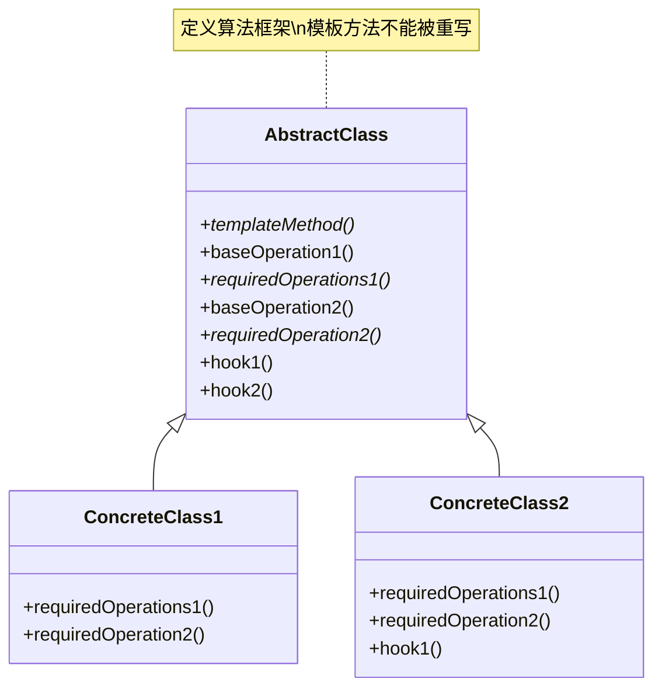

# 模板方法 (Template Method)

## 概述

**定义**：在超类中定义一个算法的框架，允许子类在不改变算法结构的情况下重写算法的特定步骤。

**分类**：行为型模式

---

## 问题场景

### 核心问题

1. **算法框架固定**：算法的整体结构固定，但某些步骤需要不同的实现
2. **代码复用**：多个子类有相似的算法逻辑，只有部分步骤不同
3. **控制子类扩展**：需要控制子类可以扩展哪些部分
4. **避免代码重复**：避免在多个子类中重复相同的代码

### 示例场景

- 数据处理流程：数据获取、处理、存储的固定流程
- 文档生成：不同格式的文档生成（HTML、PDF、Markdown等）
- 测试框架：测试的设置、执行、清理的固定流程
- 烹饪食谱：固定的烹饪步骤，但具体细节不同
- 建筑施工：固定的施工流程，但具体材料不同

---

## 解决方案

### 核心思想

将算法的不变部分移动到超类，将可变部分留给子类实现。超类定义算法的框架，子类实现具体的步骤。

### 设计原理

1. **AbstractClass（抽象类）**：定义算法框架和模板方法
2. **templateMethod（模板方法）**：定义算法的骨架
3. **primitiveOperation（基本操作）**：算法的各个步骤
4. **ConcreteClass（具体类）**：实现基本操作

---

## 结构

### UML 类图



### 参与者

- **AbstractClass（抽象类）**：定义算法的框架和模板方法
- **templateMethod（模板方法）**：定义算法的骨架
- **primitiveOperation（基本操作）**：算法的各个步骤，可以是抽象的或具体的
- **ConcreteClass（具体类）**：实现基本操作

### 协作关系

1. 抽象类定义模板方法，调用各种基本操作
2. 具体类实现基本操作
3. 客户端调用具体类的模板方法
4. 模板方法按照定义的顺序调用基本操作

---

## 代码示例

### 概念性实现

#### 核心代码

```typescript
/**
 * 抽象类：定义模板方法
 */
abstract class AbstractClass {
    /**
     * 模板方法定义了算法的骨架
     */
    public templateMethod(): void {
        this.baseOperation1();
        this.requiredOperations1();
        this.baseOperation2();
        this.hook1();
        this.requiredOperation2();
        this.baseOperation3();
        this.hook2();
    }

    /**
     * 这些操作已经实现了
     */
    protected baseOperation1(): void {
        console.log('AbstractClass says: I am doing the bulk of the work');
    }

    protected baseOperation2(): void {
        console.log('AbstractClass says: But I let subclasses override some operations');
    }

    protected baseOperation3(): void {
        console.log('AbstractClass says: But I am doing the bulk of the work anyway');
    }

    /**
     * 这些操作必须在子类中实现
     */
    protected abstract requiredOperations1(): void;
    protected abstract requiredOperation2(): void;

    /**
     * 这些是"钩子"方法。子类可以重写它们，但这不是强制的，
     * 因为钩子已经有默认（但为空）的实现。
     * 钩子在算法的关键位置提供了额外的扩展点。
     */
    protected hook1(): void { }
    protected hook2(): void { }
}

/**
 * 具体类1：必须实现所有抽象操作
 */
class ConcreteClass1 extends AbstractClass {
    protected requiredOperations1(): void {
        console.log('ConcreteClass1 says: Implemented Operation1');
    }

    protected requiredOperation2(): void {
        console.log('ConcreteClass1 says: Implemented Operation2');
    }
}

/**
 * 具体类2：可以重写一些操作
 */
class ConcreteClass2 extends AbstractClass {
    protected requiredOperations1(): void {
        console.log('ConcreteClass2 says: Implemented Operation1');
    }

    protected requiredOperation2(): void {
        console.log('ConcreteClass2 says: Implemented Operation2');
    }

    protected hook1(): void {
        console.log('ConcreteClass2 says: Overridden Hook1');
    }
}

/**
 * 客户端代码：调用模板方法
 */
function clientCode(abstractClass: AbstractClass) {
    abstractClass.templateMethod();
}

console.log('Same client code can work with different subclasses:');
clientCode(new ConcreteClass1());
console.log('');

console.log('Same client code can work with different subclasses:');
clientCode(new ConcreteClass2());
```

#### 运行结果

```
Same client code can work with different subclasses:
AbstractClass says: I am doing the bulk of the work
ConcreteClass1 says: Implemented Operation1
AbstractClass says: But I let subclasses override some operations
ConcreteClass1 says: Implemented Operation2
AbstractClass says: But I am doing the bulk of the work anyway

Same client code can work with different subclasses:
AbstractClass says: I am doing the bulk of the work
ConcreteClass2 says: Implemented Operation1
AbstractClass says: But I let subclasses override some operations
ConcreteClass2 says: Overridden Hook1
ConcreteClass2 says: Implemented Operation2
AbstractClass says: But I am doing the bulk of the work anyway
```

#### 代码解析

1. **模板方法**：`templateMethod` 定义了算法的骨架
2. **基本操作**：`baseOperation1/2/3` 是已实现的基本操作
3. **必需操作**：`requiredOperations1/2` 必须由子类实现
4. **钩子方法**：`hook1/2` 是可选的扩展点
5. **算法结构固定**：子类不能改变算法的执行顺序

---

### 实际应用示例

#### 应用场景

实现发票格式化功能，支持将发票格式化为HTML和Markdown格式。算法的框架固定，但具体格式化步骤由子类实现。

#### 核心代码

```typescript
/**
 * 辅助接口和类
 */
interface Country {
    name: string;
    vat: number;
}

interface Customer {
    name: string;
    id: string;
    country: Country;
}

interface InvoiceLine {
    product: string;
    units: number;
    unitPrice: number;
}

class Invoice {
    private _lines: InvoiceLine[] = [];
    private _notes: string = '';

    constructor(private readonly _customer: Customer) {}

    addLine(newLine: InvoiceLine) {
        this._lines = [...this._lines, newLine];
    }

    get taxes(): number {
        return this.subtotal * this.customer.country.vat;
    }

    get subtotal(): number {
        return this._lines.reduce(
            (acc, currLine) => (acc + currLine.unitPrice * currLine.units),
            0
        );
    }

    get total(): number {
        return this.subtotal + this.taxes;
    }

    get lines(): InvoiceLine[] {
        return this._lines;
    }

    get customer(): Customer {
        return this._customer;
    }

    get notes(): string { return this._notes; }
    set notes(notes: string) {
        this._notes = notes;
    }
}

/**
 * 抽象发票格式化器
 */
abstract class InvoiceFormatter {
    constructor(protected readonly invoice: Invoice) {}

    /**
     * 模板方法：定义格式化的框架
     */
    public format(): string {
        return `
${this.formatHeader()}
${this.hookFormatSubHeader()}
${this.formatCustomer()}
${this.formatInvoiceLines()}
${this.formatTaxes()}
${this.formatTotal()}
${this.formatFooter()}
${this.hookFormatSubFooter()}
`;
    }

    /**
     * 抽象方法：必须由子类实现
     */
    protected abstract formatHeader(): string;
    protected abstract formatCustomer(): string;
    protected abstract formatInvoiceLines(): string;
    protected abstract formatTaxes(): string;
    protected abstract formatFooter(): string;

    /**
     * 钩子方法：子类可以选择性重写
     */
    protected hookFormatSubHeader(): string { return ''; }
    protected formatTotal(): string {
        return `Total: ${this.invoice.total}€`;
    }
    protected hookFormatSubFooter(): string { return ''; }
}

/**
 * 具体格式化器：HTML格式
 */
class HtmlInvoiceFormatter extends InvoiceFormatter {
    protected formatHeader(): string {
        return '<h1>ACME S.L. Invoice</h1>';
    }

    protected hookFormatSubHeader(): string {
        return '</hr>';
    }

    protected formatCustomer(): string {
        return `<div id='customer'>Customer: ${this.invoice.customer.name}, id: ${this.invoice.customer.id}</div>`;
    }

    protected formatInvoiceLines(): string {
        return `<ul>\n${this.invoice.lines.map(l => (`  <li>${l.product}, units=${l.units}, amount=${l.units * l.unitPrice}€</li>`)).join('\n')}</ul>`;
    }

    protected formatTaxes(): string {
        return `<div>Taxes: ${this.invoice.taxes}€</div>`;
    }

    protected formatFooter(): string {
        return `<footer>Center Avenue, 42, Rockland  -  ${new Date().getFullYear()}</footer>`;
    }
}

/**
 * 具体格式化器：Markdown格式
 */
class MarkdownInvoiceFormatter extends InvoiceFormatter {
    protected formatHeader(): string {
        return '#ACME S.L. Invoice';
    }

    protected hookFormatSubHeader(): string {
        return '---';
    }

    protected formatCustomer(): string {
        return `Customer: **${this.invoice.customer.name}**, id: ${this.invoice.customer.id}`;
    }

    protected formatInvoiceLines(): string {
        return `${this.invoice.lines.map(l => (`*${l.product}, units=${l.units}, amount=${l.units * l.unitPrice}€`)).join('\n')}`;
    }

    protected formatTaxes(): string {
        return `Taxes: ${this.invoice.taxes}€`;
    }

    protected formatFooter(): string {
        return `Center Avenue, 42, Rockland  -  ${new Date().getFullYear()}`;
    }

    protected formatTotal(): string {
        return `**Total**: ${this.invoice.total}€`;
    }

    protected hookFormatSubFooter(): string {
        return '---';
    }
}

/**
 * 客户端代码
 */
const SPAIN: Country = {
    name: 'Spain',
    vat: 0.21,
};

const AMAZON: Customer = {
    name: 'Amazon Spain',
    id: 'amazon-spain',
    country: SPAIN,
};

const INVOICE = new Invoice(AMAZON);
INVOICE.addLine({ product: 'Nuts', units: 3, unitPrice: 5 });
INVOICE.addLine({ product: 'Still water', units: 10, unitPrice: 2 });
INVOICE.addLine({ product: 'Sandwich', units: 1, unitPrice: 10 });

console.log('Formatting in HTML');
console.log(new HtmlInvoiceFormatter(INVOICE).format());

console.log('\nFormatting in Markdown');
console.log(new MarkdownInvoiceFormatter(INVOICE).format());
```

#### 运行结果

```
Formatting in HTML
<h1>ACME S.L. Invoice</h1>
</hr>
<div id='customer'>Customer: Amazon Spain, id: amazon-spain</div>
<ul>
  <li>Nuts, units=3, amount=15€</li>
  <li>Still water, units=10, amount=20€</li>
  <li>Sandwich, units=1, amount=10€</li>
</ul>
<div>Taxes: 9.45€</div>
Total: 54.45€
<footer>Center Avenue, 42, Rockland  -  2024</footer>

Formatting in Markdown
#ACME S.L. Invoice
---
Customer: **Amazon Spain**, id: amazon-spain
*Nuts, units=3, amount=15€
*Still water, units=10, amount=20€
*Sandwich, units=1, amount=10€
Taxes: 9.45€
**Total**: 54.45€
Center Avenue, 42, Rockland  -  2024
---
```

#### 实现要点

1. **模板方法**：`format()` 方法定义了格式化的框架
2. **抽象方法**：子类必须实现的格式化步骤
3. **钩子方法**：子类可以选择性重写的扩展点
4. **算法结构固定**：格式化的顺序固定，不可改变
5. **代码复用**：公共逻辑在抽象类中实现

---

## 适用场景

### ✅ 适合使用的场景

1. **算法框架固定**：算法的整体结构固定，但某些步骤需要不同实现
2. **代码复用**：多个子类有相似的算法逻辑，避免代码重复
3. **控制扩展**：需要控制子类可以扩展哪些部分
4. **重构代码**：将重复的代码提取到超类

### ❌ 不适合使用的场景

1. **算法完全不同**：子类的算法完全不同，没有共同结构
2. **算法可变**：算法的执行顺序需要变化
3. **过度抽象**：为了使用模板方法而强行抽象

---

## 优缺点

### 优点

1. **代码复用**：将公共代码提取到超类，避免重复
2. **控制扩展**：可以控制子类可以扩展哪些部分
3. **一致性**：保证所有子类使用相同的算法结构
4. **开闭原则**：可以扩展子类而不修改超类

### 缺点

1. **限制灵活性**：子类不能改变算法的结构
2. **复杂度增加**：引入抽象类和继承层次
3. **维护困难**：抽象类的变化会影响所有子类
4. **违反里氏替换**：某些子类可能不需要所有步骤

---

## 与其他模式的关系

- **与工厂方法**：工厂方法通常是模板方法的一个步骤
- **与策略模式**：模板方法固定算法结构，策略模式替换整个算法
- **与组合模式**：组合模式可以用于构建复杂的算法结构

---

## TypeScript 实现要点

### TypeScript 特性应用

1. **抽象类**：使用抽象类定义模板方法
2. **抽象方法**：使用 `abstract` 关键字定义必须实现的方法
3. **访问修饰符**：使用 `protected` 控制方法访问
4. **可选重写**：提供默认实现，子类可以选择性重写

### 最佳实践

```typescript
/**
 * 泛型模板方法基类
 */
abstract class TemplateMethodBase<TInput, TOutput> {
    /**
     * 模板方法：定义算法框架
     */
    public execute(input: TInput): TOutput {
        this.validateInput(input);
        const processedData = this.processData(input);
        const result = this.generateResult(processedData);
        this.postProcess(result);
        return result;
    }

    /**
     * 基本操作：已实现的方法
     */
    protected validateInput(input: TInput): void {
        console.log('Validating input...');
    }

    protected postProcess(result: TOutput): void {
        console.log('Post-processing result...');
    }

    /**
     * 抽象方法：必须由子类实现
     */
    protected abstract processData(input: TInput): any;
    protected abstract generateResult(data: any): TOutput;
}

/**
 * 数据处理模板
 */
class DataProcessingTemplate extends TemplateMethodBase<any[], any[]> {
    protected processData(input: any[]): any[] {
        return input.filter(item => item !== null && item !== undefined);
    }

    protected generateResult(data: any[]): any[] {
        return data.map(item => ({ ...item, processed: true }));
    }
}

/**
 * 异步模板方法
 */
abstract class AsyncTemplateMethod<TInput, TOutput> {
    public async execute(input: TInput): Promise<TOutput> {
        await this.initialize(input);
        const result = await this.process(input);
        await this.finalize(result);
        return result;
    }

    protected async initialize(input: TInput): Promise<void> {
        console.log('Initializing...');
    }

    protected async finalize(result: TOutput): Promise<void> {
        console.log('Finalizing...');
    }

    protected abstract process(input: TInput): Promise<TOutput>;
}
```

### 钩子方法模式

```typescript
/**
 * 钩子方法接口
 */
interface TemplateHooks {
    beforeProcess?(): void;
    afterProcess?(): void;
    onError?(error: Error): void;
}

/**
 * 带钩子的模板方法
 */
abstract class TemplateWithHooks<TInput, TOutput> {
    protected hooks: TemplateHooks = {};

    public setHooks(hooks: TemplateHooks): void {
        this.hooks = { ...this.hooks, ...hooks };
    }

    public execute(input: TInput): TOutput {
        try {
            if (this.hooks.beforeProcess) {
                this.hooks.beforeProcess();
            }

            const result = this.process(input);

            if (this.hooks.afterProcess) {
                this.hooks.afterProcess();
            }

            return result;
        } catch (error) {
            if (this.hooks.onError) {
                this.hooks.onError(error as Error);
            }
            throw error;
        }
    }

    protected abstract process(input: TInput): TOutput;
}
```

### 模板方法回调

```typescript
/**
 * 模板方法配置
 */
interface TemplateConfig {
    step1: () => void;
    step2: () => void;
    step3: () => void;
}

/**
 * 可配置的模板方法
 */
class ConfigurableTemplate {
    private config: Partial<TemplateConfig> = {};

    public configure(config: Partial<TemplateConfig>): void {
        this.config = { ...this.config, ...config };
    }

    public execute(): void {
        console.log('Starting template method...');

        if (this.config.step1) {
            this.config.step1();
        } else {
            console.log('Default step 1');
        }

        if (this.config.step2) {
            this.config.step2();
        } else {
            console.log('Default step 2');
        }

        if (this.config.step3) {
            this.config.step3();
        } else {
            console.log('Default step 3');
        }

        console.log('Template method completed');
    }
}

// 使用示例
const template = new ConfigurableTemplate();
template.configure({
    step2: () => console.log('Custom step 2')
});
template.execute();
```

---

## 参考资源

- Refactoring.Guru: [Template Method Pattern](https://refactoring.guru/design-patterns/template-method)
- GoF 原书：第 5 章 "行为型模式"
- 相关模式：[工厂方法](../creational/factory-method.md) | [策略](strategy.md) | [组合](../structural/composite.md)
