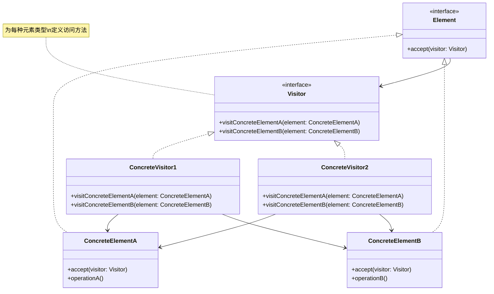

# 访问者 (Visitor)

## 概述

**定义**：允许你在不修改现有对象结构的前提下，定义作用于这些对象的新操作。

**分类**：行为型模式

---

## 问题场景

### 核心问题

1. **操作分离**：需要将操作从对象结构中分离出来
2. **添加新操作**：需要在对象结构上添加新操作，但不修改对象本身
3. **相关操作集中**：将相关的操作集中到一个类中
4. **避免类型检查**：避免大量的 instanceof 类型检查

### 示例场景

- 编译器：语法树遍历、类型检查、代码生成等
- 文档对象模型：导出为不同格式（PDF、HTML、RTF等）
- 购物车：计算运费、税费、折扣等
- 文件系统：遍历文件系统并执行不同操作
- 图形系统：图形对象的渲染、导出、碰撞检测等

---

## 解决方案

### 核心思想

将操作从对象结构中分离出来，定义独立的访问者类。对象结构中的元素接受访问者，并将自身传递给访问者，访问者执行相应的操作。

### 设计原理

1. **Visitor（访问者接口）**：声明访问操作，为每种元素类型定义一个访问方法
2. **ConcreteVisitor（具体访问者）**：实现访问操作，实现具体的业务逻辑
3. **Element（元素接口）**：声明 accept 方法，接收访问者
4. **ConcreteElement（具体元素）**：实现 accept 方法，调用访问者的访问方法

---

## 结构

### UML 类图



### 参与者

- **Visitor（访问者接口）**：声明访问操作，为每种具体元素定义一个访问方法
- **ConcreteVisitor（具体访问者）**：实现访问操作，实现具体的业务逻辑
- **Element（元素接口）**：声明 accept 方法，接收访问者
- **ConcreteElement（具体元素）**：实现 accept 方法

### 协作关系

1. 客户端创建具体的访问者对象
2. 客户端调用元素的 accept 方法，传入访问者
3. 元素的 accept 方法调用访问者的访问方法
4. 访问者执行具体的操作

---

## 代码示例

### 概念性实现

#### 核心代码

```typescript
/**
 * 元素接口
 */
interface Component {
    accept(visitor: Visitor): void;
}

/**
 * 具体元素A
 */
class ConcreteComponentA implements Component {
    public accept(visitor: Visitor): void {
        visitor.visitConcreteComponentA(this);
    }

    public exclusiveMethodOfConcreteComponentA(): string {
        return 'A';
    }
}

/**
 * 具体元素B
 */
class ConcreteComponentB implements Component {
    public accept(visitor: Visitor): void {
        visitor.visitConcreteComponentB(this);
    }

    public specialMethodOfConcreteComponentB(): string {
        return 'B';
    }
}

/**
 * 访问者接口
 */
interface Visitor {
    visitConcreteComponentA(element: ConcreteComponentA): void;
    visitConcreteComponentB(element: ConcreteComponentB): void;
}

/**
 * 具体访问者1
 */
class ConcreteVisitor1 implements Visitor {
    public visitConcreteComponentA(element: ConcreteComponentA): void {
        console.log(`${element.exclusiveMethodOfConcreteComponentA()} + ConcreteVisitor1`);
    }

    public visitConcreteComponentB(element: ConcreteComponentB): void {
        console.log(`${element.specialMethodOfConcreteComponentB()} + ConcreteVisitor1`);
    }
}

/**
 * 具体访问者2
 */
class ConcreteVisitor2 implements Visitor {
    public visitConcreteComponentA(element: ConcreteComponentA): void {
        console.log(`${element.exclusiveMethodOfConcreteComponentA()} + ConcreteVisitor2`);
    }

    public visitConcreteComponentB(element: ConcreteComponentB): void {
        console.log(`${element.specialMethodOfConcreteComponentB()} + ConcreteVisitor2`);
    }
}

/**
 * 客户端代码
 */
function clientCode(components: Component[], visitor: Visitor) {
    for (const component of components) {
        component.accept(visitor);
    }
}

const components = [
    new ConcreteComponentA(),
    new ConcreteComponentB(),
];

console.log('The client code works with all visitors via the base Visitor interface:');
const visitor1 = new ConcreteVisitor1();
clientCode(components, visitor1);
console.log('');

console.log('It allows the same client code to work with different types of visitors:');
const visitor2 = new ConcreteVisitor2();
clientCode(components, visitor2);
```

#### 运行结果

```
The client code works with all visitors via the base Visitor interface:
A + ConcreteVisitor1
B + ConcreteVisitor1

It allows the same client code to work with different types of visitors:
A + ConcreteVisitor2
B + ConcreteVisitor2
```

#### 代码解析

1. **元素接口**：`Component` 接口声明了 `accept` 方法
2. **具体元素**：元素实现 accept 方法，调用访问者的对应方法
3. **访问者接口**：`Visitor` 接口为每种元素类型定义访问方法
4. **具体访问者**：访问者实现具体的操作逻辑
5. **双重分派**：通过 accept 方法和访问者方法的组合实现双重分派

---

### 实际应用示例

#### 应用场景

计算一组产品的运费和税费。使用访问者模式，将运费和税费的计算逻辑从产品类中分离出来。

#### 核心代码

```typescript
/**
 * 元素接口
 */
interface VisitableComponent {
    accept(visitor: Visitor): number;
}

/**
 * 具体元素：耳机产品
 */
class HeadPhonesProduct implements VisitableComponent {
    constructor(
        public brand: string,
        public model: string,
        public isWireless: boolean,
        public weight: number,
        public price: number
    ) {}

    public accept(visitor: Visitor): number {
        return visitor.visitHeadPhones(this);
    }
}

/**
 * 具体元素：洗衣机产品
 */
class WashingMachineProduct implements VisitableComponent {
    constructor(
        public brand: string,
        public model: string,
        public isIndustrial: boolean,
        public weight: number,
        public price: number
    ) {}

    public accept(visitor: Visitor): number {
        return visitor.visitWashingMachine(this);
    }
}

/**
 * 具体元素：电视产品
 */
class TVProduct implements VisitableComponent {
    constructor(
        public brand: string,
        public model: string,
        public inches: number,
        public os: string,
        public price: number
    ) {}

    public accept(visitor: Visitor): number {
        return visitor.visitTV(this);
    }
}

/**
 * 访问者接口
 */
interface Visitor {
    visitHeadPhones(headphones: HeadPhonesProduct): number;
    visitWashingMachine(washingMachine: WashingMachineProduct): number;
    visitTV(tv: TVProduct): number;
}

/**
 * 具体访问者：运费计算器
 */
const CLASS_A_SHIPPING_COST_MULTIPLIER = 10;
const CLASS_B_SHIPPING_COST_MULTIPLIER = 0.005;
const CLASS_C_SHIPPING_COST_MULTIPLIER = 25;
const INDUSTRIAL_EXTRA_SHIPPING_COST = 200;
const STANDARD_EXTRA_SHIPPING_COST = 20;
const WEBOS_EXTRA_SHIPPING_COST = 20;
const APPLE_EXTRA_SHIPPING_COST = 100;
const APPLE_BRAND_NAME = 'Apple';
const WEBOS_OS_NAME = 'webOS';

class ShippingCostCalculatorVisitor implements Visitor {
    public visitHeadPhones(headphones: HeadPhonesProduct): number {
        const shippingCost = headphones.weight * CLASS_A_SHIPPING_COST_MULTIPLIER;
        if (headphones.brand === APPLE_BRAND_NAME) {
            return shippingCost + APPLE_EXTRA_SHIPPING_COST;
        }
        return shippingCost;
    }

    public visitWashingMachine(washingMachine: WashingMachineProduct): number {
        const shippingCost = washingMachine.weight * CLASS_B_SHIPPING_COST_MULTIPLIER;
        if (washingMachine.isIndustrial) {
            return shippingCost + INDUSTRIAL_EXTRA_SHIPPING_COST;
        }
        return shippingCost + STANDARD_EXTRA_SHIPPING_COST;
    }

    public visitTV(tv: TVProduct): number {
        const shippingCost = tv.inches * CLASS_C_SHIPPING_COST_MULTIPLIER;
        if (tv.os === WEBOS_OS_NAME) {
            return shippingCost + WEBOS_EXTRA_SHIPPING_COST;
        }
        return shippingCost;
    }
}

/**
 * 具体访问者：税费计算器
 */
const RECYCLABLE_ELECTRONIC_PRODUCT_SPECIAL_TAX = 25;
const VAT = 0.21;

class TaxCalculatorVisitor implements Visitor {
    visitHeadPhones(headphones: HeadPhonesProduct): number {
        return headphones.price * VAT;
    }

    visitWashingMachine(washingMachine: WashingMachineProduct): number {
        return washingMachine.price * VAT + RECYCLABLE_ELECTRONIC_PRODUCT_SPECIAL_TAX;
    }

    visitTV(tv: TVProduct): number {
        return tv.price * VAT;
    }
}

/**
 * 客户端代码
 */
function calculateCosts(
    products: VisitableComponent[],
    visitor: Visitor
): number {
    return products.reduce((acc, curr) => (acc + curr.accept(visitor)), 0);
}

const products = [
    new HeadPhonesProduct('Apple', 'Airpods', true, 50, 200),
    new WashingMachineProduct('Balay', 'C', false, 30000, 950),
    new TVProduct('LG', 'RW330', 65, 'WebOS', 350),
];

const shippingCostCalculator = new ShippingCostCalculatorVisitor();
const shippingCosts = calculateCosts(products, shippingCostCalculator);
console.log(`Total shipping costs are ${shippingCosts}`);

const taxesCalculator = new TaxCalculatorVisitor();
const taxes = calculateCosts(products, taxesCalculator);
console.log(`Total taxes are ${taxes}`);
```

#### 运行结果

```
Total shipping costs are 1750
Total taxes are 337
```

#### 实现要点

1. **元素接口**：`VisitableComponent` 接口声明了 `accept` 方法
2. **具体元素**：每个产品类实现 accept 方法，调用访问者的对应方法
3. **访问者接口**：`Visitor` 接口为每种产品类型定义访问方法
4. **具体访问者**：`ShippingCostCalculatorVisitor` 和 `TaxCalculatorVisitor` 实现不同的计算逻辑
5. **解耦合**：计算逻辑从产品类中分离出来，符合单一职责原则

---

## 适用场景

### ✅ 适合使用的场景

1. **添加新操作**：需要在对象结构上添加新操作，但不修改对象本身
2. **相关操作集中**：将相关的操作集中到一个类中
3. **复杂对象结构**：对象结构复杂，包含多种类型的对象
4. **避免类型检查**：避免大量的 instanceof 类型检查
5. **编译器实现**：语法树的遍历和操作

### ❌ 不适合使用的场景

1. **对象结构不稳定**：对象结构经常变化，需要修改访问者接口
2. **操作简单**：操作很简单，不值得使用访问者模式
3. **封装性要求高**：访问者模式会暴露元素的内部结构
4. **性能敏感**：访问者模式会增加一些性能开销

---

## 优缺点

### 优点

1. **开闭原则**：可以新增访问者而不修改元素类
2. **单一职责**：将相关的操作集中到访问者类中
3. **灵活性**：可以定义不同类型的访问者
4. **复用性**：访问者可以在多个对象结构上使用
5. **避免类型检查**：通过双重分派避免类型检查

### 缺点

1. **违反依赖倒置**：访问者依赖具体的元素类
2. **难以添加新元素**：添加新元素需要修改所有访问者
3. **封装性差**：访问者需要了解元素的内部结构
4. **复杂性增加**：增加了系统的复杂性
5. **学习成本**：双重分派的概念比较复杂

---

## 与其他模式的关系

- **与组合模式**：访问者模式常用于遍历组合模式构建的对象结构
- **与迭代器模式**：访问者可以使用迭代器遍历对象结构
- **与解释器模式**：访问者模式可以用于解释器的语法树遍历

---

## TypeScript 实现要点

### TypeScript 特性应用

1. **接口定义**：使用接口定义元素和访问者契约
2. **泛型**：使用泛型创建通用的访问者类型
3. **类型注解**：确保元素和访问者的类型安全
4. **重载方法**：为不同的元素类型定义重载方法

### 最佳实践

```typescript
/**
 * 泛型访问者接口
 */
interface IVisitor<TElement, TResult> {
    visit(element: TElement): TResult;
}

/**
 * 泛型元素接口
 */
interface IVisitable<TVisitor extends IVisitor<any, any>> {
    accept(visitor: TVisitor): any;
}

/**
 * 访问者基类
 */
abstract class BaseVisitor<TElement, TResult> implements IVisitor<TElement, TResult> {
    public abstract visit(element: TElement): TResult;
}

/**
 * 元素基类
 */
abstract class BaseElement<TVisitor extends IVisitor<any, any>> implements IVisitable<TVisitor> {
    public abstract accept(visitor: TVisitor): any;
}

/**
 * 访问者注册表
 */
class VisitorRegistry<TElement, TResult> {
    private visitors: Map<string, IVisitor<TElement, TResult>> = new Map();

    public register(type: string, visitor: IVisitor<TElement, TResult>): void {
        this.visitors.set(type, visitor);
    }

    public getVisitor(type: string): IVisitor<TElement, TResult> | undefined {
        return this.visitors.get(type);
    }

    public visit(element: TElement, type: string): TResult | undefined {
        const visitor = this.getVisitor(type);
        return visitor?.visit(element);
    }
}

/**
 * 访问者组合
 */
class CompositeVisitor<TElement, TResult> implements IVisitor<TElement, TResult> {
    private visitors: IVisitor<TElement, TResult>[] = [];

    public add(visitor: IVisitor<TElement, TResult>): void {
        this.visitors.push(visitor);
    }

    public visit(element: TElement): TResult {
        for (const visitor of this.visitors) {
            const result = visitor.visit(element);
            if (result !== undefined) {
                return result;
            }
        }
        throw new Error('No visitor could handle the element');
    }
}
```

### 反射式访问者

```typescript
/**
 * 反射式访问者
 */
class ReflectiveVisitor<TElement> {
    private handlers: Map<string, (element: any) => any> = new Map();

    public registerHandler(
        elementConstructor: Function,
        handler: (element: any) => any
    ): void {
        const typeName = elementConstructor.name;
        this.handlers.set(typeName, handler);
    }

    public visit(element: TElement): any {
        const typeName = element.constructor.name;
        const handler = this.handlers.get(typeName);

        if (!handler) {
            throw new Error(`No handler registered for type: ${typeName}`);
        }

        return handler(element);
    }
}

// 使用示例
class A {
    constructor(public value: string) {}
}

class B {
    constructor(public value: number) {}
}

const visitor = new ReflectiveVisitor<A | B>();
visitor.registerHandler(A, (element) => `A: ${element.value}`);
visitor.registerHandler(B, (element) => `B: ${element.value}`);

console.log(visitor.visit(new A('test')));
console.log(visitor.visit(new B(42)));
```

### 访问者缓存

```typescript
/**
 * 带缓存的访问者
 */
class CachedVisitor<TElement, TResult> implements IVisitor<TElement, TResult> {
    private cache: Map<string, TResult> = new Map();
    private visitor: IVisitor<TElement, TResult>;

    constructor(visitor: IVisitor<TElement, TResult>) {
        this.visitor = visitor;
    }

    public visit(element: TElement): TResult {
        const key = this.getCacheKey(element);

        if (this.cache.has(key)) {
            return this.cache.get(key)!;
        }

        const result = this.visitor.visit(element);
        this.cache.set(key, result);
        return result;
    }

    private getCacheKey(element: TElement): string {
        return JSON.stringify(element);
    }

    public clearCache(): void {
        this.cache.clear();
    }
}
```

---

## 参考资源

- Refactoring.Guru: [Visitor Pattern](https://refactoring.guru/design-patterns/visitor)
- GoF 原书：第 5 章 "行为型模式"
- 相关模式：[组合](../structural/composite.md) | [迭代器](iterator.md) | [解释器](interpreter.md)
