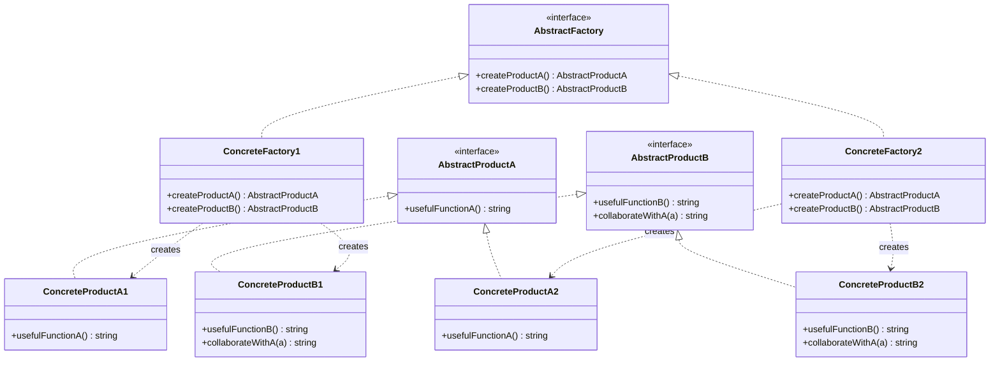

# 抽象工厂 (Abstract Factory)

## 概述

**定义**：提供创建一系列相关或相互依赖对象的接口，而无需指定它们具体的类。

**分类**：创建型模式

**别名**：Kit（工具箱）

---

## 问题场景

### 核心问题

当需要创建一系列相关的对象，并且要确保这些对象能够相互配合使用时，会遇到以下问题：

1. **产品族一致性**：需要确保创建的产品相互兼容（如 Windows 风格的按钮和窗口）
2. **依赖具体类**：代码直接使用 `new` 创建对象，与具体类紧密耦合
3. **难以切换系列**：更换产品系列（如从 Windows 换到 macOS）需要修改大量代码
4. **逻辑分散**：创建对象的逻辑分散在代码各处

### 示例场景

1. **跨平台 UI**：创建不同操作系统的 UI 组件（按钮、窗口、菜单）
2. **数据访问层**：支持多种数据库（MySQL、PostgreSQL、MongoDB）
3. **环境配置**：开发、测试、生产环境使用不同的服务实现
4. **主题系统**：支持多个主题的 UI 组件族

---

## 解决方案

### 核心思想

声明一个创建一系列对象的抽象工厂接口，每个具体工厂负责创建一个产品族（一组兼容的产品）。客户端通过抽象接口与工厂和产品交互，无需关心具体实现。

### 设计原理

1. **抽象工厂**：声明创建每种产品的抽象方法
2. **具体工厂**：实现抽象工厂，创建特定产品族
3. **产品接口**：每种产品声明通用接口
4. **产品族**：一组相互兼容的产品变体

---

## 结构

### UML 类图



### 参与者

- **AbstractFactory（抽象工厂）**：声明创建每种抽象产品的接口
- **ConcreteFactory（具体工厂）**：实现抽象工厂，创建特定产品族
- **AbstractProduct（抽象产品）**：声明一类产品的接口
- **ConcreteProduct（具体产品）**：实现抽象产品接口，由具体工厂创建
- **Client（客户端）**：使用抽象工厂和抽象产品接口

### 协作关系

1. 具体工厂创建一个产品族的所有产品
2. 产品族内的产品可以相互协作
3. 客户端通过抽象接口使用工厂和产品
4. 不同工厂创建的产品族相互独立，互不兼容

---

## 代码示例

### 概念性实现


#### 核心代码

```typescript
/**
 * 抽象工厂接口声明一组返回不同抽象产品的方法。
 * 这些产品被称为一个族，它们由高级主题或概念相关联。
 * 同一族的产品通常能够相互协作。
 */
interface AbstractFactory {
    createProductA(): AbstractProductA;
    createProductB(): AbstractProductB;
}

/**
 * 具体工厂生产属于单一变体的一族产品。
 * 工厂保证生成的产品是兼容的。
 */
class ConcreteFactory1 implements AbstractFactory {
    public createProductA(): AbstractProductA {
        return new ConcreteProductA1();
    }

    public createProductB(): AbstractProductB {
        return new ConcreteProductB1();
    }
}

/**
 * 每个具体工厂都有对应的产品变体。
 */
class ConcreteFactory2 implements AbstractFactory {
    public createProductA(): AbstractProductA {
        return new ConcreteProductA2();
    }

    public createProductB(): AbstractProductB {
        return new ConcreteProductB2();
    }
}

/**
 * 产品族的每个不同产品都应该有基础接口。
 * 产品的所有变体都必须实现此接口。
 */
interface AbstractProductA {
    usefulFunctionA(): string;
}

/**
 * 具体产品由对应的具体工厂创建。
 */
class ConcreteProductA1 implements AbstractProductA {
    public usefulFunctionA(): string {
        return '产品 A1 的结果。';
    }
}

class ConcreteProductA2 implements AbstractProductA {
    public usefulFunctionA(): string {
        return '产品 A2 的结果。';
    }
}

/**
 * 另一个产品的基础接口。
 * 所有产品可以相互交互，但正确的交互仅在同一具体变体的产品之间。
 */
interface AbstractProductB {
    usefulFunctionB(): string;
    /**
     * 产品 B 可以与产品 A 协作。
     * 抽象工厂确保其创建的所有产品具有相同的变体，因此兼容。
     */
    anotherUsefulFunctionB(collaborator: AbstractProductA): string;
}

/**
 * 具体产品 B1 只能与产品 A1 正确协作。
 */
class ConcreteProductB1 implements AbstractProductB {
    public usefulFunctionB(): string {
        return '产品 B1 的结果。';
    }

    public anotherUsefulFunctionB(collaborator: AbstractProductA): string {
        const result = collaborator.usefulFunctionA();
        return `B1 与 (${result}) 协作的结果`;
    }
}

/**
 * 具体产品 B2 只能与产品 A2 正确协作。
 */
class ConcreteProductB2 implements AbstractProductB {
    public usefulFunctionB(): string {
        return '产品 B2 的结果。';
    }

    public anotherUsefulFunctionB(collaborator: AbstractProductA): string {
        const result = collaborator.usefulFunctionA();
        return `B2 与 (${result}) 协作的结果`;
    }
}

/**
 * 客户端代码仅通过抽象类型与工厂和产品一起工作。
 * 这允许你将任何工厂或产品子类传递给客户端代码而不会破坏它。
 */
function clientCode(factory: AbstractFactory) {
    const productA = factory.createProductA();
    const productB = factory.createProductB();

    console.log(productB.usefulFunctionB());
    console.log(productB.anotherUsefulFunctionB(productA));
}

/**
 * 客户端代码可以与任何具体工厂类一起工作。
 */
console.log('客户端：测试第一种工厂类型...');
clientCode(new ConcreteFactory1());

console.log('');

console.log('客户端：测试第二种工厂类型...');
clientCode(new ConcreteFactory2());
```

#### 运行结果

```
客户端：测试第一种工厂类型...
产品 B1 的结果。
B1 与 (产品 A1 的结果。) 协作的结果

客户端：测试第二种工厂类型...
产品 B2 的结果。
B2 与 (产品 A2 的结果。) 协作的结果
```

#### 代码解析

1. **抽象工厂接口**：定义创建所有产品的方法
2. **具体工厂**：每个工厂创建一个完整的产品族
3. **产品接口**：每个产品类型声明通用接口
4. **产品协作**：同族产品可以相互协作（如 B1 调用 A1 的方法）
5. **客户端解耦**：客户端只依赖抽象接口，可以轻松切换工厂

---

### 实际应用示例


#### 应用场景

为不同环境（开发、生产）提供不同的基础设施连接器（数据库、文件系统、日志服务）。在开发环境使用模拟服务，在生产环境使用真实服务。

#### 核心代码

```typescript
/**
 * 抽象产品：数据库连接器。
 */
export abstract class DB {
    public abstract connect();
}

/**
 * 抽象产品：文件系统。
 */
export abstract class FS {
    public abstract readFile(filename: string);
}

/**
 * 抽象产品：日志提供者。
 */
export abstract class LogProvider {
    public abstract log(message: string);
}

/**
 * 具体产品：MySQL 数据库。
 */
export class MySQLDB extends DB {
    public connect() {
        console.log('已连接到 MySQL');
    }
}

/**
 * 具体产品：内存模拟数据库。
 */
export class InMemoryMockDB extends DB {
    public connect() {
        console.log('在内存中模拟数据库');
    }
}

/**
 * 具体产品：S3 文件系统。
 */
export class S3FS extends FS {
    public readFile(filename: string) {
        console.log(`从 S3 读取文件 ${filename}`);
    }
}

/**
 * 具体产品：真实文件系统。
 */
export class RealFS extends FS {
    public readFile(filename: string) {
        console.log(`从真实文件系统读取文件 ${filename}`);
    }
}

/**
 * 具体产品：模拟文件系统。
 */
export class MockFS extends FS {
    public readFile(filename: string) {
        console.log(`模拟读取文件 ${filename}`);
    }
}

/**
 * 具体产品：控制台日志提供者。
 */
export class ConsoleLogProvider extends LogProvider {
    public log(message: string) {
        console.log(`来自控制台：${message}`);
    }
}

/**
 * 具体产品：Sentry 日志提供者。
 */
export class SentryLogProvider extends LogProvider {
    public log(message: string) {
        console.log(`来自 Sentry：${message}`);
    }
}

/**
 * 抽象工厂：环境工厂。
 */
export abstract class EnvironmentFactory {
    public abstract getDB(): DB;
    public abstract getFS(): FS;
    public abstract getLogProvider(): LogProvider;
}

/**
 * 具体工厂：开发环境工厂。
 */
export class DevEnvironmentFactory extends EnvironmentFactory {
    public getDB(): DB {
        return new InMemoryMockDB();
    }

    public getFS(): FS {
        return new MockFS();
    }

    public getLogProvider(): LogProvider {
        return new ConsoleLogProvider();
    }
}

/**
 * 具体工厂：生产环境工厂。
 */
export class ProdEnvironmentFactory extends EnvironmentFactory {
    public getDB(): DB {
        return new MySQLDB();
    }

    public getFS(): FS {
        return new RealFS();
    }

    public getLogProvider(): LogProvider {
        return new SentryLogProvider();
    }
}

/**
 * 客户端函数接收工厂以生产其执行应用程序所需的内容。
 * 它不关心环境。
 */
function client(environmentFactory: EnvironmentFactory) {
    const db = environmentFactory.getDB();
    db.connect();

    const fs = environmentFactory.getFS();
    fs.readFile('document.txt');

    const logProvider = environmentFactory.getLogProvider();
    logProvider.log('hello world');
}

/**
 * 基于环境变量，将具体工厂实现注入到客户端函数。
 */
const env = process.env.NODE_ENV || 'development';

if (env === 'production') {
    console.log('=== 生产环境 ===');
    client(new ProdEnvironmentFactory());
} else {
    console.log('=== 开发环境 ===');
    client(new DevEnvironmentFactory());
}
```

#### 运行结果

```bash
NODE_ENV=development node index.js
# === 开发环境 ===
# 在内存中模拟数据库
# 模拟读取文件 document.txt
# 来自控制台：hello world

NODE_ENV=production node index.js
# === 生产环境 ===
# 已连接到 MySQL
# 从真实文件系统读取文件 document.txt
# 来自 Sentry：hello world
```

#### 实现要点

1. **产品族**：每个工厂创建三个相互兼容的服务（DB、FS、LogProvider）
2. **环境隔离**：开发和生产环境使用不同的实现，互不影响
3. **配置驱动**：通过环境变量选择工厂，无需修改代码
4. **客户端简化**：客户端代码不关心具体环境，只需调用工厂方法
5. **易于扩展**：添加新环境（如测试环境）只需创建新的具体工厂

---

## 适用场景

### ✅ 适合使用的场景

1. **产品族一致性**：需要确保创建的产品相互兼容
2. **多系列产品**：代码需要与多个不同系列的相关产品交互
3. **强调产品族**：系统主要关注产品族的接口，而不是具体实现
4. **运行时切换**：需要在运行时切换产品系列

### ❌ 不适合使用的场景

1. **单一产品**：只需要创建单一产品，使用工厂方法更简单
2. **产品族不稳定**：产品族经常变化，会导致频繁修改工厂
3. **不需要兼容性**：产品之间不需要相互协作

---

## 优缺点

### 优点

1. **产品一致性**：确保同一族的产品相互兼容
2. **避免紧耦合**：客户端不依赖具体类，符合依赖倒置原则
3. **易于切换**：可以轻松切换产品系列
4. **符合开闭原则**：添加新产品族无需修改客户端代码

### 缺点

1. **代码复杂**：引入了大量接口和类，增加了代码复杂度
2. **扩展困难**：添加新产品需要修改所有工厂
3. **抽象复杂**：过度抽象可能使代码难以理解

---

## 与其他模式的关系

- **与工厂方法**：抽象工厂通常使用一组工厂方法来实现
- **与单例模式**：具体工厂通常实现为单例
- **与原型模式**：可以使用原型模式来创建产品，而不是使用工厂方法
- **与外观模式**：外观可以与抽象工厂结合，简化复杂子系统的接口

---

## 抽象工厂 vs 工厂方法

### 工厂方法

**目的**：创建单一产品

```typescript
interface Factory {
    createProduct(): Product;
}

class Factory {
    createProduct() {
        return new ConcreteProduct();
    }
}
```

**特点**：
- 一个产品，多个子类
- 简单直接
- 易于扩展新产品

### 抽象工厂

**目的**：创建产品族

```typescript
interface AbstractFactory {
    createProductA(): ProductA;
    createProductB(): ProductB;
}
```

**特点**：
- 多个产品，一个工厂创建一个族
- 保证产品兼容性
- 更复杂，但适用于产品族场景

---

## TypeScript 实现要点

### TypeScript 特性应用

1. **抽象类**：使用 `abstract class` 定义抽象产品和工厂
2. **接口**：使用 `interface` 声明抽象产品接口
3. **实现接口**：使用 `implements` 关键字
4. **类型安全**：通过泛型和类型注解确保类型正确性

### 最佳实践

1. **产品族设计**：仔细设计产品族，确保族内产品兼容
2. **工厂命名**：具体工厂名称应反映其创建的产品族（如 `WindowsFactory`、`MacFactory`）
3. **依赖注入**：通过依赖注入传递工厂实例，提高可测试性
4. **配置管理**：使用配置文件或环境变量选择工厂

### 依赖注入示例

```typescript
class Application {
    private factory: GUIFactory;

    constructor(factory: GUIFactory) {
        this.factory = factory;
    }

    createUI() {
        const button = this.factory.createButton();
        const checkbox = this.factory.createCheckbox();
        // ...
    }
}

// 根据配置创建应用
const factory = config.os === 'Windows'
    ? new WindowsFactory()
    : new MacFactory();

const app = new Application(factory);
```

---

## 参考资源

- Refactoring.Guru: [Abstract Factory Pattern](https://refactoring.guru/design-patterns/abstract-factory)
- GoF 原书：第 3 章 "创建型模式"
- 相关模式：[工厂方法](factory-method.md) | [单例](singleton.md) | [原型](prototype.md)
