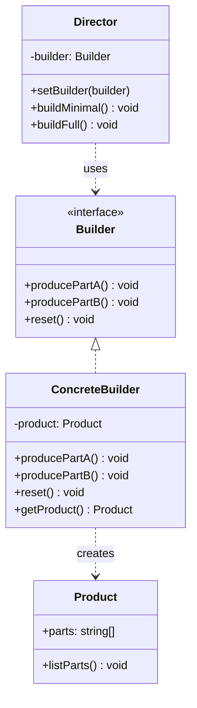

# 建造者 (Builder)

## 概述

**定义**：分步骤创建复杂对象，允许使用相同的创建代码生成不同类型和形式的对象。

**分类**：创建型模式

---

## 问题场景

### 核心问题

当需要创建一个复杂对象，该对象由多个部分组成，并且可能有多种不同的表示方式时，会遇到以下问题：

1. **重叠构造函数**：为了支持多种组合方式，需要创建大量构造函数，参数列表过长
2. **参数混淆**：多个相同类型的参数容易混淆（如 `boolean` 参数）
3. **不可变对象**：对象创建后不应修改，但需要在创建时设置大量属性
4. **复杂组装逻辑**：对象的组装过程复杂，需要按特定顺序执行

### 示例场景

1. **用户注册**：包含多个可选字段（姓名、邮箱、电话、地址等）
2. **SQL 查询构建器**：动态构建 SELECT、WHERE、JOIN 等子句
3. **文档生成器**：创建 PDF、Word 等复杂文档
4. **房屋建造**：建造不同类型的房屋（公寓、别墅、办公楼）

---

## 解决方案

### 核心思想

将对象构造代码从产品类中分离出来，放到一个独立的建造者对象中。建造者分步骤创建产品的各个部分，最后返回完整的产品。相同的构造过程可以创建不同的表示。

### 设计原理

1. **分离构造与表示**：将构造逻辑与产品表示分离
2. **分步构造**：一步步构造复杂对象，每个步骤负责创建一部分
3. **可选主管**：可以使用 Director 类管理构造步骤的顺序
4. **链式调用**：建造者方法通常返回 `this`，支持流式接口

---

## 结构

### UML 类图



### 参与者

- **Builder（建造者）**：声明创建产品各个部件的抽象接口
- **ConcreteBuilder（具体建造者）**：实现建造者接口，构造和装配产品的各个部件
- **Director（主管）**：使用建造者接口来构造对象，封装构造步骤的顺序（可选）
- **Product（产品）**：被构造的复杂对象

### 协作关系

1. 客户端创建具体建造者对象
2. 客户端将建造者传递给主管（或直接使用建造者）
3. 主管调用建造者的方法分步构造产品
4. 建造者返回构造好的产品
5. 客户端从建造者获取产品

---

## 代码示例

### 概念性实现


#### 核心代码

```typescript
/**
 * 建造者接口声明创建产品对象不同部分的方法。
 */
interface Builder {
    producePartA(): void;
    producePartB(): void;
    producePartC(): void;
}

/**
 * 具体建造者类遵循建造者接口，提供构建步骤的具体实现。
 */
class ConcreteBuilder1 implements Builder {
    private product: Product1;

    /**
     * 新的建造者实例应包含空白的产品的对象，用于后续组装。
     */
    constructor() {
        this.reset();
    }

    public reset(): void {
        this.product = new Product1();
    }

    /**
     * 所有生产步骤使用同一个产品实例。
     */
    public producePartA(): void {
        this.product.parts.push('PartA1');
    }

    public producePartB(): void {
        this.product.parts.push('PartB1');
    }

    public producePartC(): void {
        this.product.parts.push('PartC1');
    }

    /**
     * 具体建造者应提供自己的方法来检索结果。
     * 通常在返回结果后，建造者实例应准备好开始生产另一个产品。
     * 因此在 getProduct 方法体末尾调用 reset 方法是常见做法。
     */
    public getProduct(): Product1 {
        const result = this.product;
        this.reset();
        return result;
    }
}

/**
 * 只有当产品相当复杂且需要大量配置时，使用建造者模式才有意义。
 */
class Product1 {
    public parts: string[] = [];

    public listParts(): void {
        console.log(`产品部件：${this.parts.join(', ')}\n`);
    }
}

/**
 * 主管只负责按特定顺序执行构建步骤。
 * 严格来说，主管类是可选的，客户端可以直接控制建造者。
 */
class Director {
    private builder: Builder;

    /**
     * 主管与客户端代码传递给它的任何建造者实例一起工作。
     */
    public setBuilder(builder: Builder): void {
        this.builder = builder;
    }

    /**
     * 主管可以使用相同的构建步骤构造多个产品变体。
     */
    public buildMinimalViableProduct(): void {
        this.builder.producePartA();
    }

    public buildFullFeaturedProduct(): void {
        this.builder.producePartA();
        this.builder.producePartB();
        this.builder.producePartC();
    }
}

/**
 * 客户端代码创建建造者对象，将其传递给主管，然后启动构建过程。
 */
function clientCode(director: Director) {
    const builder = new ConcreteBuilder1();
    director.setBuilder(builder);

    console.log('标准基础产品：');
    director.buildMinimalViableProduct();
    builder.getProduct().listParts();

    console.log('标准完整产品：');
    director.buildFullFeaturedProduct();
    builder.getProduct().listParts();

    // 记住，建造者模式可以不使用主管类。
    console.log('自定义产品：');
    builder.producePartA();
    builder.producePartC();
    builder.getProduct().listParts();
}

const director = new Director();
clientCode(director);
```

#### 运行结果

```
标准基础产品：
产品部件：PartA1

标准完整产品：
产品部件：PartA1, PartB1, PartC1

自定义产品：
产品部件：PartA1, PartC1
```

#### 代码解析

1. **Builder 接口**：定义了所有构建步骤的接口
2. **ConcreteBuilder**：实现具体的构建逻辑，维护产品实例
3. **Director**：封装构建流程的顺序，提供预设的构建方案
4. **Product**：被构建的复杂对象，包含多个部件
5. **灵活性**：可以不使用 Director，直接调用 Builder 的方法

---

### 实际应用示例


#### 应用场景

实现用户注册系统，用户对象包含多个可选字段，需要灵活的构建方式，避免重叠构造函数问题。

#### 核心代码

```typescript
/**
 * 用户具体类。
 */
export class User {
  public name: string;
  public surname: string;
  public email: string;
  public gender: Gender = Gender.Undefined;
  public address: string;
  public isAdmin: boolean = false;
  public phoneNumber: string;

  public setName(name: string) {
    this.name = name;
  }

  public setSurname(surname: string) {
    this.surname = surname;
  }

  public setEmail(email: string) {
    // 邮箱格式验证
    if (!/^[\w-.]+@([\w-]+\.)+[\w-]{2,4}$/.test(email)) {
      throw new Error("邮箱格式无效");
    }
    this.email = email;
  }

  public setGender(gender: Gender) {
    this.gender = gender;
  }

  public setAddress(
    streetName: string,
    number: number,
    city: string,
    zipCode: string,
    country: string
  ) {
    this.address = `${streetName} ${number}, ${city} (${zipCode}) ${country}`;
  }

  public setIsAdmin(isAdmin: boolean) {
    this.isAdmin = isAdmin;
  }

  public setPhoneNumber(phoneNumber: string) {
    // 电话号码格式验证
    if (!/^[+]?[(]?\d{3}[)]?[-\s.]?\d{3}[-\s.]?\d{4,6}$/.test(phoneNumber)) {
      throw new Error("电话号码格式无效");
    }
    this.phoneNumber = phoneNumber;
  }
}

enum Gender {
  Male = "男",
  Female = "女",
  Undefined = "未指定",
}

/**
 * 通用建造者接口。
 */
export interface Builder {
  reset();
  getProduct();
}

/**
 * 用户具体建造者。
 */
export class UserBuilder implements Builder {
  #user: User;

  constructor() {
    this.reset();
  }

  public reset() {
    this.#user = new User();
    return this;
  }

  getProduct() {
    const product = this.#user;
    this.reset();  // 重置以准备下一次构建
    return product;
  }

  // 所有设置方法都返回 this，支持链式调用

  public setName(name: string) {
    this.#user.setName(name);
    return this;
  }

  public setSurname(surname: string) {
    this.#user.setSurname(surname);
    return this;
  }

  public setEmail(email: string) {
    this.#user.setEmail(email);
    return this;
  }

  public setMaleGender() {
    this.#user.setGender(Gender.Male);
    return this;
  }

  public setFemaleGender() {
    this.#user.setGender(Gender.Female);
    return this;
  }

  public setAddress(
    streetName: string,
    number: number,
    city: string,
    zipCode: string,
    country: string
  ) {
    this.#user.setAddress(streetName, number, city, zipCode, country);
    return this;
  }

  public setIsAdmin() {
    this.#user.setIsAdmin(true);
    return this;
  }

  public setPhoneNumber(phoneNumber: string) {
    this.#user.setPhoneNumber(phoneNumber);
    return this;
  }
}

/**
 * 客户端可以使用单个建造者创建所需的用户。
 */
const userBuilder = new UserBuilder();

// 创建基本用户
const user1 = userBuilder
  .setName("张三")
  .setSurname("李四")
  .setEmail("zhangsan@example.com")
  .setMaleGender()
  .getProduct();

// 创建带地址的用户
const user2 = userBuilder
  .setName("王五")
  .setPhoneNumber("+8613800138000")
  .setAddress("中关村大街", 1, "北京", "100080", "中国")
  .getProduct();

// 创建管理员用户
const user3 = userBuilder
  .setEmail("admin@example.com")
  .setIsAdmin()
  .getProduct();

console.log('用户1：', user1);
console.log('用户2：', user2);
console.log('用户3：', user3);
```

#### 运行结果

```
用户1： User {
  name: '张三',
  surname: '李四',
  email: 'zhangsan@example.com',
  gender: '男',
  isAdmin: false,
  ...
}
用户2： User {
  name: '王五',
  phoneNumber: '+8613800138000',
  address: '中关村大街 1, 北京 (100080) 中国',
  gender: '未指定',
  isAdmin: false,
  ...
}
用户3： User {
  email: 'admin@example.com',
  gender: '未指定',
  isAdmin: true,
  ...
}
```

#### 实现要点

1. **链式调用**：所有 setter 方法返回 `this`，支持流式接口
2. **输入验证**：在建造者中验证输入（邮箱、电话号码格式）
3. **灵活性**：可以选择设置任意字段，不设置的保持默认值
4. **可重用**：同一个建造者可以创建多个不同的用户
5. **私有字段**：使用 `#user` 私有字段保护产品实例

---

## 适用场景

### ✅ 适合使用的场景

1. **避免重叠构造函数**：需要多个构造函数，参数组合复杂
2. **分步创建对象**：对象的创建过程需要多个步骤
3. **不同表示**：使用相同的构造过程创建不同的产品表示
4. **不可变对象**：对象创建后不应修改，需要在创建时设置所有属性

### ❌ 不适合使用的场景

1. **简单对象**：对象构造简单，不需要多个步骤
2. **不需要配置**：产品的配置固定，不需要灵活组合
3. **类型安全**：编译时必须知道所有参数（可以使用构建器模式变体）

---

## 优缺点

### 优点

1. **分步构造**：可以分步骤创建对象，控制构造过程
2. **代码复用**：相同的构造过程可以创建不同的产品
3. **单一职责**：将构造逻辑从业务逻辑中分离
4. **灵活性**：可以改变产品的内部表示

### 缺点

1. **代码复杂度**：增加了多个类，增加了代码复杂度
2. **内部耦合**：产品与建造者紧密耦合
3. **内存占用**：如果产品很复杂，建造者会占用较多内存

---

## 与其他模式的关系

- **与抽象工厂**：抽象工厂专注于创建产品系列，建造者专注于分步构造复杂对象
- **与原型模式**：可以使用建造者来构造原型对象
- **与组合模式**：建造者常用于构造复杂的组合结构树

---

## TypeScript 实现要点

### TypeScript 特性应用

1. **私有字段**：使用 `#` 语法或 `private` 关键字保护产品实例
2. **接口定义**：使用 `interface` 定义建造者接口
3. **类型安全**：通过类型系统确保产品和建造者的类型正确性
4. **枚举**：使用 `enum` 定义固定值集合

### 最佳实践

1. **链式调用**：所有 setter 方法返回 `this`，支持流式接口
2. **不可变产品**：产品创建后不应修改，确保对象一致性
3. **验证逻辑**：在建造者中包含参数验证逻辑
4. **重置方法**：提供 `reset()` 方法，支持建造者重用

### 流式接口实现

```typescript
class FluentBuilder {
  private product: Product = new Product();

  setField(value: string): this {
    this.product.field = value;
    return this;  // 返回 this 支持链式调用
  }

  setAnotherField(value: number): this {
    this.product.anotherField = value;
    return this;
  }

  build(): Product {
    return this.product;
  }
}

// 使用
const product = new FluentBuilder()
  .setField("value")
  .setAnotherField(42)
  .build();
```

---

## 建造者 vs 重叠构造函数

### 重叠构造函数问题

```typescript
// 不好的做法：重叠构造函数
class User {
  constructor(name: string);
  constructor(name: string, email: string);
  constructor(name: string, email: string, phone: string);
  constructor(name: string, email?: string, phone?: string) {
    // 参数混淆，难以理解
  }
}

// 使用时容易出错
new User("张三", undefined, "123456");
```

### 建造者模式解决方案

```typescript
// 好的做法：使用建造者
const user = new UserBuilder()
  .setName("张三")
  .setPhoneNumber("123456")
  .getProduct();
```

---

## 参考资源

- Refactoring.Guru: [Builder Pattern](https://refactoring.guru/design-patterns/builder)
- GoF 原书：第 3 章 "创建型模式"
- 相关模式：[工厂方法](factory-method.md) | [抽象工厂](abstract-factory.md) | [原型](prototype.md)
