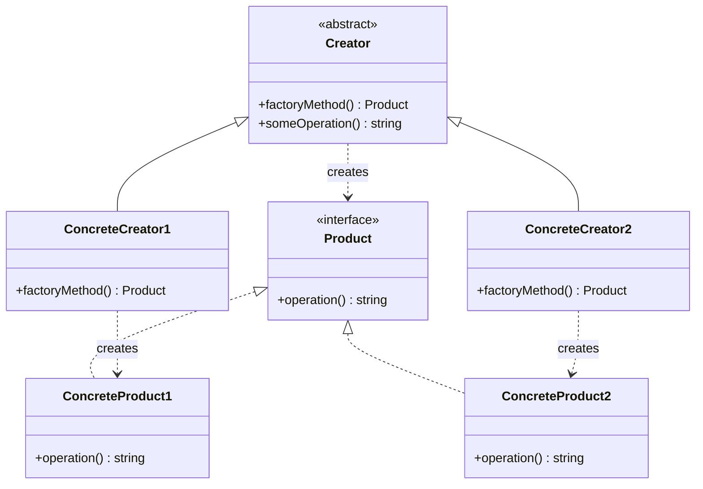

# 工厂方法 (Factory Method)

## 概述

**定义**：在父类中提供一个创建对象的接口，允许子类决定实例化对象的类型。

**分类**：创建型模式

**别名**：虚构造器（Virtual Constructor）

---

## 问题场景

### 核心问题

当需要创建对象，但无法预知对象的确切类型和依赖关系时，直接在代码中使用 `new` 关键字会导致以下问题：

1. **紧耦合**：代码与具体类紧密绑定，难以扩展
2. **重复代码**：创建对象的代码分散在各处，重复劳动
3. **难以测试**：无法轻松替换为测试用的对象或模拟对象

### 示例场景

1. **日志框架**：根据配置创建文件日志、数据库日志或网络日志
2. **数据库连接**：支持多种数据库（MySQL、PostgreSQL、MongoDB）
3. **UI 组件**：跨平台应用创建不同风格的按钮、窗口等
4. **文档处理**：根据文件类型创建对应的解析器（PDF、Word、Excel）

---

## 解决方案

### 核心思想

将对象创建逻辑封装在方法（工厂方法）中，由子类通过重写这个方法来改变创建的产品类型。所有产品实现共同接口，客户端通过接口与产品交互，无需关心具体实现。

### 设计原理

1. **分离创建与使用**：将对象创建从使用逻辑中分离出来
2. **依赖抽象**：创建者依赖产品接口，而非具体产品类
3. **延迟实例化**：子类决定具体实例化哪个产品类
4. **开闭原则**：对扩展开放（添加新产品），对修改封闭（不修改创建者）

---

## 结构

### UML 类图



### 参与者

- **Product（产品）**：声明所有产品必须实现的接口
- **ConcreteProduct（具体产品）**：实现产品接口的具体类
- **Creator（创建者）**：声明工厂方法，返回 Product 类型对象
- **ConcreteCreator（具体创建者）**：重写工厂方法，返回具体产品实例

### 协作关系

1. 创建者调用工厂方法创建产品对象
2. 具体创建者重写工厂方法，返回具体产品
3. 客户端通过创建者接口与具体创建者交互
4. 创建者的业务逻辑使用产品接口，不依赖具体产品

---

## 代码示例

### 概念性实现


#### 核心代码

```typescript
/**
 * 创建者类声明工厂方法，该方法应返回产品类的对象。
 * 创建者的子类通常提供此方法的实现。
 */
abstract class Creator {
    /**
     * 注意：创建者也可以提供工厂方法的默认实现。
     */
    public abstract factoryMethod(): Product;

    /**
     * 尽管名字叫"创建者"，但创建者的主要职责不是创建产品。
     * 它通常包含一些基于产品对象的核心业务逻辑。
     * 子类可以通过重写工厂方法并返回不同类型的产品来间接改变业务逻辑。
     */
    public someOperation(): string {
        // 调用工厂方法以获取产品对象
        const product = this.factoryMethod();
        // 使用产品
        return `创建者：相同的创建者代码刚刚处理了 ${product.operation()}`;
    }
}

/**
 * 具体创建者重写工厂方法以改变结果产品的类型。
 */
class ConcreteCreator1 extends Creator {
    /**
     * 注意：方法的签名仍使用抽象产品类型，
     * 即使实际上从方法返回具体产品。
     * 这样创建者可以保持独立于具体产品类。
     */
    public factoryMethod(): Product {
        return new ConcreteProduct1();
    }
}

class ConcreteCreator2 extends Creator {
    public factoryMethod(): Product {
        return new ConcreteProduct2();
    }
}

/**
 * 产品接口声明所有具体产品必须实现的操作。
 */
interface Product {
    operation(): string;
}

/**
 * 具体产品提供产品接口的各种实现。
 */
class ConcreteProduct1 implements Product {
    public operation(): string {
        return '{ConcreteProduct1 的结果}';
    }
}

class ConcreteProduct2 implements Product {
    public operation(): string {
        return '{ConcreteProduct2 的结果}';
    }
}

/**
 * 客户端代码与具体创建者的实例一起工作，尽管通过其基接口。
 * 只要客户端继续通过基接口与创建者一起工作，
 * 就可以向它传递任何创建者的子类。
 */
function clientCode(creator: Creator) {
    console.log('客户端：我不了解创建者的类，但它仍然有效。');
    console.log(creator.someOperation());
}

/**
 * 应用程序根据配置或环境选择创建者的类型。
 */
console.log('应用：使用 ConcreteCreator1 启动。');
clientCode(new ConcreteCreator1());
console.log('');

console.log('应用：使用 ConcreteCreator2 启动。');
clientCode(new ConcreteCreator2());
```

#### 运行结果

```
应用：使用 ConcreteCreator1 启动。
客户端：我不了解创建者的类，但它仍然有效。
创建者：相同的创建者代码刚刚处理了 {ConcreteProduct1 的结果}

应用：使用 ConcreteCreator2 启动。
客户端：我不了解创建者的类，但它仍然有效。
创建者：相同的创建者代码刚刚处理了 {ConcreteProduct2 的结果}
```

#### 代码解析

1. **抽象创建者**：定义工厂方法 `factoryMethod()` 和使用产品的业务逻辑
2. **具体创建者**：重写工厂方法，返回不同的具体产品
3. **产品接口**：所有产品实现相同的接口，确保可替换性
4. **客户端解耦**：客户端只依赖创建者基类，可以轻松切换具体创建者

---

### 实际应用示例


#### 应用场景

实现一个数据库连接框架，支持多种数据库（MongoDB、Redis），根据环境变量自动切换数据库连接。

#### 核心代码

```typescript
/**
 * 具有工厂方法的抽象类。
 */
export abstract class DBConnectionFactory {
    public abstract createDBConnection(): DBConnection;
}

/**
 * 具体工厂，每个工厂生产一个具体的连接。
 */
export class MongoConnectionFactory extends DBConnectionFactory {
    public createDBConnection(): DBConnection {
        return new MongoConnection();
    }
}

export class RedisConnectionFactory extends DBConnectionFactory {
    public createDBConnection(): DBConnection {
        return new RedisConnection();
    }
}

/**
 * 要创建的抽象产品 = 数据库连接。
 */
export abstract class DBConnection {
    provider: string;

    public connect() {
        console.log(`已连接到 ${this.provider}`);
    }
}

/**
 * 要创建的具体产品 = 数据库连接。
 */
export class MongoConnection extends DBConnection {
    provider: string;

    constructor() {
        super();
        this.provider = 'Mongo DB';
    }
}

export class RedisConnection extends DBConnection {
    provider: string;

    constructor() {
        super();
        this.provider = 'Redis';
    }
}

/**
 * 客户端函数接受任何具体工厂。
 */
function main(dbConnectionFactory: DBConnectionFactory) {
    const dbConnection = dbConnectionFactory.createDBConnection();
    dbConnection.connect();
}

/**
 * 根据环境变量，我们创建一个具体工厂并将其注入到客户端函数。
 */
const dbType = process.env.DB || 'Mongo';

switch (dbType) {
    case 'Mongo':
        console.log('使用 MongoDB 数据库');
        main(new MongoConnectionFactory());
        break;
    case 'Redis':
        console.log('使用 Redis 数据库');
        main(new RedisConnectionFactory());
        break;
    default:
        console.error('未知数据库');
}
```

#### 运行结果

```bash
DB=Mongo node index.js
# 使用 MongoDB 数据库
# 已连接到 Mongo DB

DB=Redis node index.js
# 使用 Redis 数据库
# 已连接到 Redis
```

#### 实现要点

1. **抽象工厂**：`DBConnectionFactory` 定义工厂方法接口
2. **具体工厂**：`MongoConnectionFactory` 和 `RedisConnectionFactory` 实现具体创建逻辑
3. **抽象产品**：`DBConnection` 定义所有数据库连接的通用接口
4. **环境驱动**：根据环境变量 `DB` 选择工厂，实现灵活切换
5. **依赖注入**：客户端函数接收工厂对象，而不是直接创建具体类

---

## 适用场景

### ✅ 适合使用的场景

1. **无法预知对象类型**：编译时不知道需要创建哪种对象
2. **希望扩展框架**：允许用户扩展框架的内部组件
3. **复用现有对象**：通过对象池复用对象，节省资源
4. **解耦对象创建**：将创建逻辑与使用逻辑分离

### ❌ 不适合使用的场景

1. **对象类型简单**：只需要创建少量且固定的对象类型，直接使用 `new` 更简单
2. **创建逻辑复杂**：如果创建逻辑非常复杂，可能需要考虑使用建造者模式

---

## 优缺点

### 优点

1. **避免紧耦合**：创建者类与具体产品类解耦
2. **符合开闭原则**：可以引入新产品类型，无需修改现有代码
3. **代码复用**：所有具体创建者共享创建者的通用逻辑
4. **职责分离**：将创建对象的职责委托给子类

### 缺点

1. **类数量增加**：每个具体产品都需要一个具体创建者
2. **代码复杂度**：引入了更多的抽象层，增加了理解难度
3. **依赖继承**：需要使用继承来实现，限制了灵活性

---

## 与其他模式的关系

- **与抽象工厂**：抽象工厂通常使用一组工厂方法来实现
- **与原型模式**：原型模式可以通过工厂方法来克隆原型对象
- **与单例模式**：工厂方法可以返回单例对象
- **与策略模式**：工厂方法可以用于创建策略对象

---

## TypeScript 实现要点

### TypeScript 特性应用

1. **抽象类**：使用 `abstract class` 定义创建者基类
2. **抽象方法**：使用 `abstract` 关键字声明必须由子类实现的方法
3. **接口**：使用 `interface` 定义产品接口
4. **类型安全**：通过类型系统确保产品和创建者的类型正确性

### 最佳实践

1. **命名约定**：工厂方法通常命名为 `createXXX()` 或 `newXXX()`
2. **参数化工厂**：可以通过参数控制创建的产品类型
3. **异常处理**：当无法创建对象时，抛出明确的异常
4. **文档注释**：使用 JSDoc 注释说明工厂方法的用途和返回类型

### 参数化工厂方法

```typescript
class LoggerFactory {
    createLogger(type: 'console' | 'file' | 'database'): Logger {
        switch (type) {
            case 'console':
                return new ConsoleLogger();
            case 'file':
                return new FileLogger();
            case 'database':
                return new DatabaseLogger();
            default:
                throw new Error(`Unknown logger type: ${type}`);
        }
    }
}
```

---

## 工厂方法 vs 简单工厂

### 简单工厂

```typescript
class SimpleFactory {
    static create(type: string): Product {
        if (type === 'A') return new ProductA();
        if (type === 'B') return new ProductB();
        throw new Error('Unknown type');
    }
}
```

**特点**：
- 使用静态方法
- 不需要创建工厂实例
- 违反开闭原则（添加新产品需修改工厂）

### 工厂方法

```typescript
abstract class Factory {
    abstract create(): Product;
}

class FactoryA extends Factory {
    create() { return new ProductA(); }
}
```

**特点**：
- 使用实例方法
- 可以创建工厂子类
- 符合开闭原则

---

## 参考资源

- Refactoring.Guru: [Factory Method Pattern](https://refactoring.guru/design-patterns/factory-method)
- GoF 原书：第 3 章 "创建型模式"
- 相关模式：[抽象工厂](abstract-factory.md) | [原型](prototype.md) | [单例](singleton.md)
