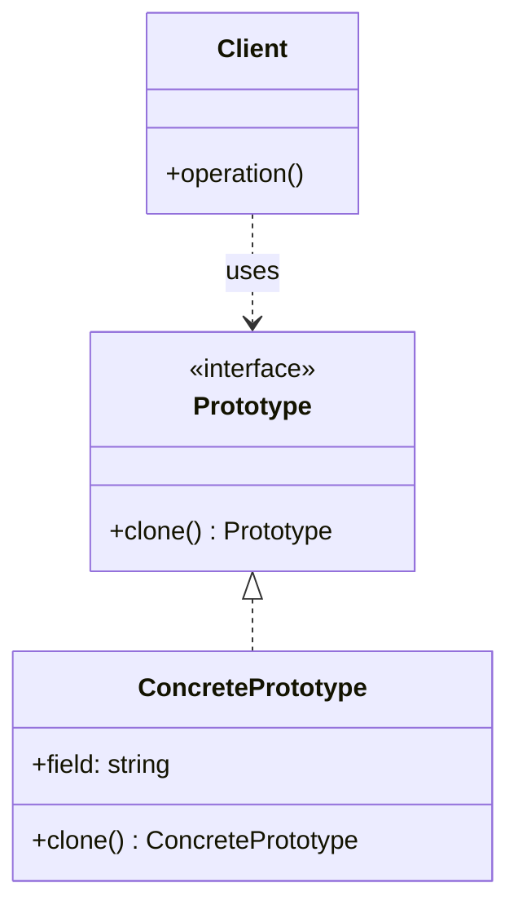

# 原型 (Prototype)

## 概述

**定义**：通过复制现有对象来创建新对象，而无需使代码依赖于对象所属的类。

**分类**：创建型模式

**别名**：克隆（Clone）

---

## 问题场景

### 核心问题

当需要复制一个对象，但不知道对象的具体类型，或者不想依赖对象的类时，直接使用 `new` 创建会很困难。而且，有些对象的初始化过程可能非常复杂或成本很高。

### 示例场景

1. **文档编辑器**：复制粘贴已创建的复杂文档结构
2. **游戏开发**：复制已配置的敌人、道具等游戏对象
3. **数据处理**：基于模板对象创建大量相似对象
4. **性能优化**：避免昂贵的初始化过程，直接复制已有对象

---

## 解决方案

### 核心思想

让对象自己负责复制自己。实现一个 `clone()` 方法，返回当前对象的副本。客户端代码通过调用这个方法来创建新对象，而无需知道对象的具体类型。

### 设计原理

1. **克隆接口**：声明一个 `clone()` 方法，所有可克隆对象都实现这个接口
2. **自我复制**：对象内部知道如何复制自己的所有字段
3. **浅拷贝 vs 深拷贝**：根据需求选择适当的拷贝策略
4. **原型注册表**：维护常用原型的字典，方便按名称获取和克隆

---

## 结构

### UML 类图



### 参与者

- **Prototype（原型）**：声明克隆方法的接口或抽象类
- **ConcretePrototype（具体原型）**：实现克隆方法，返回自己的副本
- **Client（客户端）**：通过调用原型对象的 `clone()` 方法来创建新对象

### 协作关系

1. 客户端请求一个原型对象克隆自己
2. 原型对象创建并返回一个新对象作为副本
3. 副本的字段值与原型相同（深拷贝或浅拷贝）

---

## 代码示例

### 概念性实现


#### 核心代码

```typescript
/**
 * 示例类，具有克隆能力。
 * 我们将看到如何克隆不同类型的字段。
 */
class Prototype {
    public primitive: any;
    public component: object;
    public circularReference: ComponentWithBackReference;

    /**
     * 克隆方法，返回当前对象的副本。
     */
    public clone(): this {
        const clone = Object.create(this);

        // 克隆组件对象
        clone.component = Object.create(this.component);

        // 克隆具有反向引用的嵌套对象需要特殊处理。
        // 克隆完成后，嵌套对象应该指向克隆对象，而不是原始对象。
        // 扩展操作符（spread）很适合这个场景。
        clone.circularReference = {
            ...this.circularReference,
            prototype: { ...this },
        };

        return clone;
    }
}

/**
 * 具有反向引用的组件类。
 */
class ComponentWithBackReference {
    public prototype;

    constructor(prototype: Prototype) {
        this.prototype = prototype;
    }
}

/**
 * 客户端代码。
 */
function clientCode() {
    const p1 = new Prototype();
    p1.primitive = 245;
    p1.component = new Date();
    p1.circularReference = new ComponentWithBackReference(p1);

    const p2 = p1.clone();

    // 验证基本类型字段
    if (p1.primitive === p2.primitive) {
        console.log('基本类型字段值已成功克隆到副本。');
    }

    // 验证简单组件对象
    if (p1.component !== p2.component) {
        console.log('简单组件已被克隆。');
    }

    // 验证具有反向引用的组件
    if (p1.circularReference !== p2.circularReference) {
        console.log('具有反向引用的组件已被克隆。');
    }

    // 验证反向引用是否指向正确的对象
    if (p1.circularReference.prototype !== p2.circularReference.prototype) {
        console.log('具有反向引用的组件链接到克隆对象。');
    }
}

clientCode();
```

#### 运行结果

```
基本类型字段值已成功克隆到副本。
简单组件已被克隆。
具有反向引用的组件已被克隆。
具有反向引用的组件链接到克隆对象。
```

#### 代码解析

1. **基本类型字段**：基本类型（number、string、boolean）通过值复制，自动克隆
2. **对象引用**：使用 `Object.create()` 创建新对象，实现浅拷贝
3. **循环引用**：特殊处理嵌套对象的反向引用，确保副本的引用指向副本本身
4. **扩展操作符**：使用 `...` 操作符快速复制对象属性

---

### 实际应用示例


#### 应用场景

实现一个文档系统，支持复制粘贴各种文档组件（标题、文本框、链接、图形等）。

#### 核心代码

```typescript
/**
 * 可克隆接口。
 */
export interface Cloneable<T> {
    clone(): T;
}

/**
 * 组件原型基类，实现基本的克隆功能。
 */
export class ComponentPrototype implements Cloneable<ComponentPrototype> {
    clone(): ComponentPrototype {
        // 使用扩展操作符进行浅拷贝
        return { ...this };
    }
}

/**
 * 文档类，包含多个组件。
 */
export class Document extends ComponentPrototype {
    components: ComponentPrototype[] = [];

    /**
     * 克隆文档，包括所有组件。
     */
    clone(): Document {
        const clonedDocument = new Document();
        // 克隆每个组件
        clonedDocument.components = this.components.map(c => c.clone());
        return clonedDocument;
    }

    add(component: ComponentPrototype) {
        this.components.push(component);
    }
}

/**
 * 标题组件。
 */
export class Title extends ComponentPrototype {
    constructor(public text: string) {
        super();
    }

    setText(text: string) {
        this.text = text;
    }
}

/**
 * 图形组件。
 */
export class Drawing extends ComponentPrototype {
    constructor(public shape: 'circle' | 'square' | 'line') {
        super();
    }
}

/**
 * 文本框组件。
 */
export class TextBox extends ComponentPrototype {
    constructor(public text: string) {
        super();
    }
}

/**
 * 链接组件。
 */
export class Link extends ComponentPrototype {
    constructor(public text: string, public url: string) {
        super();
    }
}

/**
 * 客户端代码。
 */
const document = new Document();
const title = new Title('示例标题');
const textbox = new TextBox('这是示例文本');

document.add(title);
document.add(new Drawing('line'));
document.add(textbox);
document.add(new Link('example.com', 'https://example.com/'));

// 克隆整个文档
const clonedDocument = document.clone();

// 修改原始文档的组件
title.setText('原始文档的新标题');
textbox.setText('原始文档的新文本');

console.log('原始文档：', document);
console.log('克隆文档：', clonedDocument);
```

#### 运行结果

```
原始文档： Document {
  components: [
    Title { text: '原始文档的新标题' },
    Drawing { shape: 'line' },
    TextBox { text: '原始文档的新文本' },
    Link { text: 'example.com', url: 'https://example.com/' }
  ]
}
克隆文档： Document {
  components: [
    Title { text: '示例标题' },
    Drawing { shape: 'line' },
    TextBox { text: '这是示例文本' },
    Link { text: 'example.com', url: 'https://example.com/' }
  ]
}
```

#### 实现要点

1. **接口定义**：定义 `Cloneable<T>` 接口，提供泛型支持
2. **基类实现**：`ComponentPrototype` 基类提供默认的浅拷贝实现
3. **深拷贝处理**：`Document` 类重写 `clone()` 方法，对组件数组进行深拷贝
4. **独立性**：克隆对象与原对象相互独立，修改一个不会影响另一个

---

## 适用场景

### ✅ 适合使用的场景

1. **对象创建成本高**：初始化过程复杂或耗时长，复制比从头创建更高效
2. **需要对象副本**：需要创建与现有对象完全相同的新对象
3. **类型不确定**：客户端代码不知道对象的具体类型
4. **避免子类爆炸**：如果通过工厂方法创建需要大量子类，原型模式更灵活

### ❌ 不适合使用的场景

1. **对象简单**：对象创建成本不高，直接使用 `new` 更简单
2. **不可变性要求**：如果对象应该是不可变的，不应该提供克隆方法
3. **循环引用复杂**：对象图中的循环引用过多，深拷贝实现困难

---

## 优缺点

### 优点

1. **无需依赖具体类**：可以克隆对象而无需知道其具体类型
2. **避免重复初始化**：复制现有对象比重新初始化更高效
3. **动态创建对象**：可以在运行时动态克隆对象，而不是硬编码创建逻辑
4. **简化对象创建**：复杂对象的创建只需要一个 `clone()` 调用

### 缺点

1. **循环引用难处理**：具有循环引用的对象需要特殊的深拷贝实现
2. **深拷贝复杂**：实现真正的深拷贝可能很困难，尤其是嵌套对象
3. **隐藏依赖**：克隆方法可能依赖其他对象的克隆逻辑，难以追踪

---

## 与其他模式的关系

- **与工厂方法**：原型可以与工厂方法结合，工厂方法通过克隆原型来创建对象
- **与抽象工厂**：抽象工厂可以使用原型来存储和克隆产品系列
- **与组合模式**：组合对象（如文档）的克隆需要递归克隆所有子组件
- **与备忘录模式**：两者都涉及对象状态复制，但备忘录用于恢复状态，原型用于创建新对象

---

## TypeScript 实现要点

### TypeScript 特性应用

1. **泛型接口**：`Cloneable<T>` 提供类型安全的克隆方法
2. **类型推断**：`clone(): this` 返回当前类型，保持类型正确性
3. **扩展操作符**：使用 `...` 快速复制对象属性
4. **接口实现**：通过 `implements` 确保类实现了克隆接口

### 最佳实践

1. **选择拷贝策略**：根据需求选择浅拷贝或深拷贝
2. **处理特殊字段**：注意处理 `Date`、`RegExp`、`Map`、`Set` 等特殊对象
3. **处理循环引用**：使用 `WeakMap` 或其他方式追踪已复制的对象
4. **不可变对象**：对于不可变对象，可以直接返回 `this`

### 深拷贝工具函数

```typescript
/**
 * 深拷贝工具函数（简化版）
 */
function deepClone<T>(obj: T): T {
    if (obj === null || typeof obj !== 'object') {
        return obj;
    }

    if (obj instanceof Date) {
        return new Date(obj.getTime()) as any;
    }

    if (obj instanceof Array) {
        return obj.map(item => deepClone(item)) as any;
    }

    if (obj instanceof Object) {
        const clonedObj = {} as any;
        for (const key in obj) {
            if (obj.hasOwnProperty(key)) {
                clonedObj[key] = deepClone(obj[key]);
            }
        }
        return clonedObj;
    }
}
```

---

## 浅拷贝 vs 深拷贝

### 浅拷贝（Shallow Copy）

只复制对象的第一层属性，嵌套对象仍然是引用。

```typescript
const shallow = { ...original };
```

**特点**：
- 实现简单
- 性能较好
- 嵌套对象共享引用

### 深拷贝（Deep Copy）

递归复制所有层级的对象，创建完全独立的副本。

```typescript
const deep = JSON.parse(JSON.stringify(original));
```

**特点**：
- 完全独立
- 实现复杂
- 性能开销大

---

## 参考资源

- Refactoring.Guru: [Prototype Pattern](https://refactoring.guru/design-patterns/prototype)
- GoF 原书：第 3 章 "创建型模式"
- 相关模式：[工厂方法](factory-method.md) | [抽象工厂](abstract-factory.md) | [单例](singleton.md)
