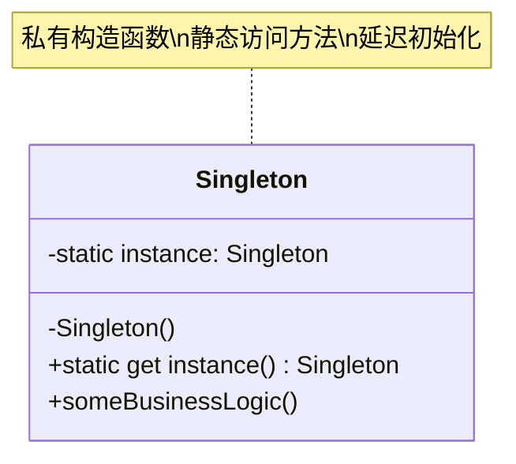

# 单例 (Singleton)

## 概述

**定义**：保证一个类只有一个实例，并提供一个访问该实例的全局访问点。

**分类**：创建型模式

---

## 问题场景

### 核心问题

1. **控制共享资源的访问**：某些资源（如数据库连接、日志系统）在程序中应该只有一个实例，以避免资源冲突和数据不一致。
2. **提供全局访问点**：需要从程序的任何地方访问这个唯一实例，而不需要通过参数传递。

### 示例场景

- 数据库连接池：整个应用程序共享同一个连接池
- 日志记录器：所有日志写入同一个文件
- 配置管理器：全局唯一的配置对象
- 线程池：管理有限的工作线程

---

## 解决方案

### 核心思想

将类的构造函数设为私有，防止外部直接创建实例。在类内部维护一个静态的私有实例变量，通过静态的公共方法（getter）来获取这个唯一实例。

### 设计原理

1. **私有构造函数**：防止使用 `new` 关键字创建多个实例
2. **静态实例变量**：在类级别存储唯一实例
3. **静态访问方法**：提供全局访问点，延迟初始化实例
4. **延迟初始化**：首次调用时才创建实例，提高性能

---

## 结构

### UML 类图



### 参与者

- **Singleton（单例）**：定义一个 `instance` 静态方法，让客户可以访问它的唯一实例；同时定义一个私有构造函数，防止外部直接创建实例。

### 协作关系

1. 客户端只能通过 Singleton 的静态 `instance` 方法获取实例
2. 首次调用时创建实例并缓存
3. 后续调用返回已缓存的实例

---

## 代码示例

### 概念性实现


#### 核心代码

```typescript
/**
 * 单例类定义了一个 instance 静态 getter，
 * 让客户端可以访问唯一的单例实例。
 */
class Singleton {
    // 私有静态实例变量
    static #instance: Singleton;

    /**
     * 构造函数始终为私有，防止直接使用 new 操作符创建对象。
     */
    private constructor() { }

    /**
     * 控制对单例实例访问的静态 getter。
     *
     * 这个实现允许你扩展单例类，
     * 同时保持每个子类只有一个实例。
     */
    public static get instance(): Singleton {
        if (!Singleton.#instance) {
            Singleton.#instance = new Singleton();
        }

        return Singleton.#instance;
    }

    /**
     * 单例可以定义一些业务逻辑，这些逻辑可以在其实例上执行。
     */
    public someBusinessLogic() {
        // 业务逻辑代码
    }
}

/**
 * 客户端代码。
 */
function clientCode() {
    const s1 = Singleton.instance;
    const s2 = Singleton.instance;

    if (s1 === s2) {
        console.log('单例模式正常工作，两个变量包含相同的实例。');
    } else {
        console.log('单例模式失败，变量包含不同的实例。');
    }
}

clientCode();
```

#### 代码解析

1. **私有静态字段**：使用 `static #instance` 存储唯一实例，TypeScript 的私有字段语法确保外部无法直接访问
2. **私有构造函数**：`private constructor()` 防止外部使用 `new` 创建实例
3. **静态 getter**：`get instance()` 提供全局访问点，在首次调用时创建实例
4. **延迟初始化**：只有在第一次调用 `instance` 时才真正创建对象

---

### 实际应用示例


#### 应用场景

实现一个日志记录器（Logger），确保整个应用程序使用同一个日志实例，避免多个写入者造成的文件冲突。

#### 核心代码

```typescript
/**
 * Logger 类定义了 getInstance 方法，
 * 让客户端可以访问唯一的单例实例。
 */
class Logger {
    private static instance: Logger;
    public readonly entries: string[] = [];

    /**
     * Logger 的构造函数始终为私有，
     * 防止直接使用 new 操作符创建对象。
     */
    private constructor() { }

    /**
     * 控制对单例实例访问的静态方法。
     */
    public static getInstance(): Logger {
        if (!Logger.instance) {
            Logger.instance = new Logger();
        }

        return Logger.instance;
    }

    /**
     * 添加日志条目的业务逻辑方法。
     */
    public add(log: string) {
        this.entries.push(log);
    }

    /**
     * 显示所有日志条目。
     */
    public show() {
        console.log('日志条目：');
        this.entries.forEach((entry, index) => {
            console.log(`${index + 1}. ${entry}`);
        });
    }
}

/**
 * 客户端代码。
 */
function clientCode() {
    const logger1 = Logger.getInstance();
    const logger2 = Logger.getInstance();

    logger1.add('第一次日志记录');
    logger2.add('第二次日志记录');

    logger1.show();

    // 验证两个变量是否指向同一实例
    console.log(
        logger1 === logger2
            ? '两个 Logger 变量包含相同的实例'
            : '两个 Logger 变量包含不同的实例'
    );
}

clientCode();
```

#### 运行结果

```
日志条目：
1. 第一次日志记录
2. 第二次日志记录
两个 Logger 变量包含相同的实例
```

#### 实现要点

1. **公共日志数组**：`entries` 是公共的，方便客户端访问和显示
2. **静态方法而非 getter**：使用 `getInstance()` 方法而不是 getter，这是另一种常见风格
3. **业务逻辑**：包含 `add()` 和 `show()` 等实际功能方法
4. **全局一致性**：无论在代码的哪个位置获取 Logger，都是同一个实例

---

## 适用场景

### ✅ 适合使用的场景

1. **需要严格控制共享资源**：数据库连接、线程池、缓存等
2. **需要全局访问点**：日志、配置管理、事件总线等
3. **实例创建成本高**：延迟初始化可以节省启动时间
4. **需要保持状态一致性**：全局计数器、ID 生成器等

### ❌ 不适合使用的场景

1. **需要多实例**：如果未来可能需要多个实例，不要使用单例
2. **可测试性要求高**：单例难以进行单元测试（因为全局状态）
3. **违反单一职责原则**：单例常常承担过多职责
4. **多线程环境**：需要额外的线程安全措施（如双重检查锁定）

---

## 优缺点

### 优点

1. **保证唯一性**：确保一个类只有一个实例
2. **全局访问**：提供全局访问点，易于获取实例
3. **延迟初始化**：只在需要时创建，节省资源
4. **减少全局变量**：比使用全局变量更规范、更可控

### 缺点

1. **违反单一职责原则**：单例类既管理实例又负责业务逻辑
2. **难以测试**：全局状态使得单元测试困难，需要模拟单例
3. **隐藏依赖**：使用单例的类隐藏了对单例的依赖，不明确
4. **多线程问题**：在多线程环境中需要额外的同步机制

---

## 与其他模式的关系

- **与工厂方法**：单例可以用工厂方法来实现
- **与抽象工厂**：抽象工厂的具体工厂通常实现为单例
- **与建造者**：可以使用建造者来构建单例对象
- **与外观**：外观类通常实现为单例，因为系统只需要一个入口

---

## TypeScript 实现要点

### TypeScript 特性应用

1. **私有字段**：使用 `#` 前缀的私有字段（ES2022）或 `private` 关键字
2. **静态成员**：使用 `static` 关键字定义类级别的成员
3. **Getter 方法**：使用 `get` 关键字创建属性访问器
4. **类型注解**：明确标注实例的类型

### 最佳实践

1. **延迟初始化**：在首次访问时创建实例，而不是在模块加载时
2. **不可变性**：如果可能，将单例设为只读（使用 `Object.freeze()` 或 `readonly`）
3. **线程安全**：在多线程环境中使用双重检查锁定
4. **依赖注入**：考虑使用依赖注入框架管理单例，而不是手动实现

### 线程安全的单例实现

```typescript
class ThreadSafeSingleton {
    private static instance: ThreadSafeSingleton;
    private static lock = false;

    private constructor() {}

    public static getInstance(): ThreadSafeSingleton {
        if (!ThreadSafeSingleton.instance) {
            // 模拟锁定机制
            if (!ThreadSafeSingleton.lock) {
                ThreadSafeSingleton.lock = true;
                ThreadSafeSingleton.instance = new ThreadSafeSingleton();
                ThreadSafeSingleton.lock = false;
            }
        }

        return ThreadSafeSingleton.instance;
    }
}
```

---

## 参考资源

- Refactoring.Guru: [Singleton Pattern](https://refactoring.guru/design-patterns/singleton)
- GoF 原书：第 3 章 "创建型模式"
- 相关模式：[工厂方法](factory-method.md) | [抽象工厂](abstract-factory.md) | [建造者](builder.md)
