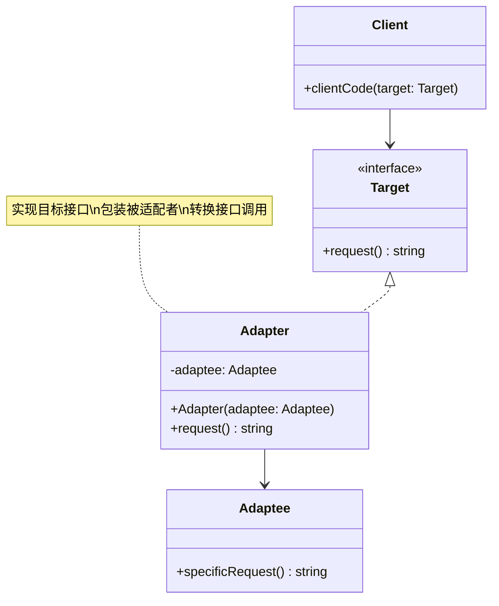

# 适配器 (Adapter)

## 概述

**定义**：将一个类的接口转换成客户期望的另一个接口。适配器让原本接口不兼容的类可以合作无间。

**分类**：结构型模式

---

## 问题场景

### 核心问题

1. **接口不兼容**：现有系统中存在一些功能良好的类，但其接口与新的系统需求不匹配。
2. **复用第三方代码**：想要使用第三方库或遗留代码，但其接口与当前系统的接口标准不一致。

### 示例场景

- 集成第三方支付接口，但其 API 格式与系统不一致
- 使用英国出租车计价库，但系统使用公里和欧元，而库使用英里和英镑
- 数据格式转换（如 XML 转 JSON）
- 新旧系统接口适配

---

## 解决方案

### 核心思想

创建一个适配器类，包装需要被适配的对象（Adaptee），将目标接口（Target）的调用转换为被适配对象的接口调用。

### 设计原理

1. **目标接口（Target）**：定义客户期望使用的接口
2. **被适配者（Adaptee）**：需要被适配的现有接口
3. **适配器（Adapter）**：实现目标接口，包装被适配者，完成接口转换
4. **委托转换**：适配器将请求委托给被适配者，并进行必要的格式转换

---

## 结构

### UML 类图



### 参与者

- **Target（目标接口）**：定义客户使用的特定领域接口
- **Adaptee（被适配者）**：定义一个需要适配的现有接口
- **Adapter（适配器）**：将 Adaptee 的接口转换成 Target 接口
- **Client（客户端）**：使用 Target 接口与符合该接口的对象协作

### 协作关系

1. 客户端通过 Target 接口调用适配器的方法
2. 适配器将请求转换为被适配者的接口调用
3. 被适配者执行实际的业务逻辑
4. 适配器可能对结果进行格式转换后返回给客户端

---

## 代码示例

### 概念性实现

#### 核心代码

```typescript
/**
 * 目标类声明客户端可以使用的接口
 */
class Target {
    public request(): string {
        return 'Target: The default target\'s behavior.';
    }
}

/**
 * 被适配者包含一些有用的行为，
 * 但其接口与客户端代码不兼容
 */
class Adaptee {
    public specificRequest(): string {
        return '.eetpadA eht fo roivaheb laicepS';
    }
}

/**
 * 适配器使被适配者的接口与目标接口兼容
 */
class Adapter extends Target {
    private adaptee: Adaptee;

    constructor(adaptee: Adaptee) {
        super();
        this.adaptee = adaptee;
    }

    public request(): string {
        const result = this.adaptee.specificRequest().split('').reverse().join('');
        return `Adapter: (TRANSLATED) ${result}`;
    }
}

/**
 * 客户端代码支持所有遵循目标接口的类
 */
function clientCode(target: Target) {
    console.log(target.request());
}

// 使用示例
console.log('Client: I can work just fine with the Target objects:');
const target = new Target();
clientCode(target);

console.log('');

const adaptee = new Adaptee();
console.log('Client: The Adaptee class has a weird interface. See, I don\'t understand it:');
console.log(`Adaptee: ${adaptee.specificRequest()}`);

console.log('');

console.log('Client: But I can work with it via the Adapter:');
const adapter = new Adapter(adaptee);
clientCode(adapter);
```

#### 运行结果

```
Client: I can work just fine with the Target objects:
Target: The default target's behavior.

Client: The Adaptee class has a weird interface. See, I don't understand it:
Adaptee: .eetpadA eht fo roivaheb laicepS

Client: But I can work with it via the Adapter:
Adapter: (TRANSLATED) Special behavior of the Adaptee
```

#### 代码解析

1. **目标接口**：`Target` 类定义了标准的 `request()` 方法
2. **被适配者**：`Adaptee` 类有自己特有的 `specificRequest()` 方法，接口不兼容
3. **适配器**：`Adapter` 继承 `Target`，内部持有 `Adaptee` 实例
4. **接口转换**：`request()` 方法调用 `specificRequest()` 并将结果反转，实现接口转换
5. **透明使用**：客户端通过统一的 `Target` 接口使用，无需关心适配细节

---

### 实际应用示例

#### 应用场景

需要使用一个英国出租车计价库，该库使用英里（miles）和英镑（£）计算价格，但我们的系统使用公里（km）和欧元（€）。

#### 核心代码

```typescript
/**
 * 目标接口：应用程序期望的接口
 */
interface TaxiCalculator {
    calculatePriceInEuros(km: number, isAirport: boolean): number;
}

/**
 * 被适配者：现有的英国出租车计价库
 */
class UKTaxiCalculatorLibrary {
    public getPriceInPounds(miles: number, fare: Fares): number {
        if (fare === Fares.Airport) {
            return 5 + miles * 2.15;
        }
        return miles * 1.95;
    }
}

enum Fares {
    Standard,
    Airport,
}

/**
 * 适配器：使英国计价库接口符合目标接口
 */
class UKTaxiCalculatorLibraryAdapter implements TaxiCalculator {
    constructor(private adaptee: UKTaxiCalculatorLibrary) {
    }

    calculatePriceInEuros(km: number, isAirport: boolean): number {
        // 公里转英里
        const miles = km * 1.609;
        // 布尔值转枚举
        const fare = isAirport ? Fares.Airport : Fares.Standard;
        // 调用被适配者的方法（返回英镑）
        const pounds = this.adaptee.getPriceInPounds(miles, fare);
        // 英镑转欧元
        const euros = pounds * 1.15;
        return euros;
    }
}

/**
 * 客户端代码：使用目标接口
 */
function client(taxiCalculator: TaxiCalculator): void {
    console.log('Calculating the price for a 15 Km run to the airport');
    const priceInEuros = taxiCalculator.calculatePriceInEuros(15, true);
    console.log(`Total price: ${priceInEuros}€`);
}

// 使用示例
const incompatibleLibrary = new UKTaxiCalculatorLibrary();
const adaptedLibrary = new UKTaxiCalculatorLibraryAdapter(incompatibleLibrary);
client(adaptedLibrary);
```

#### 运行结果

```
Calculating the price for a 15 Km run to the airport
Total price: 63.66455€
```

#### 实现要点

1. **单位转换**：将公里转换为英里（1 km = 1.609 miles）
2. **参数映射**：将布尔值 `isAirport` 转换为 `Fares` 枚举
3. **货币转换**：将英镑转换为欧元（1 £ = 1.15 €）
4. **接口统一**：客户端只需知道 `TaxiCalculator` 接口，无需关心底层实现
5. **复用现有代码**：无需修改英国计价库，通过适配器即可复用

---

## 适用场景

### ✅ 适合使用的场景

1. **集成第三方库**：需要使用已有的第三方组件，但其接口不符合系统要求
2. **遗留系统重构**：希望复用旧系统的功能，但需要适配新接口
3. **接口标准化**：多个类似功能但接口不同的类，需要统一接口
4. **数据格式转换**：需要在不同数据格式之间进行转换

### ❌ 不适合使用的场景

1. **接口已经兼容**：如果接口已经匹配，无需使用适配器
2. **完全重写更简单**：如果适配器的实现比重写整个类还复杂
3. **性能敏感**：适配器会增加一层调用，可能影响性能
4. **过度设计**：简单场景下不需要引入适配器模式

---

## 优缺点

### 优点

1. **单一职责原则**：将接口转换逻辑分离到单独的适配器类中
2. **开闭原则**：无需修改现有代码即可引入新的适配器
3. **提高复用性**：可以让不兼容的类一起工作，提高代码复用
4. **灵活性好**：可以在运行时切换不同的适配器实现

### 缺点

1. **增加复杂性**：引入新的类和层次，增加系统复杂度
2. **调试困难**：多层适配可能导致调用链复杂，增加调试难度
3. **性能开销**：额外的转换层可能带来性能损失
4. **过度使用**：不恰当的使用会导致代码难以维护

---

## 与其他模式的关系

- **与桥接**：桥接模式在设计阶段分离抽象和实现，适配器模式在运行时适配已有接口
- **与装饰器**：装饰器模式在不改变接口的前提下增强功能，适配器模式改变接口
- **与外观**：外观模式简化复杂子系统的接口，适配器模式转换不兼容的接口
- **与代理**：代理模式控制对对象的访问，适配器模式改变对象的接口

---

## TypeScript 实现要点

### TypeScript 特性应用

1. **接口实现**：使用 `implements` 实现目标接口
2. **类继承**：使用 `extends` 继承目标类（类适配器）
3. **类型注解**：明确标注适配者和目标接口的类型
4. **枚举类型**：使用 `enum` 定义类型安全的枚举

### 对象适配器 vs 类适配器

#### 对象适配器（推荐）

```typescript
class Adapter implements Target {
    constructor(private adaptee: Adaptee) {}

    public request(): string {
        // 使用组合，更灵活
        return this.adaptee.specificRequest();
    }
}
```

#### 类适配器

```typescript
class Adapter extends Adaptee implements Target {
    public request(): string {
        // 使用继承，只能适配单个类
        return this.specificRequest();
    }
}
```

**最佳实践**：优先使用对象适配器，因为它更灵活，可以适配多个对象，也符合组合优于继承的原则。

### 多接口适配

```typescript
class MultiAdapter implements Target1, Target2 {
    constructor(private adaptee1: Adaptee1, private adaptee2: Adaptee2) {}

    public request1(): string {
        return this.adaptee1.specificRequest1();
    }

    public request2(): string {
        return this.adaptee2.specificRequest2();
    }
}
```

---

## 参考资源

- Refactoring.Guru: [Adapter Pattern](https://refactoring.guru/design-patterns/adapter)
- GoF 原书：第 4 章 "结构型模式"
- 相关模式：[桥接](bridge.md) | [装饰器](decorator.md) | [外观](facade.md)
