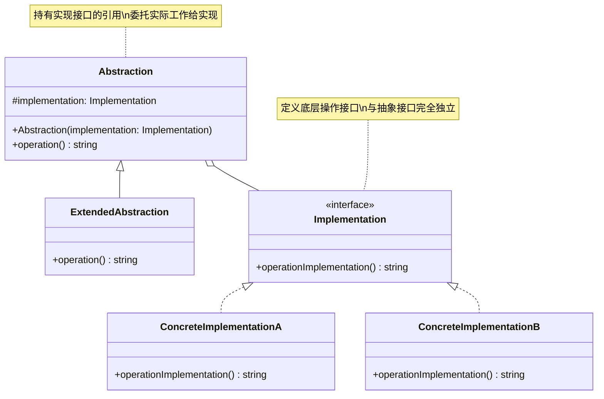

# 桥接 (Bridge)

## 概述

**定义**：将抽象部分与实现部分分离，使它们都可以独立地变化。

**分类**：结构型模式

---

## 问题场景

### 核心问题

1. **类爆炸**：当两个或多个维度变化时，类的数量会呈指数级增长（如不同形状 × 不同颜色）
2. **耦合度过高**：抽象与实现紧密绑定，修改一个会影响另一个
3. **扩展困难**：新增一种抽象或实现都需要修改现有代码

### 示例场景

- 不同类型的图形（圆形、方形）可以使用不同的渲染方式（矢量、位图）
- 不同类型的远程控制（基础型、高级型）控制不同品牌的设备（Sony、LG）
- 不同视图（简略视图、详细视图）展示不同类型的内容（文章、视频、推文）

---

## 解决方案

### 核心思想

将抽象（Abstraction）与实现（Implementation）分离，通过组合关系将实现对象注入到抽象对象中，使两者可以独立变化。

### 设计原理

1. **抽象层次**：定义高层操作的接口，不涉及具体实现细节
2. **实现层次**：定义底层操作的接口，专注于具体平台或技术
3. **桥接连接**：抽象层包含实现层的引用，通过组合而非继承关联
4. **独立变化**：两个层次可以独立扩展，互不影响

**避免的类爆炸**：
```
不使用桥接：         使用桥接后：
    A                     A         N
  /   \                /     \     / \
 Aa    Ab      =>    Aa(N) Ab(N)  1   2
/ \   /  \
1  2  1  2
```

---

## 结构

### UML 类图



### 参与者

- **Abstraction（抽象）**：定义抽象类的接口，维护一个指向实现层次的引用
- **RefinedAbstraction（扩展抽象）**：扩展抽象类，改进和扩展抽象接口
- **Implementation（实现）**：定义实现类的接口，这个接口不一定要与抽象接口完全一致
- **ConcreteImplementation（具体实现）**：实现实现接口，定义具体的底层操作

### 协作关系

1. 客户端创建具体的实现对象
2. 将实现对象注入到抽象对象中（通常通过构造函数）
3. 抽象对象将操作委托给实现对象
4. 扩展抽象时只需继承抽象类，实现新接口时只需实现实现接口

---

## 代码示例

### 概念性实现

#### 核心代码

```typescript
/**
 * 实现接口定义了所有实现类的接口
 */
interface Implementation {
    operationImplementation(): string;
}

/**
 * 具体实现 A 对应特定平台
 */
class ConcreteImplementationA implements Implementation {
    public operationImplementation(): string {
        return 'ConcreteImplementationA: Here\'s the result on the platform A.';
    }
}

/**
 * 具体实现 B 对应另一个平台
 */
class ConcreteImplementationB implements Implementation {
    public operationImplementation(): string {
        return 'ConcreteImplementationB: Here\'s the result on the platform B.';
    }
}

/**
 * 抽象类定义了"控制"部分的接口
 * 维护对实现对象的引用，委托实际工作
 */
class Abstraction {
    protected implementation: Implementation;

    constructor(implementation: Implementation) {
        this.implementation = implementation;
    }

    public operation(): string {
        const result = this.implementation.operationImplementation();
        return `Abstraction: Base operation with:\n${result}`;
    }
}

/**
 * 扩展抽象可以在不改变实现类的情况下
 */
class ExtendedAbstraction extends Abstraction {
    public operation(): string {
        const result = this.implementation.operationImplementation();
        return `ExtendedAbstraction: Extended operation with:\n${result}`;
    }
}

/**
 * 客户端代码只依赖抽象类
 */
function clientCode(abstraction: Abstraction) {
    console.log(abstraction.operation());
}

// 使用示例
let implementation = new ConcreteImplementationA();
let abstraction = new Abstraction(implementation);
clientCode(abstraction);

console.log('');

implementation = new ConcreteImplementationB();
abstraction = new ExtendedAbstraction(implementation);
clientCode(abstraction);
```

#### 运行结果

```
Abstraction: Base operation with:
ConcreteImplementationA: Here's the result on the platform A.

ExtendedAbstraction: Extended operation with:
ConcreteImplementationB: Here's the result on the platform B.
```

#### 代码解析

1. **实现接口**：`Implementation` 定义底层操作接口，独立于抽象接口
2. **具体实现**：`ConcreteImplementationA` 和 `ConcreteImplementationB` 提供不同平台的实现
3. **抽象类**：`Abstraction` 包含实现对象的引用，委托实际工作
4. **扩展抽象**：`ExtendedAbstraction` 继承并扩展抽象，无需修改实现
5. **组合关联**：抽象与实现通过组合关系关联，而非继承

---

### 实际应用示例

#### 应用场景

为网页中的不同内容类型（文章、视频、推文）提供不同的视图展示方式（视觉视图、描述性视图）。

#### 核心代码

```typescript
/**
 * 抽象层次：列表项视图
 */
abstract class ListItemViewAbstraction {
    constructor(protected contentType: ContentTypeImplementation) {
    }

    abstract getRenderedItem(): string;
}

/**
 * 实现层次：内容类型接口
 */
interface ContentTypeImplementation {
    renderTitle(): string;
    renderCaption(): string;
    renderThumbnail(): string;
    renderLink(): string;
}

/**
 * 具体抽象：视觉列表视图
 */
class VisualListItemView extends ListItemViewAbstraction {
    getRenderedItem(): string {
        return `    <li>
        ${this.contentType.renderThumbnail()}
        ${this.contentType.renderLink()}
    </li>`;
    }
}

/**
 * 具体抽象：描述性列表视图
 */
class DescriptiveListItemView extends ListItemViewAbstraction {
    getRenderedItem(): string {
        return `    <li>
        ${this.contentType.renderTitle()}
        ${this.contentType.renderCaption()}
    </li>`;
    }
}

/**
 * 具体实现：文章内容类型
 */
class PostContentType implements ContentTypeImplementation {
    constructor(
        protected title,
        protected caption,
        protected imageUrl,
        protected url) {}

    renderTitle(): string {
        return `<h2>${this.title}<h2>`;
    }
    renderCaption(): string {
        return `<p>${this.caption}</p>`;
    }
    renderThumbnail(): string {
        return ``;
    }
    renderLink(): string {
        return `<a href='${this.url}'>${this.title}</a>`;
    }
}

/**
 * 具体实现：视频内容类型
 */
class VideoContentType implements ContentTypeImplementation {
    constructor(
        protected title,
        protected description,
        protected thumbnailUrl,
        protected url) {}

    renderTitle(): string {
        return `<h2>${this.title}<h2>`;
    }
    renderCaption(): string {
        return `<p>${this.description}</p>`;
    }
    renderThumbnail(): string {
        return ``;
    }
    renderLink(): string {
        return `<a href='${this.url}'>${this.title}</a>`;
    }
}

/**
 * 具体实现：推文内容类型
 */
class TweetContentType implements ContentTypeImplementation {
    constructor(
        protected tweet,
        protected profilePictureUrl,
        protected tweetUrl) {}

    renderTitle(): string {
        return `<h2>${this.tweet.substring(0, 50)}...<h2>`;
    }
    renderCaption(): string {
        return `<p>${this.tweet}</p>`;
    }
    renderThumbnail(): string {
        return ``;
    }
    renderLink(): string {
        return `<a href='${this.tweetUrl}'>${this.tweet.substring(0, 30)}...</a>`;
    }
}

// 客户端代码
const content = [
    new PostContentType(
        'New example available on RefactoringGuru',
        'Bridge design pattern now has a real world example',
        'http://img.sample.org/bridge.jpg',
        'https://refactoring.guru/design-patterns/bridge',
    ),
    new TweetContentType(
        'Windows will support Linux executables natively on Windows 12',
        'http://img.sample.org/profile.jpg',
        'https://twitter.com/genbeta/387487346856/',
    ),
    new VideoContentType(
        'BRIDGE | Patrones de Diseño',
        'En éste vídeo de la serie de PATRONES DE DISEÑO veremos el PATRÓN BRIDGE!',
        'http://img.sample.org/bridge.jpg',
        'https://www.youtube.com/watch?v=6bIHhzqMdgg',
    ),
];

// 使用视觉视图渲染
const visualList = content.map(i => new VisualListItemView(i));
console.log('<h1>Visual Page</h1>');
console.log('<ul>');
for (const visualItem of visualList) {
    console.log(visualItem.getRenderedItem());
}
console.log('</ul>');

// 使用描述性视图渲染
const descriptiveList = content.map(i => new DescriptiveListItemView(i));
console.log('<h1>Descriptive Page</h1>');
console.log('<ul>');
for (const descriptiveItem of descriptiveList) {
    console.log(descriptiveItem.getRenderedItem());
}
console.log('</ul>');
```

#### 运行结果

```
<h1>Visual Page</h1>
<ul>
    <li>
        
        <a href='https://refactoring.guru/design-patterns/bridge'>New example available on RefactoringGuru</a>
    </li>
    <li>
        
        <a href='https://twitter.com/genbeta/387487346856/'>Windows will support Linux...</a>
    </li>
    ...
</ul>

<h1>Descriptive Page</h1>
<ul>
    <li>
        <h2>New example available on RefactoringGuru<h2>
        <p>Bridge design pattern now has a real world example</p>
    </li>
    ...
</ul>
```

#### 实现要点

1. **两个独立维度**：视图（抽象）和内容类型（实现）可以独立变化
2. **新增视图**：只需继承 `ListItemViewAbstraction`，不影响现有内容类型
3. **新增内容类型**：只需实现 `ContentTypeImplementation`，不影响现有视图
4. **灵活组合**：任意视图可以渲染任意内容类型
5. **避免类爆炸**：若使用继承，需要为每个视图×内容类型组合创建类

---

## 适用场景

### ✅ 适合使用的场景

1. **多维度变化**：系统有两个或多个独立变化的维度
2. **避免类爆炸**：不希望因为多维度变化导致类的数量爆炸式增长
3. **运行时切换**：需要在运行时切换不同的实现
4. **共享实现**：多个对象需要共享同一个实现对象，减少重复代码

### ❌ 不适合使用的场景

1. **单一维度**：只有一个变化维度时，使用继承更简单
2. **紧密耦合**：抽象与实现需要紧密绑定的场景
3. **简单场景**：简单的应用场景不需要引入桥接模式
4. **过度设计**：预期不会频繁变化的系统

---

## 优缺点

### 优点

1. **分离关注点**：将抽象与实现分离，各自独立变化
2. **开闭原则**：可以独立扩展抽象层次和实现层次
3. **组合优于继承**：通过组合关系降低耦合度
4. **减少子类数量**：避免多维度继承导致的类爆炸
5. **运行时灵活**：可以在运行时动态切换实现

### 缺点

1. **增加复杂性**：引入额外的抽象层，增加系统复杂度
2. **理解困难**：初次接触可能难以理解抽象与实现的关系
3. **设计难度**：需要正确识别抽象和实现的边界
4. **性能影响**：多层委托可能带来轻微性能开销

---

## 与其他模式的关系

- **与适配器**：桥接模式在设计阶段分离抽象和实现，适配器模式在运行时适配已有接口
- **与抽象工厂**：抽象工厂可以配合桥接模式，创建实现对象
- **与组合**：桥接可以与组合模式结合，构建更灵活的结构
- **与策略**：桥接的实现部分类似策略模式，但策略关注算法变化，桥接关注平台变化

---

## TypeScript 实现要点

### TypeScript 特性应用

1. **抽象类**：使用 `abstract class` 定义抽象层
2. **接口实现**：使用 `implements` 实现实现层接口
3. **访问修饰符**：使用 `protected` 保护实现引用
4. **构造函数注入**：通过构造函数注入实现对象

### 依赖注入模式

```typescript
class Abstraction {
    constructor(protected implementation: Implementation) {
        // 依赖注入
    }
}
```

### 最佳实践

1. **命名约定**：抽象层通常以 Abstraction 结尾，实现层以 Implementation 结尾
2. **接口隔离**：实现接口应该只包含基本操作，不包含抽象层的业务逻辑
3. **双向桥接**：如果需要，可以实现抽象与实现的双向通信
4. **工厂配合**：使用工厂模式创建实现对象，实现更灵活的配置

### 完整示例结构

```typescript
// 1. 定义实现接口
interface Device {
    turnOn(): void;
    turnOff(): void;
}

// 2. 实现具体设备
class TV implements Device {
    turnOn() { console.log('TV is ON'); }
    turnOff() { console.log('TV is OFF'); }
}

class Radio implements Device {
    turnOn() { console.log('Radio is ON'); }
    turnOff() { console.log('Radio is OFF'); }
}

// 3. 定义抽象控制
abstract class RemoteControl {
    constructor(protected device: Device) {}

    abstract turnOn(): void;
    abstract turnOff(): void;
}

// 4. 实现具体控制器
class BasicRemote extends RemoteControl {
    turnOn() { this.device.turnOn(); }
    turnOff() { this.device.turnOff(); }
}

class AdvancedRemote extends RemoteControl {
    turnOn() {
        console.log('Advanced: Powering on...');
        this.device.turnOn();
    }
    turnOff() {
        console.log('Advanced: Powering off...');
        this.device.turnOff();
    }
}

// 使用
const tv = new TV();
const remote = new AdvancedRemote(tv);
remote.turnOn();
```

---

## 参考资源

- Refactoring.Guru: [Bridge Pattern](https://refactoring.guru/design-patterns/bridge)
- GoF 原书：第 4 章 "结构型模式"
- 相关模式：[适配器](adapter.md) | [抽象工厂](../creational/abstract-factory.md) | [组合](composite.md)
