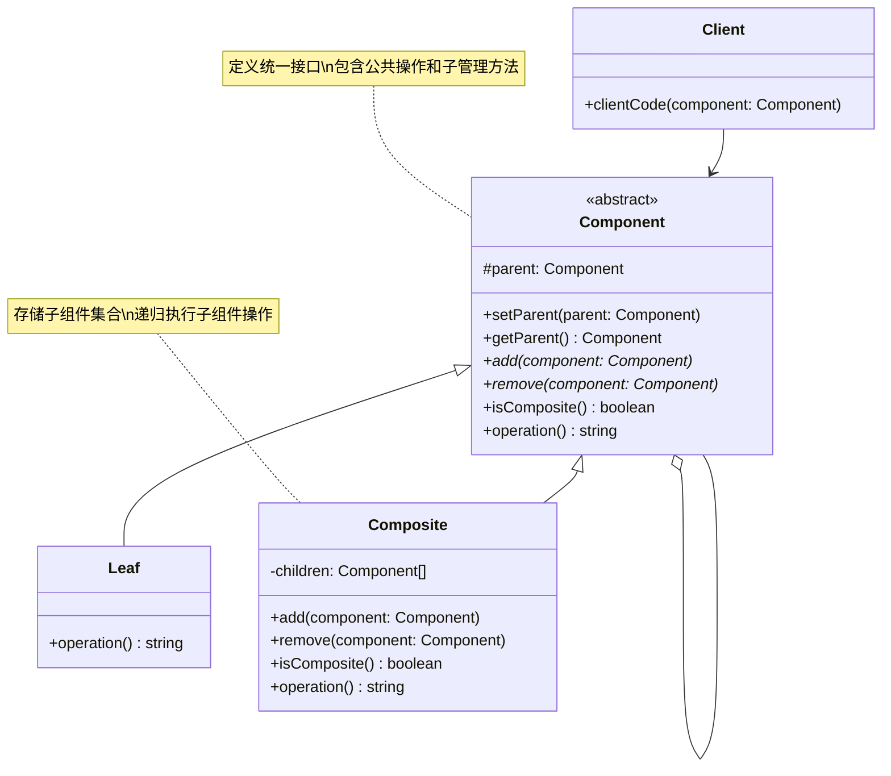

# 组合 (Composite)

## 概述

**定义**：将对象组合成树形结构来表示"部分-整体"的层次结构。组合模式让客户端能够统一地处理单个对象和对象的组合。

**分类**：结构型模式

---

## 问题场景

### 核心问题

1. **处理树形结构**：需要表示对象的层次结构（如文件系统、组织架构）
2. **统一接口**：希望对单个对象和组合对象使用相同的操作方式
3. **简化客户端代码**：不希望客户端在使用时需要区分对象和组合

### 示例场景

- 文件系统：文件和文件夹的统一操作
- 图形编辑器：简单图形和复杂图形的统一绘制
- 菜单系统：菜单项和子菜单的统一处理
- 组织架构：员工和部门的统一管理
- 包裹系统：计算包裹中商品的总价格

---

## 解决方案

### 核心思想

定义一个统一的组件接口，让叶子对象（Leaf）和组合对象（Composite）都实现该接口。组合对象包含子组件的集合，可以递归地处理子组件。

### 设计原理

1. **组件接口**：定义统一的行为接口，适用于单个对象和组合对象
2. **叶子节点**：实现组件接口，表示没有子节点的终端对象
3. **组合节点**：实现组件接口，包含子组件集合，可以添加/删除子组件
4. **透明性**：客户端无需区分单个对象和组合对象，统一处理

---

## 结构

### UML 类图



### 参与者

- **Component（组件）**：声明组合中对象的接口，实现所有类共有接口的默认行为
- **Leaf（叶子节点）**：表示组合中的叶子节点对象，没有子节点
- **Composite（组合节点）**：定义有子组件的组件的行为，存储子组件，实现子组件相关操作
- **Client（客户端）**：通过组件接口操作组合对象

### 协作关系

1. 客户端使用组件接口与组合结构中的对象交互
2. 客户端不区分叶子节点和组合节点，统一调用操作方法
3. 组合节点将操作请求转发给其所有子组件
4. 递归处理整个树形结构

---

## 代码示例

### 概念性实现

#### 核心代码

```typescript
/**
 * 组件基类声明公共操作
 */
abstract class Component {
    protected parent!: Component | null;

    /**
     * 可选：设置和获取父组件的引用
     */
    public setParent(parent: Component | null) {
        this.parent = parent;
    }

    public getParent(): Component | null {
        return this.parent;
    }

    /**
     * 可选：在基类中定义子管理操作
     * 叶子节点的这些方法可以是空实现
     */
    public add(component: Component): void { }

    public remove(component: Component): void { }

    /**
     * 判断是否是组合节点
     */
    public isComposite(): boolean {
        return false;
    }

    /**
     * 抽象操作方法
     */
    public abstract operation(): string;
}

/**
 * 叶子节点表示组合的终端对象
 */
class Leaf extends Component {
    public operation(): string {
        return 'Leaf';
    }
}

/**
 * 组合节点包含子组件
 */
class Composite extends Component {
    protected children: Component[] = [];

    /**
     * 添加子组件
     */
    public add(component: Component): void {
        this.children.push(component);
        component.setParent(this);
    }

    /**
     * 移除子组件
     */
    public remove(component: Component): void {
        const componentIndex = this.children.indexOf(component);
        this.children.splice(componentIndex, 1);
        component.setParent(null);
    }

    public isComposite(): boolean {
        return true;
    }

    /**
     * 递归执行所有子组件的操作
     */
    public operation(): string {
        const results = [];
        for (const child of this.children) {
            results.push(child.operation());
        }
        return `Branch(${results.join('+')})`;
    }
}

/**
 * 客户端代码通过组件接口工作
 */
function clientCode(component: Component) {
    console.log(`RESULT: ${component.operation()}`);
}

// 使用示例
const simple = new Leaf();
console.log('Client: I\'ve got a simple component:');
clientCode(simple);
console.log('');

// 构建组合结构
const tree = new Composite();
const branch1 = new Composite();
branch1.add(new Leaf());
branch1.add(new Leaf());
const branch2 = new Composite();
branch2.add(new Leaf());
tree.add(branch1);
tree.add(branch2);
console.log('Client: Now I\'ve got a composite tree:');
clientCode(tree);
console.log('');

// 动态管理树结构
function clientCode2(component1: Component, component2: Component) {
    if (component1.isComposite()) {
        component1.add(component2);
    }
    console.log(`RESULT: ${component1.operation()}`);
}

console.log('Client: I don\'t need to check the components classes even when managing the tree:');
clientCode2(tree, simple);
```

#### 运行结果

```
Client: I've got a simple component:
RESULT: Leaf

Client: Now I've got a composite tree:
RESULT: Branch(Branch(Leaf+Leaf)+Leaf)

Client: I don't need to check the components classes even when managing the tree:
RESULT: Branch(Branch(Leaf+Leaf)+Leaf+Leaf)
```

#### 代码解析

1. **组件接口**：`Component` 定义统一的操作接口，包括 `add()`、`remove()` 和 `operation()`
2. **叶子节点**：`Leaf` 实现基本操作，`add()` 和 `remove()` 为空实现
3. **组合节点**：`Composite` 维护子组件列表，递归调用子组件的 `operation()`
4. **透明性**：客户端统一使用 `Component` 接口，无需区分叶子节点和组合节点
5. **树形结构**：通过递归构建和处理树形层次结构

---

### 实际应用示例

#### 应用场景

计算快递包裹的总价格，包裹可以包含商品（叶子）或其他包裹（组合），形成嵌套结构。

#### 核心代码

```typescript
/**
 * 组件基类：包裹组件
 */
export abstract class PackageComponent {
    constructor(public title: string) {}

    public add(packageComponent: PackageComponent): void {}
    public remove(packageComponent: PackageComponent): void {}

    public isComposite(): boolean {
        return false;
    }

    public abstract getPrice(): number;
}

/**
 * 叶子节点：商品
 */
export class ProductLeaf extends PackageComponent {
    constructor(title: string, protected price: number) {
        super(title);
    }

    public getPrice(): number {
        return this.price;
    }
}

/**
 * 组合节点：包含其他包裹的复合包裹
 */
class MultiPackageComposite extends PackageComponent {
    protected childrenPackages: PackageComponent[] = [];

    public add(packageComponent: PackageComponent): void {
        this.childrenPackages.push(packageComponent);
    }

    public remove(packageComponent: PackageComponent): void {
        const index = this.childrenPackages.indexOf(packageComponent);
        this.childrenPackages.splice(index, 1);
    }

    public isComposite(): boolean {
        return true;
    }

    /**
     * 递归计算所有子包裹的价格总和
     */
    public getPrice(): number {
        return this.childrenPackages.reduce((prev, curr) => prev + curr.getPrice(), 0);
    }
}

/**
 * 辅助函数（类似建造者模式）隐藏具体组件类型
 */
function getGalaxyS68Pack(): PackageComponent {
    const complexMobilePackage = new MultiPackageComposite('Galaxy S68 Pack');
    complexMobilePackage.add(new ProductLeaf('Galaxy S68', 900));
    complexMobilePackage.add(new ProductLeaf('S68 Charger', 25));
    complexMobilePackage.add(new ProductLeaf('S68 Case', 15));
    return complexMobilePackage;
}

function getCanonM50Pack(): PackageComponent {
    const complexCameraPackage = new MultiPackageComposite('Canon M50 Pack');
    complexCameraPackage.add(new ProductLeaf('Canon M50', 600));
    complexCameraPackage.add(new ProductLeaf('A50 1.8 Lens', 250));
    complexCameraPackage.add(new ProductLeaf('128 Gb Micro SD', 40));
    complexCameraPackage.add(new ProductLeaf('Canon Generic Case', 150));
    return complexCameraPackage;
}

function getHeadphones(): PackageComponent {
    return new ProductLeaf('HyperX Cloud Flight', 150);
}

// 客户端代码
const galaxyPackage: PackageComponent = getGalaxyS68Pack();
const canonPackage: PackageComponent = getCanonM50Pack();
const simpleHeadphonesPackage: PackageComponent = getHeadphones();

const mainShipment: PackageComponent = new MultiPackageComposite('Main Shipment');
mainShipment.add(galaxyPackage);
mainShipment.add(canonPackage);
mainShipment.add(simpleHeadphonesPackage);

console.log(`Total shipment cost: ${mainShipment.getPrice()}€`);
```

#### 运行结果

```
Total shipment cost: 2130€
```

#### 实现要点

1. **递归计算**：`getPrice()` 递归遍历整个树形结构，计算所有商品的总价
2. **透明处理**：客户端统一使用 `PackageComponent` 接口，无需区分商品和包裹
3. **灵活组合**：可以任意嵌套包裹，创建复杂的层次结构
4. **简化使用**：辅助函数隐藏具体组件类型，提供便捷的创建方式
5. **实际场景**：
   - Galaxy S68 Pack: 900 + 25 + 15 = 940€
   - Canon M50 Pack: 600 + 250 + 40 + 150 = 1040€
   - Headphones: 150€
   - 总计: 940 + 1040 + 150 = 2130€

---

## 适用场景

### ✅ 适合使用的场景

1. **树形结构**：需要表示对象的层次结构（文件系统、DOM、菜单等）
2. **统一处理**：希望统一处理单个对象和组合对象
3. **递归结构**：数据结构本身就是递归的（如目录包含子目录）
4. **简化客户端**：不希望客户端代码区分对象和组合

### ❌ 不适合使用的场景

1. **简单层次**：只有单层结构，不需要递归处理
2. **类型安全**：需要在编译时区分不同类型的对象
3. **叶子为主**：大部分是叶子对象，组合对象很少
4. **性能敏感**：递归调用可能影响性能

---

## 优缺点

### 优点

1. **统一接口**：客户端可以统一处理单个对象和组合对象
2. **简化代码**：客户端无需区分对象类型，代码更简洁
3. **易于扩展**：新增叶子节点或组合节点都很方便
4. **层次清晰**：自然地表示树形层次结构
5. **开闭原则**：无需修改现有代码即可添加新类型的组件

### 缺点

1. **设计复杂**：难以限制组合中的组件类型（如组合只能包含特定类型）
2. **类型安全**：由于统一接口，可能在运行时才发现类型错误
3. **递归开销**：深层嵌套可能导致递归性能问题
4. **过度泛化**：叶子节点需要实现不需要的方法（如 add、remove）

---

## 与其他模式的关系

- **与装饰器**：装饰器模式在不改变对象结构的前提下添加功能，组合模式构建树形结构
- **与迭代器**：组合模式可以配合迭代器模式遍历树形结构
- **与访问者**：访问者模式可以在不修改组件类的前提下对组合结构执行复杂操作
- **与命令**：命令模式可以将整个组合结构作为一个命令执行
- **与享元**：享元模式可以优化组合模式中共享的叶子节点

---

## TypeScript 实现要点

### TypeScript 特性应用

1. **抽象类**：使用 `abstract class` 定义组件基类
2. **可选方法**：叶子节点可以不实现 `add()` 和 `remove()`
3. **类型保护**：使用 `isComposite()` 进行类型检查
4. **访问修饰符**：使用 `protected` 保护子组件列表

### 安全性组合模式

标准实现中，叶子节点的 `add()` 和 `remove()` 是空实现，可能导致运行时错误。可以使用类型系统增强安全性：

```typescript
// 方案1：使用类型守卫
function isComposite(component: Component): component is Composite {
    return component.isComposite();
}

// 方案2：将子管理方法移到 Composite 中
abstract class Component {
    public abstract operation(): string;
}

class Composite extends Component {
    private children: Component[] = [];

    public add(component: Component): void {
        this.children.push(component);
    }

    public operation(): string {
        // ...
    }
}

// 客户端需要类型检查
if (isComposite(component)) {
    component.add(newComponent);
}
```

### 透明性 vs 安全性

#### 透明性（标准实现）

```typescript
abstract class Component {
    public add(component: Component): void {}
    public remove(component: Component): void {}
}
```

**优点**：客户端统一处理
**缺点**：类型不安全，可能导致运行时错误

#### 安全性（改进实现）

```typescript
abstract class Component {
    public abstract operation(): string;
}

class Composite extends Component {
    public add(component: Component): void { }
    public remove(component: Component): void { }
}
```

**优点**：类型安全
**缺点**：客户端需要类型检查

### 遍历组合结构

```typescript
class Composite extends Component {
    private children: Component[] = [];

    // 深度优先遍历
    public traverse(): void {
        for (const child of this.children) {
            child.operation();
            if (child instanceof Composite) {
                child.traverse();
            }
        }
    }

    // 使用迭代器模式
    public*[Symbol.iterator](): Iterator<Component> {
        for (const child of this.children) {
            yield child;
            if (child instanceof Composite) {
                yield* child;
            }
        }
    }
}
```

### 最佳实践

1. **使用父引用**：维护对父组件的引用，便于向上遍历
2. **惰性初始化**：对于大型组合结构，可以惰性加载子组件
3. **缓存结果**：对于耗时操作（如计算价格），可以缓存结果
4. **限制深度**：对于深层嵌套，考虑设置最大深度限制

---

## 参考资源

- Refactoring.Guru: [Composite Pattern](https://refactoring.guru/design-patterns/composite)
- GoF 原书：第 4 章 "结构型模式"
- 相关模式：[装饰器](decorator.md) | [迭代器](../behavioral/iterator.md) | [访问者](../behavioral/visitor.md)
