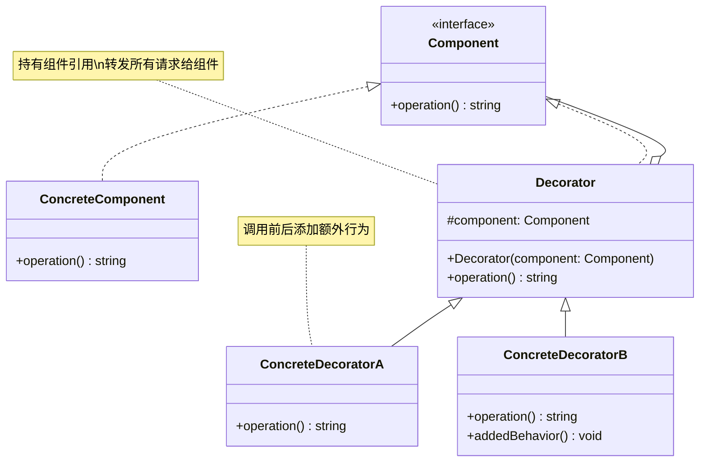

# 装饰器 (Decorator)

## 概述

**定义**：动态地给对象添加一些额外的职责。就扩展功能而言，装饰器模式比生成子类更为灵活。

**分类**：结构型模式

---

## 问题场景

### 核心问题

1. **静态继承的局限**：使用继承扩展功能会导致类爆炸，且无法在运行时动态添加或删除功能
2. **多层嵌套**：每个功能组合都需要创建一个子类，导致类的数量呈指数级增长
3. **违反单一职责**：包含多种功能的类过于臃肿，难以维护

### 示例场景

- 咖啡订单系统：咖啡 + 牛奶 + 摩卡 + 奶泡
- 数据流处理：数据压缩 + 加密 + 缓冲
- Web 控制器：身份验证 + 日志记录 + 性能监控
- UI 组件：带边框的窗口 + 可滚动 + 可调整大小

---

## 解决方案

### 核心思想

将对象包装在装饰器对象中，装饰器与被装饰对象实现相同的接口，可以在调用被装饰对象的行为前后添加额外的行为。

### 设计原理

1. **组件接口**：定义对象和装饰器的共同接口
2. **具体组件**：实现基本功能的核心对象
3. **装饰器基类**：实现组件接口，包含对组件的引用
4. **具体装饰器**：添加额外功能的装饰器实现

**对比继承**：
```
继承方式：                    装饰器方式：
  Component                    Component
    |                            |
ConcreteComponent          ConcreteComponent
    |                            |
  ┌───┴───┐                     Decorator
  |   |   |                         |
 A1  A2  A3                    ┌────┴────┐
  |   |   |                     D1      D2
  B   B   B                     |       |
    类爆炸                    可以任意组合
```

---

## 结构

### UML 类图



### 参与者

- **Component（组件）**：定义对象和装饰器的共同接口
- **ConcreteComponent（具体组件）**：实现组件接口，是被装饰的核心对象
- **Decorator（装饰器）**：实现组件接口，包含对组件对象的引用
- **ConcreteDecorator（具体装饰器）**：添加具体功能的装饰器实现

### 协作关系

1. 客户端将具体组件对象传递给装饰器
2. 装饰器在调用组件方法前后添加额外行为
3. 多个装饰器可以嵌套包装，形成装饰链
4. 请求沿装饰链传递，每个装饰器依次处理

---

## 代码示例

### 概念性实现

#### 核心代码

```typescript
/**
 * 组件接口定义可被装饰器改变的操作
 */
interface Component {
    operation(): string;
}

/**
 * 具体组件提供默认实现
 */
class ConcreteComponent implements Component {
    public operation(): string {
        return 'ConcreteComponent';
    }
}

/**
 * 装饰器基类遵循组件接口
 * 主要目的是定义所有具体装饰器的包装接口
 */
class Decorator implements Component {
    protected component: Component;

    constructor(component: Component) {
        this.component = component;
    }

    /**
     * 装饰器将所有工作委托给被包装的组件
     */
    public operation(): string {
        return this.component.operation();
    }
}

/**
 * 具体装饰器调用包装对象并改变结果
 */
class ConcreteDecoratorA extends Decorator {
    /**
     * 装饰器可以调用父实现而不是直接调用包装对象
     * 这样简化了装饰器类的扩展
     */
    public operation(): string {
        return `ConcreteDecoratorA(${super.operation()})`;
    }
}

/**
 * 装饰器可以在调用包装对象之前或之后执行行为
 */
class ConcreteDecoratorB extends Decorator {
    public operation(): string {
        return `ConcreteDecoratorB(${super.operation()})`;
    }
}

/**
 * 客户端代码使用组件接口与所有对象交互
 */
function clientCode(component: Component) {
    console.log(`RESULT: ${component.operation()}`);
}

// 使用示例
const simple = new ConcreteComponent();
console.log('Client: I\'ve got a simple component:');
clientCode(simple);
console.log('');

// 装饰组件
const decorator1 = new ConcreteDecoratorA(simple);
const decorator2 = new ConcreteDecoratorB(decorator1);
console.log('Client: Now I\'ve got a decorated component:');
clientCode(decorator2);
```

#### 运行结果

```
Client: I've got a simple component:
RESULT: ConcreteComponent

Client: Now I've got a decorated component:
RESULT: ConcreteDecoratorB(ConcreteDecoratorA(ConcreteComponent))
```

#### 代码解析

1. **组件接口**：`Component` 定义统一的 `operation()` 方法
2. **具体组件**：`ConcreteComponent` 实现基本功能
3. **装饰器基类**：`Decorator` 实现组件接口，持有组件引用
4. **具体装饰器**：`ConcreteDecoratorA` 和 `ConcreteDecoratorB` 在调用前后包装结果
5. **嵌套装饰**：可以多层嵌套装饰器，每个装饰器依次处理请求

---

### 实际应用示例

#### 应用场景

为 Web 控制器添加遥测功能，记录请求的处理时间，而无需修改原有控制器代码。

#### 核心代码

```typescript
/**
 * 控制器接口和类型定义
 */
interface ControllerRequest {
    url: string;
    method: string;
    data?: any;
}

interface ControllerResponse {
    status: number;
    data: any;
}

interface Controller {
    process(req: ControllerRequest): Promise<ControllerResponse>;
}

/**
 * 具体组件：用户控制器
 */
class UserController implements Controller {
    public process(req: ControllerRequest): Promise<ControllerResponse> {
        const users = [
            { id: 1, name: 'John' },
            { id: 2, name: 'Bob' },
            { id: 3, name: 'Alice' },
        ];

        const response: ControllerResponse = {
            status: 200,
            data: {}
        };

        if (req.method === 'GET') {
            response.data = users;
        } else {
            response.status = 400;
            response.data = {
                message: 'Bad request'
            };
        }

        return new Promise((resolve) => {
            setTimeout(() => {
                resolve(response);
            }, 200);
        });
    }
}

/**
 * 装饰器基类
 */
class Decorator implements Controller {
    protected controller: Controller;

    constructor(controller: Controller) {
        this.controller = controller;
    }

    public process(req: ControllerRequest): Promise<ControllerResponse> {
        return this.controller.process(req);
    }
}

/**
 * 具体装饰器：添加遥测功能
 */
class TelemetryDecorator extends Decorator {
    public async process(req: ControllerRequest): Promise<ControllerResponse> {
        const start = new Date().getTime();

        // 调用原始控制器
        const result = await super.process(req);

        const end = new Date().getTime();
        const time = end - start;

        // 添加额外行为：记录性能数据
        console.log(`${req.url} ${req.method} => ${time}ms`);

        return result;
    }
}

// 客户端代码
const userController = new TelemetryDecorator(new UserController());
userController.process({ url: '/users', method: 'GET' });
```

#### 运行结果

```
/users GET => 202ms
```

#### 实现要点

1. **不修改原代码**：无需修改 `UserController` 即可添加遥测功能
2. **透明装饰**：装饰器实现相同的接口，客户端无感知
3. **异步处理**：装饰器支持异步操作，使用 `async/await`
4. **可组合**：可以添加更多装饰器（如日志、验证等）
5. **关注点分离**：遥测功能与业务逻辑分离，易于维护

#### 更多装饰器示例

```typescript
/**
 * 日志装饰器
 */
class LoggingDecorator extends Decorator {
    public async process(req: ControllerRequest): Promise<ControllerResponse> {
        console.log(`[${new Date().toISOString()}] Request: ${req.method} ${req.url}`);

        const result = await super.process(req);

        console.log(`[${new Date().toISOString()}] Response: ${result.status}`);
        return result;
    }
}

/**
 * 认证装饰器
 */
class AuthDecorator extends Decorator {
    public async process(req: ControllerRequest): Promise<ControllerResponse> {
        if (!req.data || !req.data.token) {
            return {
                status: 401,
                data: { message: 'Unauthorized' }
            };
        }

        return super.process(req);
    }
}

// 组合多个装饰器
const controller = new LoggingDecorator(
    new AuthDecorator(
        new TelemetryDecorator(
            new UserController()
        )
    )
);
```

---

## 适用场景

### ✅ 适合使用的场景

1. **动态添加功能**：需要在运行时动态地给对象添加或撤销功能
2. **多种功能组合**：多个功能可以任意组合，导致类爆炸时
3. **继承替代**：继承会导致大量子类时，使用装饰器更灵活
4. **功能叠加**：需要在不修改原有代码的情况下扩展功能

### ❌ 不适合使用的场景

1. **静态配置**：功能在编译时确定，运行时不会改变
2. **初始复杂**：被装饰对象本身就很复杂，装饰器会增加理解难度
3. **性能敏感**：多层装饰可能带来性能开销
4. **依赖具体实现**：需要依赖被装饰对象的具体实现细节

---

## 优缺点

### 优点

1. **开闭原则**：无需修改原有代码即可扩展功能
2. **灵活组合**：可以动态地组合任意数量的装饰器
3. **单一职责**：每个装饰器只关注一个功能
4. **运行时灵活**：可以在运行时添加或删除装饰器
5. **避免类爆炸**：比继承更灵活，减少了类的数量

### 缺点

1. **理解困难**：多层嵌套的装饰器难以理解和调试
2. **封装问题**：装饰器可能访问被装饰对象的内部状态
3. **类型检查**：运行时装饰可能导致类型检查困难
4. **初始化复杂**：创建多层装饰的对象较为复杂
5. **小对象过多**：每个装饰器都是一个独立的对象

---

## 与其他模式的关系

- **与适配器**：适配器改变对象的接口，装饰器增强对象的功能
- **与组合**：装饰器模式类似于只有一个子组件的组合模式
- **与策略**：策略模式改变对象的行为，装饰器模式增强对象的行为
- **与责任链**：责任链模式按顺序处理请求，装饰器模式层层包装请求
- **与代理**：代理模式控制对对象的访问，装饰器模式增强对象的功能

---

## TypeScript 实现要点

### TypeScript 特性应用

1. **接口实现**：使用 `implements` 实现组件接口
2. **类继承**：使用 `extends` 继承装饰器基类
3. **访问修饰符**：使用 `protected` 保护组件引用
4. **装饰器语法**：TypeScript 提供了装饰器语法糖（实验性功能）

### TypeScript 装饰器语法

TypeScript 提供了内置的装饰器语法，可以用于类、方法、属性、参数等：

```typescript
// 类装饰器
@Component({
    selector: 'app-user',
    templateUrl: './user.component.html'
})
class UserComponent {
    // 方法装饰器
    @Log()
    getUser() {
        return 'John';
    }

    // 属性装饰器
    @Input()
    name: string;

    // 参数装饰器
    updateUser(@Required name: string) {
        // ...
    }
}

// 装饰器工厂
function Log() {
    return function(
        target: any,
        propertyKey: string,
        descriptor: PropertyDescriptor
    ) {
        const originalMethod = descriptor.value;

        descriptor.value = function(...args: any[]) {
            console.log(`Calling ${propertyKey} with`, args);
            const result = originalMethod.apply(this, args);
            console.log(`${propertyKey} returned`, result);
            return result;
        };
    };
}
```

**注意**：TypeScript 的装饰器语法与装饰器设计模式不同，前者是语言特性，后者是设计模式。

### 方法装饰器实现

```typescript
/**
 * 性能监控装饰器
 */
function measureTime(
    target: any,
    propertyKey: string,
    descriptor: PropertyDescriptor
) {
    const originalMethod = descriptor.value;

    descriptor.value = function(...args: any[]) {
        const start = performance.now();
        const result = originalMethod.apply(this, args);
        const end = performance.now();

        console.log(`${propertyKey} took ${end - start}ms`);
        return result;
    };

    return descriptor;
}

class UserService {
    @measureTime
    getUser(id: number) {
        // 模拟耗时操作
        return { id, name: 'John' };
    }
}

const service = new UserService();
service.getUser(1); // 输出: getUser took 0.123ms
```

### 装饰器组合

```typescript
/**
 * 创建多层装饰器
 */
function decorateComponent(component: Component): Component {
    const decorated = new LoggingDecorator(
        new AuthDecorator(
            new TelemetryDecorator(component)
        )
    );
    return decorated;
}

// 或者使用链式调用
function decorateComponent(component: Component): Component {
    return new LoggingDecorator(
        new AuthDecorator(
            new TelemetryDecorator(component)
        )
    );
}
```

### 最佳实践

1. **保持接口一致**：装饰器必须实现与组件相同的接口
2. **透明性**：装饰器对客户端应该是透明的
3. **可组合性**：装饰器应该可以任意组合
4. **单一职责**：每个装饰器只负责一个功能
5. **避免过度装饰**：不要创建太多装饰器层级

### 装饰器 vs 继承

```typescript
// 继承方式：类爆炸
class CoffeeWithMilk extends Coffee { }
class CoffeeWithMilkAndMocha extends CoffeeWithMilk { }
class CoffeeWithMilkAndMochaAndWhip extends CoffeeWithMilkAndMocha { }

// 装饰器方式：灵活组合
const coffee = new WhipDecorator(
    new MochaDecorator(
        new MilkDecorator(
            new SimpleCoffee()
        )
    )
);
```

---

## 参考资源

- Refactoring.Guru: [Decorator Pattern](https://refactoring.guru/design-patterns/decorator)
- GoF 原书：第 4 章 "结构型模式"
- TypeScript 装饰器文档: [TypeScript Decorators](https://www.typescriptlang.org/docs/handbook/decorators.html)
- 相关模式：[适配器](adapter.md) | [代理](proxy.md) | [责任链](../behavioral/chain-of-responsibility.md)
