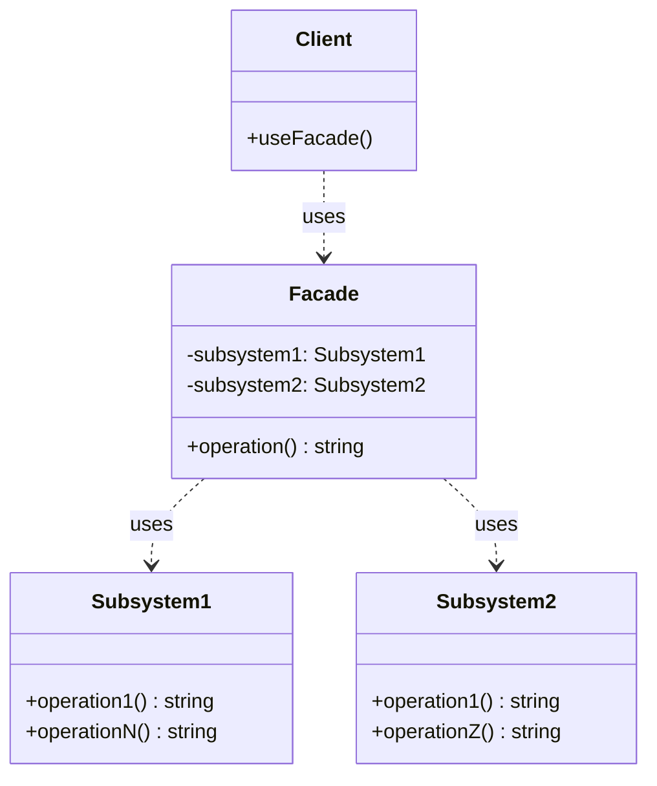

# 外观 (Facade)

## 概述

**定义**：为复杂子系统提供一个简化的接口，使子系统更容易使用。

**分类**：结构型模式

---

## 问题场景

### 核心问题

当需要与一个复杂的库、框架或系统交互，但只需要使用其一小部分功能时，会遇到以下问题：

1. **复杂度过高**：系统包含大量类和复杂的交互关系，难以理解和使用
2. **依赖过多**：客户端必须与多个子系统类直接交互，造成紧耦合
3. **代码重复**：相同的初始化和配置代码在客户端代码中重复出现
4. **学习曲线陡峭**：新手需要深入学习整个系统才能完成简单任务

### 示例场景

1. **数据库访问**：简化数据库连接、查询、关闭等复杂操作
2. **API 封装**：为复杂的第三方 API 提供简化的调用接口
3. **文件转换**：封装读取、解析、转换、写入等多个步骤
4. **多媒体处理**：简化音频、视频编解码的复杂流程

---

## 解决方案

### 核心思想

创建一个外观类，为子系统提供简化的接口。外观类将客户端的请求委派给适当的子系统对象，并管理子系统的生命周期。客户端只需要与外观类交互，无需直接处理复杂的子系统。

### 设计原理

1. **简化接口**：提供一个简单易用的高层接口
2. **委派调用**：将请求转发给相应的子系统对象
3. **封装复杂度**：隐藏子系统的内部交互和初始化逻辑
4. **可选直接访问**：客户端仍然可以直接访问子系统（如果需要）

---

## 结构

### UML 类图



### 参与者

- **Facade（外观）**：提供简化的接口，将客户端请求委派给子系统
- **Subsystem（子系统）**：实现系统的功能，处理外观委派的任务
- **Client（客户端）**：通过外观接口与子系统交互

### 协作关系

1. 客户端调用外观对象的方法
2. 外观对象将请求委派给相应的子系统对象
3. 子系统对象执行实际的操作
4. 外观对象可以选择性地管理子系统的生命周期

---

## 代码示例

### 概念性实现

#### 核心代码

```typescript
/**
 * 外观类为复杂的一个或多个子系统逻辑提供简单接口。
 * 外观将客户端请求委派给子系统内适当的对象。
 * 外观还负责管理它们的生命周期。
 * 所有这些保护客户端免受子系统复杂性的影响。
 */
class Facade {
    protected subsystem1: Subsystem1;
    protected subsystem2: Subsystem2;

    /**
     * 根据应用程序的需要，可以为外观提供现有的子系统对象，
     * 或强制外观自己创建它们。
     */
    constructor(subsystem1?: Subsystem1, subsystem2?: Subsystem2) {
        this.subsystem1 = subsystem1 || new Subsystem1();
        this.subsystem2 = subsystem2 || new Subsystem2();
    }

    /**
     * 外观的方法是访问子系统复杂功能的便捷快捷方式。
     * 然而，客户端只能获得子系统功能的一部分。
     */
    public operation(): string {
        let result = '外观初始化子系统：\n';
        result += this.subsystem1.operation1();
        result += this.subsystem2.operation1();
        result += '外观命令子系统执行操作：\n';
        result += this.subsystem1.operationN();
        result += this.subsystem2.operationZ();

        return result;
    }
}

/**
 * 子系统可以接受来自外观或客户端的请求。
 * 无论如何，对于子系统来说，外观只是另一个客户端，它不是子系统的一部分。
 */
class Subsystem1 {
    public operation1(): string {
        return '子系统1：准备就绪！\n';
    }

    public operationN(): string {
        return '子系统1：开始！\n';
    }
}

/**
 * 某些外观可以同时处理多个子系统。
 */
class Subsystem2 {
    public operation1(): string {
        return '子系统2：准备就绪！\n';
    }

    public operationZ(): string {
        return '子系统2：开火！';
    }
}

/**
 * 客户端代码通过外观提供的简单接口与复杂子系统一起工作。
 * 当外观管理子系统的生命周期时，客户端甚至可能不知道子系统的存在。
 * 这种方法使你能够保持复杂度的可控性。
 */
function clientCode(facade: Facade) {
    console.log(facade.operation());
}

/**
 * 客户端代码可能已经创建了一些子系统对象。
 * 在这种情况下，用这些对象初始化外观可能是有意义的，
 * 而不是让外观创建新实例。
 */
const subsystem1 = new Subsystem1();
const subsystem2 = new Subsystem2();
const facade = new Facade(subsystem1, subsystem2);
clientCode(facade);
```

#### 运行结果

```
外观初始化子系统：
子系统1：准备就绪！
子系统2：准备就绪！
外观命令子系统执行操作：
子系统1：开始！
子系统2：开火！
```

#### 代码解析

1. **Facade 类**：提供简化的 `operation()` 方法，内部调用多个子系统的方法
2. **依赖注入**：可以通过构造函数传入已有的子系统对象
3. **默认创建**：如果没有传入子系统对象，外观会自动创建
4. **客户端简化**：客户端只需调用一个方法，无需了解子系统的复杂性

---

### 实际应用示例

#### 应用场景

实现一个 ETL（Extract-Transform-Load）处理器，封装文件读取、数据转换和文件写入的复杂流程。

#### 核心代码

```typescript
type Map = { [key: string]: any };

/**
 * 数据提取器接口
 */
interface Extractor {
  extract(): Promise<string>;
}

/**
 * 数据转换器接口
 */
interface Transformer {
  transform(input: string): Map;
}

/**
 * 数据加载器接口
 */
interface Loader {
  load(input: Map): Promise<any>;
}

/**
 * 文件提取器：从文件系统中提取数据
 */
class FileExtractor implements Extractor {
  filepath: string;
  constructor(filepath: string) {
    this.filepath = filepath;
  }

  public async extract() {
    return fs.readFile(this.filepath, "utf8");
  }
}

/**
 * 文件加载器：将数据写入文件系统
 */
class FileLoader implements Loader {
  filepath: string;
  constructor(filepath: string) {
    this.filepath = filepath;
  }

  public async load(input: Map) {
    return fs.writeFile(this.filepath, JSON.stringify(input, undefined, 4));
  }
}

/**
 * 文件转换器：解析字符串并转换为 Map
 */
class FileTransformer implements Transformer {
  public transform(input: string): Map {
    let result: Map = {};

    input.split("\n").forEach((line) => {
      if (line.trim().length === 0) return;

      const [key] = line.split(",");
      if (typeof result[key] === "undefined") {
        result[key] = 0;
      }
      result[key] = result[key] + 1;
    });

    return result;
  }
}

/**
 * ETL 处理器外观类
 * 封装提取、转换、加载的复杂流程
 */
class ETLProcessor {
  extractor: Extractor;
  transformer: Transformer;
  loader: Loader;

  constructor(extractor: Extractor, transformer: Transformer, loader: Loader) {
    this.extractor = extractor;
    this.transformer = transformer;
    this.loader = loader;
  }

  /**
   * 简化的处理接口
   * 客户端只需调用这一个方法
   */
  public async process() {
    const input = await this.extractor.extract();
    const transformed = this.transformer.transform(input);
    return this.loader.load(transformed);
  }
}

/**
 * 客户端代码
 * 使用外观类简化复杂的 ETL 流程
 */
const processor = new ETLProcessor(
  new FileExtractor("input.txt"),
  new FileTransformer(),
  new FileLoader("output.json")
);

processor.process().then(() => {
  console.log("处理完成");
});
```

#### 运行结果

```bash
# 假设 input.txt 内容为：
# apple,red
# banana,yellow
# apple,green

# 运行后 output.json 内容为：
{
    "apple": 2,
    "banana": 1
}

# 控制台输出：
处理完成
```

#### 实现要点

1. **接口定义**：定义了 Extractor、Transformer、Loader 三个接口
2. **具体实现**：每个接口都有对应的文件系统实现
3. **外观封装**：ETLProcessor 封装了完整的 ETL 流程
4. **依赖注入**：通过构造函数注入具体的实现类
5. **客户端简化**：客户端只需调用 `process()` 方法，无需了解内部细节

---

## 适用场景

### ✅ 适合使用的场景

1. **简化复杂系统**：需要为一个复杂的子系统提供简单接口
2. **分层架构**：在多层架构中，外观可以作为某一层的入口
3. **重构遗留系统**：为遗留系统提供新接口，逐步重构
4. **减少依赖**：希望减少客户端与子系统之间的直接依赖

### ❌ 不适合使用的场景

1. **需要完全访问**：客户端需要访问子系统的所有功能
2. **引入不必要 abstraction**：系统本身已经很简单，不需要额外的抽象层
3. **过度封装**：外观限制了子系统的灵活性

---

## 优缺点

### 优点

1. **简化接口**：将复杂的子系统简化为易用的接口
2. **解耦**：减少客户端与子系统之间的依赖
3. **代码复用**：常见的操作序列可以在外观中复用
4. **灵活访问**：客户端仍然可以直接访问子系统（如果需要）

### 缺点

1. **上帝对象**：外观可能演变成包含大量逻辑的"上帝对象"
2. **限制功能**：外观只提供子系统功能的一部分
3. **违反开闭原则**：修改子系统可能需要修改外观

---

## 与其他模式的关系

- **与抽象工厂**：外观可以与抽象工厂结合，简化子系统的创建
- **与单例模式**：外观通常实现为单例，因为系统只需要一个入口
- **与中介者模式**：外观简化子系统的接口，中介者简化对象间的通信
- **与适配器模式**：外观提供新接口简化系统，适配器转换现有接口

---

## TypeScript 实现要点

### TypeScript 特性应用

1. **接口定义**：使用 `interface` 定义子系统接口
2. **可选参数**：使用 `?` 实现可选的子系统对象注入
3. **类型注解**：明确标注方法的参数和返回值类型
4. **Promise**：使用 `Promise` 处理异步操作

### 最佳实践

1. **单一职责**：外观只负责简化接口，不包含业务逻辑
2. **可选依赖**：允许客户端传入已有的子系统对象
3. **保持简单**：外观的方法应该简洁明了，避免复杂的逻辑
4. **文档完善**：清晰记录外观提供的每个功能

### 异步外观示例

```typescript
class DatabaseFacade {
  private connection: Connection;

  async connect() {
    this.connection = await createConnection();
  }

  async query(sql: string) {
    return this.connection.execute(sql);
  }

  async close() {
    await this.connection.close();
  }
}

// 使用
const db = new DatabaseFacade();
await db.connect();
const result = await db.query("SELECT * FROM users");
await db.close();
```

---

## 外观 vs 适配器

### 外观模式

**目的**：简化现有接口

```typescript
class Facade {
  simplifiedMethod() {
    subsystem1.method1();
    subsystem2.method2();
    subsystem3.method3();
  }
}
```

**特点**：
- 定义新接口
- 简化复杂系统
- 客户端可以选择直接使用子系统

### 适配器模式

**目的**：转换接口

```typescript
class Adapter implements TargetInterface {
  request() {
    adaptee.specificRequest();
  }
}
```

**特点**：
- 转换一个接口到另一个
- 使不兼容的接口协同工作
- 客户端必须通过适配器访问

---

## 参考资源

- Refactoring.Guru: [Facade Pattern](https://refactoring.guru/design-patterns/facade)
- GoF 原书：第 4 章 "结构型模式"
- 相关模式：[适配器](adapter.md) | [中介者](../behavioral/mediator.md) | [单例](../creational/singleton.md)
