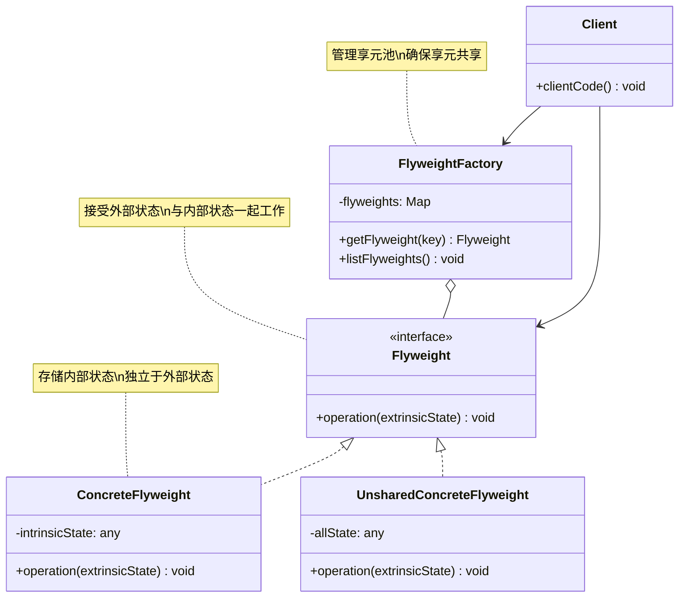

# 享元 (Flyweight)

## 概述

**定义**：运用共享技术有效地支持大量细粒度的对象。享元模式通过共享对象来最小化内存使用或计算开销。

**分类**：结构型模式

---

## 问题场景

### 核心问题

1. **内存浪费**：创建大量相似对象导致内存消耗过大
2. **性能问题**：对象数量过多导致系统性能下降
3. **重复数据**：多个对象包含相同的状态数据

### 示例场景

- 文本编辑器：每个字符对象包含字体、大小、颜色等属性
- 游戏开发：大量相同的树木、建筑物、车辆对象
- 网页渲染：大量相同样式的图标、按钮
- 地图应用：大量相同类型的车辆和建筑

---

## 解决方案

### 核心思想

将对象的状态分为内部状态（Intrinsic State，可共享）和外部状态（Extrinsic State，不可共享）。内部状态存储在享元对象中，外部状态由客户端存储并在使用时传递给享元。

### 设计原理

1. **内部状态**：存储在享元对象内部，可被多个对象共享
2. **外部状态**：依赖于具体场景，不可共享，由客户端管理
3. **享元工厂**：管理享元对象的创建和共享，确保享元被正确复用
4. **共享与复用**：相同内部状态的对象只创建一次，多次复用

**状态分离示例**：
```
不使用享元：                  使用享元后：
1000个汽车对象               3个享元对象 (Car, Truck, Motorbike)
每个对象包含：                + 1000个位置对象 (x, y, direction)
- 类型 (共享)                  类型：内部状态 (存储在享元)
- 3D模型 (共享)               3D模型：内部状态 (存储在享元)
- 位置 (不共享)               位置：外部状态 (由客户端管理)
- 方向 (不共享)               方向：外部状态 (由客户端管理)
内存：~3GB                    内存：~30MB
```

---

## 结构

### UML 类图



### 参与者

- **Flyweight（享元接口）**：定义接受外部状态并在此状态下操作的方法
- **ConcreteFlyweight（具体享元）**：实现享元接口，存储内部状态
- **UnsharedConcreteFlyweight（非共享具体享元）**：并非所有的享元子类都需要被共享
- **FlyweightFactory（享元工厂）**：创建和管理享元对象，确保享元被适当地共享
- **Client（客户端）**：维护外部状态的引用，在需要时将外部状态传递给享元

### 协作关系

1. 客户端请求享元对象时，享元工厂返回已存在的或创建新的享元
2. 客户端存储和管理外部状态
3. 客户端在调用享元方法时传递外部状态
4. 享元将内部状态与外部状态组合，执行具体操作

---

## 代码示例

### 概念性实现

#### 核心代码

```typescript
/**
 * 享元类存储共享的状态部分（内部状态）
 */
class Flyweight {
    private sharedState: any;

    constructor(sharedState: any) {
        this.sharedState = sharedState;
    }

    /**
     * 享元接受剩余状态（外部状态）并通过方法参数传递
     */
    public operation(uniqueState): void {
        const s = JSON.stringify(this.sharedState);
        const u = JSON.stringify(uniqueState);
        console.log(`Flyweight: Displaying shared (${s}) and unique (${u}) state.`);
    }
}

/**
 * 享元工厂创建和管理享元对象
 * 确保享元被正确共享
 */
class FlyweightFactory {
    private flyweights: {[key: string]: Flyweight} = <any>{};

    constructor(initialFlyweights: string[][]) {
        for (const state of initialFlyweights) {
            this.flyweights[this.getKey(state)] = new Flyweight(state);
        }
    }

    /**
     * 返回给定状态的享元字符串哈希
     */
    private getKey(state: string[]): string {
        return state.join('_');
    }

    /**
     * 返回现有享元或创建新的
     */
    public getFlyweight(sharedState: string[]): Flyweight {
        const key = this.getKey(sharedState);

        if (!(key in this.flyweights)) {
            console.log('FlyweightFactory: Can\'t find a flyweight, creating new one.');
            this.flyweights[key] = new Flyweight(sharedState);
        } else {
            console.log('FlyweightFactory: Reusing existing flyweight.');
        }

        return this.flyweights[key];
    }

    public listFlyweights(): void {
        const count = Object.keys(this.flyweights).length;
        console.log(`\nFlyweightFactory: I have ${count} flyweights:`);
        for (const key in this.flyweights) {
            console.log(key);
        }
    }
}

/**
 * 客户端代码通常在应用初始化时创建一堆预填充的享元
 */
const factory = new FlyweightFactory([
    ['Chevrolet', 'Camaro2018', 'pink'],
    ['Mercedes Benz', 'C300', 'black'],
    ['Mercedes Benz', 'C500', 'red'],
    ['BMW', 'M5', 'red'],
    ['BMW', 'X6', 'white'],
]);
factory.listFlyweights();

// 添加汽车到数据库
function addCarToPoliceDatabase(
    ff: FlyweightFactory, plates: string, owner: string,
    brand: string, model: string, color: string,
) {
    console.log('\nClient: Adding a car to database.');

    // 获取或创建享元
    const flyweight = ff.getFlyweight([brand, model, color]);

    // 客户端代码存储或计算外部状态并传递给享元方法
    flyweight.operation([plates, owner]);
}

addCarToPoliceDatabase(factory, 'CL234IR', 'James Doe', 'BMW', 'M5', 'red');

addCarToPoliceDatabase(factory, 'CL234IR', 'James Doe', 'BMW', 'X1', 'red');

factory.listFlyweights();
```

#### 运行结果

```
FlyweightFactory: I have 5 flyweights:
Chevrolet_Camaro2018_pink
Mercedes Benz_C300_black
Mercedes Benz_C500_red
BMW_M5_red
BMW_X6_white

Client: Adding a car to database.
FlyweightFactory: Reusing existing flyweight.
Flyweight: Displaying shared (["BMW","M5","red"]) and unique (["CL234IR","James Doe"]) state.

Client: Adding a car to database.
FlyweightFactory: Can't find a flyweight, creating new one.
Flyweight: Displaying shared (["BMW","X1","red"]) and unique (["CL234IR","James Doe"]) state.

FlyweightFactory: I have 6 flyweights:
Chevrolet_Camaro2018_pink
Mercedes Benz_C300_black
Mercedes Benz_C500_red
BMW_M5_red
BMW_X6_white
BMW_X1_red
```

#### 代码解析

1. **内部状态**：品牌、型号、颜色存储在享元对象中，可被多个对象共享
2. **外部状态**：车牌号、车主由客户端管理，传递给享元方法
3. **享元工厂**：管理享元对象的创建和共享，通过哈希键查找
4. **状态组合**：享元将内部状态与外部状态组合后执行操作
5. **内存优化**：相同品牌、型号、颜色的汽车共享同一个享元对象

---

### 实际应用示例

#### 应用场景

在地图应用中展示大量车辆（汽车、卡车、摩托车），每辆车都有大型 3D 模型。使用享元模式共享 3D 模型数据，避免重复加载。

#### 核心代码

```typescript
/**
 * 车辆类型枚举
 */
enum VehicleType {
    Car = 'Car',
    Truck = 'Truck',
    Motorbike = 'Motorbike',
}

enum Direction {
    North = 0,
    NorthEast = 45,
    East = 90,
    SouthEast = 135,
    South = 180,
    SouthWest = 225,
    West = 270,
    NorthWest = 315,
}

/**
 * 车辆享元类只存储共享的状态部分（3D模型）
 */
class VehicleFlyweight {
    public shared3DModel: number[];

    constructor(protected vehicleType: VehicleType) {
        switch (vehicleType) {
        case VehicleType.Car:
            this.shared3DModel = this.readFile('mediumCar.3d');
            break;
        case VehicleType.Truck:
            this.shared3DModel = this.readFile('largeTruck.3d');
            break;
        default:
            this.shared3DModel = this.readFile('smallMotorbike.3d');
        }
    }

    /**
     * 模拟读取大型 3D 模型文件
     */
    protected readFile(filename: string): number[] {
        if (/^large/.test(filename)) {
            return Array.from({ length: 1024 * 1024 }, () => Math.random());
        }
        if (/^medium/.test(filename)) {
            return Array.from({ length: 1024 * 256 }, () => Math.random());
        }
        return Array.from({ length: 1024 * 16 }, () => Math.random());
    }

    public render(x: number, y: number, direction: Direction) {
        console.log(`Rendered ${this.vehicleType} in position {${x}, ${y}} with direction ${direction}º`);
    }
}

/**
 * 车辆类包含非共享状态和对共享状态的引用
 */
export class Vehicle {
    constructor(
        public vehicleType: VehicleType,
        public x: number,
        public y: number,
        public direction: Direction,
        protected vehicleFlyweight: VehicleFlyweight,
    ) {}

    public render(x: number, y: number, direction: Direction) {
        this.vehicleFlyweight.render(x, y, direction);
    }
}

/**
 * 车辆工厂内部管理所有享元对象
 */
class VehicleFactory {
    private static vehicleFlyweights: Map<VehicleType, VehicleFlyweight> =
        new Map<VehicleType, VehicleFlyweight>();

    /**
     * 检查享元池中是否存在外部状态，否则创建新的
     */
    protected static getVehicle(
        vehicleType: VehicleType,
        x: number,
        y: number,
        direction: Direction,
    ): Vehicle {
        if (!this.vehicleFlyweights.has(vehicleType)) {
            this.vehicleFlyweights.set(vehicleType, new VehicleFlyweight(vehicleType));
        }
        return new Vehicle(
            vehicleType,
            x,
            y,
            direction,
            this.vehicleFlyweights.get(vehicleType)
        );
    }

    public static getCar(x: number, y: number, direction: Direction): Vehicle {
        return this.getVehicle(VehicleType.Car, x, y, direction);
    }

    public static getTruck(x: number, y: number, direction: Direction): Vehicle {
        return this.getVehicle(VehicleType.Truck, x, y, direction);
    }

    public static getMotorbike(x: number, y: number, direction: Direction): Vehicle {
        return this.getVehicle(VehicleType.Motorbike, x, y, direction);
    }
}

// 客户端代码
console.log('Initially the application takes:');
for (const [key, value] of Object.entries(process.memoryUsage())) {
    console.log(`    ${Math.round(value / (1024 * 1024))}MB of ${key}`);
}

const vehicles: Vehicle[] = [];

// 创建 1000 辆汽车
for (let i = 0; i < 1000; i += 1) {
    const x = Math.random() * 1000;
    const y = Math.random() * 1000;
    const direction = i % 2 ? Direction.North : Direction.South;
    vehicles.push(VehicleFactory.getCar(x, y, direction));
}

// 创建 500 辆卡车
for (let i = 0; i < 500; i += 1) {
    const x = Math.random() * 1000;
    const y = Math.random() * 1000;
    const direction = i % 2 ? Direction.East : Direction.West;
    vehicles.push(VehicleFactory.getTruck(x, y, direction));
}

// 创建 5000 辆摩托车
for (let i = 0; i < 5000; i += 1) {
    const x = Math.random() * 1000;
    const y = Math.random() * 1000;
    const direction = i % 2 ? Direction.SouthEast : Direction.NorthWest;
    vehicles.push(VehicleFactory.getMotorbike(x, y, direction));
}

console.log(`After creating ${vehicles.length} vehicles the application takes:`);
for (const [key, value] of Object.entries(process.memoryUsage())) {
    console.log(`    ${Math.round(value / (1024 * 1024))}MB of ${key}`);
}

// 对比：直接创建享元对象
console.log('Lets create some vehicles flyweights directly to see what happens');

const flyweights: VehicleFlyweight[] = [];

for (let i = 0; i < 100; i += 1) {
    flyweights.push(new VehicleFlyweight(VehicleType.Truck));
}

console.log(`After creating ${flyweights.length} flyweights finally the application takes:`);
for (const [key, value] of Object.entries(process.memoryUsage())) {
    console.log(`    ${Math.round(value / (1024 * 1024))}MB of ${key}`);
}
```

#### 运行结果

```
Initially the application takes:
    75MB of rss
    72MB of heapTotal
    36MB of heapUsed
    25MB of external

After creating 6500 vehicles the application takes:
    110MB of rss
    105MB of heapTotal
    39MB of heapUsed
    47MB of external

Lets create some vehicles flyweights directly to see what happens
After creating 100 flyweights finally the application takes:
    2352MB of rss
    2280MB of heapTotal
    2273MB of heapUsed
    56MB of external
```

#### 实现要点

1. **内存节省**：6500 辆车只创建了 3 个享元对象（汽车、卡车、摩托车各一个）
2. **内部状态**：3D 模型数据作为内部状态存储在享元对象中
3. **外部状态**：位置 (x, y) 和方向作为外部状态由客户端管理
4. **享元工厂**：`VehicleFactory` 管理享元对象的创建和共享
5. **性能对比**：
   - 使用享元：6500 辆车约 110MB（只加载 3 个 3D 模型）
   - 不使用享元：100 个对象约 2.3GB（每个对象都加载 3D 模型）

---

## 适用场景

### ✅ 适合使用的场景

1. **大量相似对象**：需要创建大量相似对象时
2. **内存敏感**：内存资源有限，需要优化内存使用时
3. **状态分离**：对象状态可以分为内部和外部状态时
4. **重复数据**：多个对象包含大量相同数据时

### ❌ 不适合使用的场景

1. **对象数量少**：创建的对象数量不多时，无需使用享元
2. **状态难以分离**：内部和外部状态难以区分时
3. **可变状态**：对象的内部状态经常变化时
4. **优先性能**：享元查找可能影响运行时性能

---

## 优缺点

### 优点

1. **内存优化**：通过共享对象大幅减少内存使用
2. **性能提升**：减少对象创建和垃圾回收的开销
3. **对象复用**：相同状态的对象只创建一次，多次复用
4. **集中管理**：通过享元工厂统一管理享元对象

### 缺点

1. **增加复杂性**：需要分离内部和外部状态，增加系统复杂度
2. **运行时开销**：查找享元、传递外部状态会增加运行时开销
3. **线程安全**：在多线程环境中需要考虑享元的线程安全性
4. **代码复杂**：享元模式使得代码逻辑更加复杂

---

## 与其他模式的关系

- **与组合**：享元模式可以与组合模式结合，在共享叶节点的同时构建树形结构
- **与策略**：享元模式可以共享策略对象，减少内存使用
- **与工厂方法**：享元工厂类似于工厂方法，专注于对象的共享和复用
- **与单例**：享元对象通常实现为单例，确保每种内部状态只有一个实例

---

## TypeScript 实现要点

### TypeScript 特性应用

1. **Map 数据结构**：使用 `Map` 存储享元对象，支持任意类型的键
2. **枚举类型**：使用 `enum` 定义享元类型
3. **类型注解**：明确标注内部状态和外部状态的类型
4. **访问修饰符**：使用 `private` 保护享元池

### 享元工厂实现

```typescript
class FlyweightFactory {
    // 使用 Map 存储享元对象
    private flyweights: Map<string, Flyweight> = new Map();

    getFlyweight(key: string, ...args: any[]): Flyweight {
        if (!this.flyweights.has(key)) {
            this.flyweights.set(key, new Flyweight(...args));
        }
        return this.flyweights.get(key)!;
    }

    // 获取享元数量
    getSize(): number {
        return this.flyweights.size;
    }

    // 清空享元池
    clear(): void {
        this.flyweights.clear();
    }
}
```

### 内部状态 vs 外部状态

```typescript
// 内部状态：存储在享元对象中
interface IntrinsicState {
    type: string;
    texture: string;
    model: number[];
}

// 外部状态：由客户端管理
interface ExtrinsicState {
    position: { x: number; y: number };
    rotation: number;
    scale: number;
}

class Flyweight {
    constructor(private intrinsic: IntrinsicState) {}

    public operation(extrinsic: ExtrinsicState): void {
        // 组合内部和外部状态
        console.log(
            `Rendering ${this.intrinsic.type} at ` +
            `(${extrinsic.position.x}, ${extrinsic.position.y}) ` +
            `rotation: ${extrinsic.rotation}`
        );
    }
}
```

### 不可变享元

```typescript
// 使用 readonly 确保内部状态不可变
class ImmutableFlyweight {
    constructor(
        private readonly intrinsic: Readonly<IntrinsicState>
    ) {}

    public operation(extrinsic: ExtrinsicState): void {
        // 内部状态不可修改，保证线程安全
    }
}
```

### 享元缓存策略

```typescript
class CachedFlyweightFactory {
    private cache: Map<string, Flyweight> = new Map();
    private maxSize: number;

    constructor(maxSize: number = 1000) {
        this.maxSize = maxSize;
    }

    getFlyweight(key: string): Flyweight | null {
        const flyweight = this.cache.get(key);

        if (flyweight) {
            // LRU: 移到末尾
            this.cache.delete(key);
            this.cache.set(key, flyweight);
            return flyweight;
        }

        // 超过最大容量，删除最旧的
        if (this.cache.size >= this.maxSize) {
            const firstKey = this.cache.keys().next().value;
            this.cache.delete(firstKey);
        }

        return null;
    }
}
```

### 最佳实践

1. **合理划分状态**：仔细分析哪些状态可以共享，哪些不能
2. **外部状态优化**：外部状态应该尽可能轻量
3. **享元缓存**：考虑使用 LRU 或其他缓存策略
4. **线程安全**：在多线程环境中确保享元的线程安全性
5. **性能监控**：监控享元的命中率，优化享元池大小

### 内存对比示例

```typescript
// 不使用享元
const cars: Car[] = [];
for (let i = 0; i < 10000; i++) {
    cars.push(new Car('Toyota', 'Camry', 'Red', large3DModel));
}
// 内存：~10GB

// 使用享元
const carFlyweight = new CarFlyweight('Toyota', 'Camry', 'Red', large3DModel);
const cars: CarContext[] = [];
for (let i = 0; i < 10000; i++) {
    cars.push(new CarContext(carFlyweight, x, y, direction));
}
// 内存：~100MB
```

---

## 参考资源

- Refactoring.Guru: [Flyweight Pattern](https://refactoring.guru/design-patterns/flyweight)
- GoF 原书：第 4 章 "结构型模式"
- 相关模式：[组合](composite.md) | [策略](../behavioral/strategy.md) | [单例](../creational/singleton.md)
