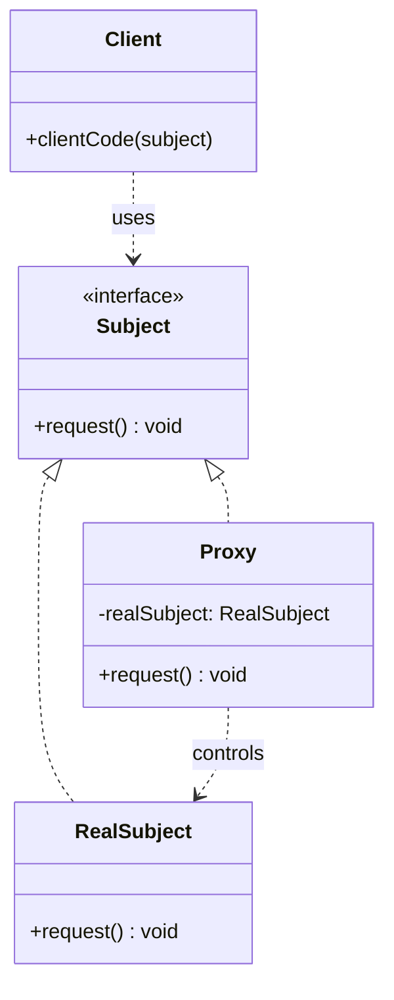

# 代理 (Proxy)

## 概述

**定义**：为其他对象提供一种代理或占位符，以控制对该对象的访问。

**分类**：结构型模式

---

## 问题场景

### 核心问题

当需要直接访问对象会造成不便或性能问题时，需要控制对对象的访问：

1. **延迟初始化**：大型对象的初始化成本高，希望延迟到真正需要时
2. **访问控制**：限制对敏感对象的访问，需要权限验证
3. **缓存查询**：频繁查询相同数据，希望缓存结果以提高性能
4. **远程访问**：对象位于远程服务器，需要处理网络通信

### 示例场景

- **虚拟代理**：延迟加载大型图像或文档
- **保护代理**：控制对敏感资源的访问权限
- **缓存代理**：缓存网络请求或数据库查询结果
- **智能代理**：在访问对象时添加引用计数等额外功能

---

## 解决方案

### 核心思想

创建一个代理类，实现与真实对象相同的接口。代理在客户端和真实对象之间充当中介，可以在请求到达真实对象之前或之后执行各种操作（如权限检查、缓存、日志记录等）。

### 设计原理

1. **相同接口**：代理与真实对象实现相同的接口
2. **请求转发**：代理将请求转发给真实对象
3. **额外功能**：在转发前后添加额外功能
4. **透明性**：客户端无需区分真实对象和代理

---

## 结构

### UML 类图



### 参与者

- **Subject（主体）**：声明真实主体和代理的公共接口
- **RealSubject（真实主体）**：实现具体的业务逻辑
- **Proxy（代理）**：包含对真实主体的引用，控制对其的访问
- **Client（客户端）**：通过主体接口与对象交互

---

## 代码示例

### 概念性实现

#### 核心代码

```typescript
/**
 * 主体接口声明真实主体和代理的公共操作。
 */
interface Subject {
    request(): void;
}

/**
 * 真实主体包含一些核心业务逻辑。
 */
class RealSubject implements Subject {
    public request(): void {
        console.log('真实主体：处理请求。');
    }
}

/**
 * 代理的接口与真实主体相同。
 */
class Proxy implements Subject {
    private realSubject: RealSubject;

    constructor(realSubject: RealSubject) {
        this.realSubject = realSubject;
    }

    /**
     * 代理模式最常见的应用是延迟加载、缓存、访问控制、日志等。
     * 代理可以执行这些操作之一，然后根据结果将执行传递给
     * 链接的真实主体对象中的同名方法。
     */
    public request(): void {
        if (this.checkAccess()) {
            this.realSubject.request();
            this.logAccess();
        }
    }

    private checkAccess(): boolean {
        console.log('代理：在实际请求之前检查访问。');
        return true;
    }

    private logAccess(): void {
        console.log('代理：记录请求时间。');
    }
}

/**
 * 客户端代码通过主体接口与所有对象（主体和代理）一起工作。
 */
function clientCode(subject: Subject) {
    subject.request();
}

console.log('客户端：使用真实主体执行客户端代码：');
const real = new RealSubject();
clientCode(real);

console.log('');

console.log('客户端：使用代理执行相同的客户端代码：');
const proxy = new Proxy(new RealSubject());
clientCode(proxy);
```

#### 运行结果

```
客户端：使用真实主体执行客户端代码：
真实主体：处理请求。

客户端：使用代理执行相同的客户端代码：
代理：在实际请求之前检查访问。
真实主体：处理请求。
代理：记录请求时间。
```

#### 代码解析

1. **接口一致性**：代理和真实主体实现相同的接口
2. **访问控制**：`checkAccess()` 方法在调用真实主体前验证权限
3. **日志记录**：`logAccess()` 方法在操作完成后记录日志
4. **透明性**：客户端代码无需知道是在使用代理还是真实主体

---

### 实际应用示例

#### 应用场景

为天气服务 SDK 创建缓存代理，避免频繁的远程请求，提高性能。

#### 核心代码

```typescript
interface WeatherService {
    request(): Promise<WeatherForecast>;
}

interface WeatherForecast {
    avgTemperature: number;
    maxPrecipitationProbability: number;
}

/**
 * 真实天气服务：模拟网络请求，有1秒延迟
 */
class RealWeatherServiceSDK implements WeatherService {
    public async request(): Promise<WeatherForecast> {
        const randomForecast = {
            avgTemperature: Math.random() * 35,
            maxPrecipitationProbability: Math.random() * 100,
        };

        return new Promise((resolve) => {
            setTimeout(() => resolve(randomForecast), 1000);
        });
    }
}

/**
 * 缓存代理：缓存天气服务响应，避免重复请求
 */
class ProxyWeatherService implements WeatherService {
    private cachedResponse: WeatherForecast;
    private cacheDate: Date;
    private expirationTimeInMillis = 24 * 60 * 60 * 1000; // 24小时

    constructor(private realWeatherService: WeatherService) {}

    public async request(): Promise<WeatherForecast> {
        console.log(`请求天气数据，时间：${new Date().toISOString()}`);
        const startTime = Date.now();

        // 检查缓存是否过期
        if (this.isCacheExpired()) {
            console.log('缓存无效，调用真实天气服务...');
            this.setCache(await this.realWeatherService.request());
        } else {
            console.log('使用缓存数据...');
        }

        const requestTime = Date.now() - startTime;
        console.log(`请求处理时间：${requestTime} 毫秒`);
        return this.cachedResponse;
    }

    private isCacheExpired(): boolean {
        return this.cachedResponse ?
            Date.now() > this.cacheDate.getTime() + this.expirationTimeInMillis :
            true;
    }

    private setCache(weatherForecast: WeatherForecast) {
        this.cachedResponse = weatherForecast;
        this.cacheDate = new Date();
    }
}

/**
 * 客户端代码
 */
async function clientCode(weatherService: WeatherService) {
    for (let i = 0; i < 3; i++) {
        const forecast = await weatherService.request();
        console.log(
            `天气预报：平均温度 ${forecast.avgTemperature.toFixed(1)}ºC，` +
            `最大降水概率 ${forecast.maxPrecipitationProbability.toFixed(0)}%`
        );
    }
}

// 使用真实服务
console.log('--- 使用真实天气服务 ---');
await clientCode(new RealWeatherServiceSDK());

// 使用缓存代理
console.log('\n--- 使用缓存代理 ---');
const proxy = new ProxyWeatherService(new RealWeatherServiceSDK());
await clientCode(proxy);
```

#### 运行结果

```
--- 使用真实天气服务 ---
请求天气数据，时间：2024-01-15T10:00:00.000Z
请求处理时间：1003 毫秒
天气预报：平均温度 22.3ºC，最大降水概率 45%
请求天气数据，时间：2024-01-15T10:00:01.003Z
请求处理时间：1001 毫秒
...（每次都是1000ms延迟）

--- 使用缓存代理 ---
请求天气数据，时间：2024-01-15T10:00:04.000Z
缓存无效，调用真实天气服务...
请求处理时间：1003 毫秒
天气预报：平均温度 18.7ºC，最大降水概率 32%
请求天气数据，时间：2024-01-15T10:00:05.003Z
使用缓存数据...
请求处理时间：2 毫秒
...（后续请求使用缓存，只需2ms）
```

#### 实现要点

1. **相同接口**：代理实现与真实服务相同的 `WeatherService` 接口
2. **缓存管理**：`cachedResponse` 和 `cacheDate` 管理缓存状态
3. **过期检查**：`isCacheExpired()` 检查缓存是否超过24小时
4. **性能提升**：首次请求耗时1000ms，后续请求只需2ms
5. **透明性**：客户端代码无需修改，只需替换为代理对象

---

## 代理类型

### 虚拟代理（Virtual Proxy）

延迟初始化大型对象。

```typescript
class ImageProxy {
    private realImage: RealImage;

    display() {
        if (!this.realImage) {
            this.realImage = new RealImage(filename);
        }
        this.realImage.display();
    }
}
```

### 保护代理（Protection Proxy）

控制对对象的访问。

```typescript
class ProtectedProxy {
    access(user: User) {
        if (user.hasPermission()) {
            this.realObject.access();
        } else {
            throw new Error('Access denied');
        }
    }
}
```

### 缓存代理（Caching Proxy）

缓存结果以提高性能。

```typescript
class CachedProxy {
    private cache: Map<string, Result>;

    async query(key: string) {
        if (this.cache.has(key)) {
            return this.cache.get(key);
        }
        const result = await this.realObject.query(key);
        this.cache.set(key, result);
        return result;
    }
}
```

---

## 适用场景

### ✅ 适合使用的场景

1. **延迟初始化**：大型对象的初始化成本高
2. **访问控制**：需要限制对敏感对象的访问
3. **缓存结果**：频繁操作，希望缓存结果
4. **远程访问**：对象位于不同地址空间
5. **智能引用**：需要添加引用计数、日志等额外功能

### ❌ 不适合使用的场景

1. **简单对象**：对象访问简单快速，不需要代理
2. **延迟不重要**：不需要延迟初始化
3. **过度设计**：引入代理增加系统复杂度

---

## 优缺点

### 优点

1. **控制访问**：可以在访问对象前添加各种控制逻辑
2. **延迟初始化**：延迟创建大型对象，节省资源
3. **提高性能**：通过缓存减少重复操作
4. **开放封闭**：在不修改真实对象的情况下添加新功能

### 缺点

1. **响应延迟**：增加了额外的调用层级
2. **代码复杂**：增加了系统的复杂度
3. **维护成本**：需要保持代理和真实对象的接口同步

---

## 与其他模式的关系

- **与适配器**：适配器改变对象接口，代理保持接口不变
- **与装饰器**：装饰器添加行为，代理控制访问
- **与单例**：代理可以实现为单例，提供全局访问点

---

## TypeScript 实现要点

1. **接口实现**：代理和真实对象实现相同接口
2. **类型安全**：通过类型系统确保接口一致性
3. **异步处理**：使用 `Promise` 处理异步代理操作
4. **泛型**：可以使用泛型创建通用代理类

### 智能代理示例

```typescript
class SmartProxy<T extends object> {
    private realObject: T;
    private accessCount = 0;

    constructor(realObject: T) {
        this.realObject = realObject;
    }

    // 使用 Proxy 对象拦截所有属性访问
    getProxy(): T {
        return new Proxy(this.realObject, {
            get: (target, prop) => {
                this.accessCount++;
                console.log(`访问属性 ${String(prop)}，访问次数：${this.accessCount}`);
                return target[prop as keyof T];
            }
        }) as T;
    }
}
```

---

## 参考资源

- Refactoring.Guru: [Proxy Pattern](https://refactoring.guru/design-patterns/proxy)
- GoF 原书：第 4 章 "结构型模式"
- 相关模式：[适配器](adapter.md) | [装饰器](decorator.md) | [外观](facade.md)
